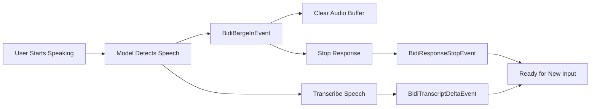

When a user starts speaking while the model is still responding, `BidiAgent` stops the current response. This behavior, called barge-in, lets the user take the floor without waiting for the assistant to finish.

## How Barge-in Works

Barge-ins are detected through Voice Activity Detection (VAD) built into the model providers:



## Handling Barge-in

The barge-in flow: Model’s VAD detects user speech → `BidiBargeInEvent` sent → Audio buffer cleared → Response terminated → User’s speech transcribed → Model ready for new input.

### Automatic Handling (Default)

When using `AudioIO`, barge-ins are handled automatically:

```python
import asyncio
from strands.experimental.bidi.agent import BidiAgent
from strands.experimental.bidi.io import AudioIO
from strands.experimental.bidi.models import BedrockNovaSonicModel

model = BedrockNovaSonicModel(model_id="amazon.nova-2-sonic-v1:0")
agent = BidiAgent(model=model)
audio_io = AudioIO()

async def main():
    # Barge-ins handled automatically
    await agent.run(
        inputs=[audio_io.input()],
        outputs=[audio_io.output()]
    )

asyncio.run(main())
```

The `AudioIO` output automatically clears the audio buffer, stops playback immediately, and resumes normal operation for the next response.

### Manual Handling

For custom behavior, process barge-in events manually:

```python
import asyncio
from strands.experimental.bidi.agent import BidiAgent
from strands.experimental.bidi.models import BedrockNovaSonicModel
from strands.experimental.bidi.types import BidiBargeInEvent

model = BedrockNovaSonicModel(model_id="amazon.nova-2-sonic-v1:0")
agent = BidiAgent(model=model)

async def main():
    await agent.start()
    await agent.send("Tell me a long story")

    async for event in agent.receive():
        if isinstance(event, BidiBargeInEvent):
            print(f"Barge-in: {event.reason}")
            # Custom handling:
            # - Update UI to show barge-in
            # - Log analytics
            # - Clear custom buffers

    await agent.stop()

asyncio.run(main())
```

## Barge-in Events

### Key Events

**BidiBargeInEvent** - Emitted when barge-in detected:

-   `reason`: `"user_speech"` (most common) or `"error"`

## Barge-in Hooks

Use hooks to track barge-ins across your application:

```python
from strands.experimental.bidi.agent import BidiAgent
from strands.experimental.bidi.hooks import (
    BidiBargeInEvent as BidiBargeInHookEvent,
)

class BargeInTracker:
    def __init__(self):
        self.barge_in_count = 0

    async def on_barge_in(self, event: BidiBargeInHookEvent):
        self.barge_in_count += 1
        print(f"Barge-in #{self.barge_in_count}: {event.reason}")

        # Log to analytics
        # Update UI
        # Track user behavior

tracker = BargeInTracker()
agent = BidiAgent(
    model=model,
    hooks=[tracker]
)
```

## Common Issues

### Barge-in Not Working

If barge-ins aren’t being detected:

```python
from strands.experimental.bidi.models import OpenAIRealtimeModel

# Check VAD configuration (OpenAI)
model = OpenAIRealtimeModel(
    model_id="gpt-realtime-2.1",
    transcription_model_id="gpt-transcribe",
    params={
        "audio": {
            "input": {
                "turn_detection": {
                    "type": "server_vad",
                    "threshold": 0.3,  # Lower = more sensitive
                    "silence_duration_ms": 300  # Shorter = faster detection
                }
            }
        }
    }
)

# Verify microphone is working
audio_io = AudioIO(input_device_index=1)  # Specify device

# Check system permissions (macOS)
# System Preferences → Security & Privacy → Microphone
```

### Audio Continues After Barge-in

If audio keeps playing after barge-in:

```python
# Ensure AudioIO is handling barge-ins
async def __call__(self, event: BidiOutputEvent):
    if isinstance(event, BidiBargeInEvent):
        self._buffer.clear()  # Critical!
        print("Buffer cleared due to barge-in")
```

### Frequent False Barge-ins

If barge-in is detected too easily:

```python
from strands.experimental.bidi.models import OpenAIRealtimeModel

# Increase VAD threshold (OpenAI)
model = OpenAIRealtimeModel(
    model_id="gpt-realtime-2.1",
    transcription_model_id="gpt-transcribe",
    params={
        "audio": {
            "input": {
                "turn_detection": {
                    "type": "server_vad",
                    "threshold": 0.7,  # Higher = less sensitive
                    "prefix_padding_ms": 500,  # More context
                    "silence_duration_ms": 700  # Longer silence required
                }
            }
        }
    }
)
```

## Related pages

- [BidiAgent](/docs/user-guide/sdk/bidirectional-streaming/agent/index.md) (1 shared tag)
- [Build a realtime voice agent](/docs/user-guide/sdk/bidirectional-streaming/index.md) (1 shared tag)
- [Events](/docs/user-guide/sdk/bidirectional-streaming/events/index.md) (1 shared tag)
- [Google Gemini Live](/docs/user-guide/sdk/bidirectional-streaming/models/google/index.md) (1 shared tag)
- [I/O Streams](/docs/user-guide/sdk/bidirectional-streaming/io/index.md) (1 shared tag)
- [OpenAI Realtime](/docs/user-guide/sdk/bidirectional-streaming/models/openai/index.md) (1 shared tag)
- [Bidirectional Streaming Observability](/docs/user-guide/sdk/bidirectional-streaming/observability/index.md) (1 shared tag)
- [Bidirectional Streaming Hooks](/docs/user-guide/sdk/bidirectional-streaming/hooks/index.md) (1 shared tag)
- [Build a voice agent](/docs/user-guide/sdk/bidirectional-streaming/quickstart/index.md) (1 shared tag)
- [Bedrock Nova Sonic](/docs/user-guide/sdk/bidirectional-streaming/models/bedrock/index.md) (1 shared tag)


## Implementation

### Python

- [harness-sdk/strands-py/src/strands/experimental/bidi/types/events.py](https://github.com/strands-agents/harness-sdk/blob/main/strands-py/src/strands/experimental/bidi/types/events.py)
- [harness-sdk/strands-py/src/strands/experimental/bidi/io/audio.py](https://github.com/strands-agents/harness-sdk/blob/main/strands-py/src/strands/experimental/bidi/io/audio.py)
