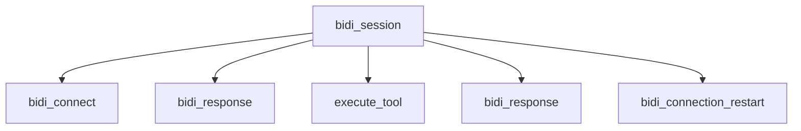

A `BidiAgent` session is shaped differently from a request/response agent: one connection spans multiple model responses, tool calls, and possibly reconnects, and a response can end because the user barged in rather than because the model finished. This page covers the traces, metrics, and logs specific to bidirectional streaming. For the tracing, metrics, and logging concepts shared by every Strands agent, see [Traces](/docs/user-guide/sdk/observability-evaluation/traces/index.md), [Metrics](/docs/user-guide/sdk/observability-evaluation/metrics/index.md), and [Logs](/docs/user-guide/sdk/observability-evaluation/logs/index.md).

## Enabling tracing

Tracing configuration is the same as for a non-streaming agent. Configure OpenTelemetry as described in [Traces](/docs/user-guide/sdk/observability-evaluation/traces/index.md) and session spans are produced automatically.

Install OpenTelemetry dependencies

To run the Bedrock Nova Sonic example below and export OTEL data, install both extras:

```shell
pip install 'strands-agents[bidi,otel]'
```

```python
import asyncio

from strands.experimental.bidi.agent import BidiAgent
from strands.experimental.bidi.types import BidiConnectionStartEvent
from strands.experimental.bidi.models import BedrockNovaSonicModel
from strands.telemetry import StrandsTelemetry

strands_telemetry = StrandsTelemetry()
strands_telemetry.setup_otlp_exporter()     # Send spans to an OTLP endpoint
strands_telemetry.setup_console_exporter()  # Print spans to stdout


async def main():
    agent = BidiAgent(
        model=BedrockNovaSonicModel(model_id="amazon.nova-2-sonic-v1:0"),
        system_prompt="You are a helpful voice assistant.",
        name="Voice Assistant",
    )

    # The session span opens on entry and closes on exit. The connection start
    # event confirms the provider connection is established and traced.
    async with agent:
        async for event in agent.receive():
            if isinstance(event, BidiConnectionStartEvent):
                break


asyncio.run(main())
```

Endpoints and headers come from the standard OpenTelemetry environment variables:

```bash
# Specify a custom OTLP endpoint
export OTEL_EXPORTER_OTLP_ENDPOINT="http://collector.example.com:4318"

# Set default OTLP headers
export OTEL_EXPORTER_OTLP_HEADERS="key1=value1,key2=value2"
```

## Trace structure

The session span is the parent of the response, connection, restart, and tool spans. It starts a new trace when no recording span is active. When `BidiAgent` runs inside an instrumented request or a custom span, the session span joins that existing trace:



| Span | Covers |
| --- | --- |
| `bidi_session` | The whole session, from agent start to agent stop |
| `bidi_connect` | Establishing the model connection |
| `bidi_response` | One response from the model |
| `execute_tool` | One tool call |
| `bidi_connection_restart` | A reconnect, fired proactively by the reconnect timer or reactively after a provider timeout |

Two span names carry a suffix identifying what they cover: `bidi_session <agent name>` and `execute_tool <tool name>`. The response ID is an attribute rather than part of the span name, which avoids a distinct span name per turn and the aggregation fragmentation that causes in most tracing backends.

Response spans and tool spans can overlap in wall-clock time, since the model may keep streaming audio while a tool call runs. Tool spans are children of the session rather than of the response that requested the tool.

## Captured attributes

Every span carries `gen_ai.event.start_time`, `gen_ai.event.end_time`, and `gen_ai.system` set to `strands-agents`, matching the non-streaming agent. Under the latest semantic conventions, `gen_ai.provider.name` replaces `gen_ai.system`.

| Span | Attribute | Description |
| --- | --- | --- |
| Session | `gen_ai.operation.name` | `bidi_session` |
| Session | `gen_ai.agent.name` | Name of the agent, defaulting to `Strands Agents` |
| Session | `gen_ai.request.model` | Model ID, when the provider exposes one |
| Session | `gen_ai.agent.tools` | JSON array of tool names registered on the agent |
| Session | `gen_ai.system_instructions` | System prompt, subject to the redaction policy |
| Session | `gen_ai.usage.input_tokens` | Input tokens accumulated across the session |
| Session | `gen_ai.usage.output_tokens` | Output tokens accumulated across the session |
| Session | `gen_ai.usage.total_tokens` | Total tokens accumulated across the session |
| Session | `gen_ai.usage.cache_read.input_tokens` | Cached input tokens read across the session |
| Connection | `gen_ai.operation.name` | `bidi_connect` |
| Connection | `gen_ai.request.model` | Model ID, when the provider exposes one |
| Response | `gen_ai.operation.name` | `bidi_response` |
| Response | `gen_ai.response.id` | Provider-assigned response identifier |
| Response | `gen_ai.server.time_to_first_audio` | Milliseconds from response start to first audio chunk |
| Restart | `gen_ai.operation.name` | `bidi_connection_restart` |
| Restart | `gen_ai.bidi.restart_reason` | `timeout` on the reactive path, `scheduled` on the proactive path |
| Restart | `gen_ai.bidi.restart_error_message` | Timeout message that triggered a reactive restart, when present |

The cache-read count uses the semantic-convention name `gen_ai.usage.cache_read.input_tokens`. The deprecated alias `gen_ai.usage.cache_read_input_tokens` is emitted alongside it unless you opt into the latest conventions with `OTEL_SEMCONV_STABILITY_OPT_IN="gen_ai_latest_experimental"`, which also switches `gen_ai.system` to `gen_ai.provider.name`. See [Captured Attributes](/docs/user-guide/sdk/observability-evaluation/traces/index.md#captured-attributes) on the Traces page for the shared attribute set.

Session token counts are written when the session span closes. A session that is still open has no usage attributes. Zero-valued usage attributes are omitted, so an absent cache-read attribute means no positive cache-read count was observed; it does not distinguish “not reported” from “reported as zero.”

Use `bidi_connect` to diagnose slow provider setup. When setup fails, both the connection and session spans close with error status and the exception surfaces to the caller.

`gen_ai.server.time_to_first_audio` is recorded once, on the first audio chunk. A text-only response has no such attribute. A model stream error closes the response span with error status. Ending a session mid-turn also closes the response span and is not itself an error.

A restart span covers the reconnect operation. During this interval, sends wait for the connection gate to reopen. Check span status, rather than the presence of `gen_ai.bidi.restart_error_message`, to determine whether the restart succeeded. Status `OK` means the agent reconnected and the session continued, even on a reactive restart that carries the triggering timeout message.

Tool calls use the same `execute_tool <tool name>` span and attributes as non-streaming agents. See [Tool-Level Attributes](/docs/user-guide/sdk/observability-evaluation/traces/index.md#tool-level-attributes).

### Barge-in events

A barge-in is recorded as a `bidi_barge_in` event on the session span with a `barge_in.reason` attribute.

To count barge-ins, query the session span’s `bidi_barge_in` events. Keeping the event on the session also captures barge-ins between response spans. For detection and playback behavior, see [Barge-in](/docs/user-guide/sdk/bidirectional-streaming/barge-in/index.md).

## Inspecting spans locally

The console exporter is the fastest way to confirm spans are being produced. A session that registers two tools and includes a barge-in produces the following session span, with the resource block omitted:

Example session span

```json
{
    "name": "bidi_session Voice Assistant",
    "context": {
        "trace_id": "0xef368de68111d713160d6d38e7a305ff",
        "span_id": "0xa11b2c3d4e5f6789",
        "trace_state": "[]"
    },
    "kind": "SpanKind.INTERNAL",
    "parent_id": null,
    "start_time": "2026-08-10T13:27:25.500000Z",
    "end_time": "2026-08-10T13:27:30.900000Z",
    "status": {
        "status_code": "OK"
    },
    "attributes": {
        "gen_ai.event.start_time": "2026-08-10T13:27:25.500001+00:00",
        "gen_ai.operation.name": "bidi_session",
        "gen_ai.system": "strands-agents",
        "gen_ai.agent.name": "Voice Assistant",
        "gen_ai.request.model": "amazon.nova-2-sonic-v1:0",
        "gen_ai.agent.tools": "[\"get_weather\", \"calculator\"]",
        "gen_ai.system_instructions": "You are a helpful voice assistant.",
        "gen_ai.event.end_time": "2026-08-10T13:27:30.900000+00:00",
        "gen_ai.usage.input_tokens": 120,
        "gen_ai.usage.output_tokens": 64,
        "gen_ai.usage.total_tokens": 184
    },
    "events": [
        {
            "name": "bidi_barge_in",
            "timestamp": "2026-08-10T13:27:28.100000Z",
            "attributes": {
                "barge_in.reason": "user_speech"
            }
        }
    ],
    "links": []
}
```

`gen_ai.usage.cache_read.input_tokens` is omitted here because no positive cache-read count was observed. Zero-valued usage attributes are not exported, so absence does not distinguish “not reported” from “reported as zero.” A single spoken turn within the same session produces the following child response span:

Example response span

```json
{
    "name": "bidi_response",
    "context": {
        "trace_id": "0xef368de68111d713160d6d38e7a305ff",
        "span_id": "0xce2958bc052dcc39",
        "trace_state": "[]"
    },
    "kind": "SpanKind.INTERNAL",
    "parent_id": "0xa11b2c3d4e5f6789",
    "start_time": "2026-08-10T13:27:26.709677Z",
    "end_time": "2026-08-10T13:27:26.830163Z",
    "status": {
        "status_code": "OK"
    },
    "attributes": {
        "gen_ai.event.start_time": "2026-08-10T13:27:26.709679+00:00",
        "gen_ai.operation.name": "bidi_response",
        "gen_ai.system": "strands-agents",
        "gen_ai.response.id": "resp_01",
        "gen_ai.event.end_time": "2026-08-10T13:27:26.830133+00:00",
        "gen_ai.server.time_to_first_audio": 120
    },
    "events": [],
    "links": []
}
```

For local trace visualization, follow the shared [Local Development Setup](/docs/user-guide/sdk/observability-evaluation/traces/index.md#local-development-setup), which covers Jaeger and console-exporter setup. See [Visualization and Analysis](/docs/user-guide/sdk/observability-evaluation/traces/index.md#visualization-and-analysis) for other OpenTelemetry-compatible backends.

## Session metrics

`BidiAgent` does not produce a metrics summary object. Barge-in and reconnect counts come through hooks, token usage comes through the event stream, and response latency is recorded on trace spans.

### Counting barge-ins and reconnects

Register a hook provider to accumulate session health counters:

```python
import logging

from strands.experimental.bidi.hooks import (
    BidiAfterConnectionRestartEvent,
    BidiBargeInEvent,
)
from strands.hooks import HookProvider, HookRegistry

logger = logging.getLogger(__name__)


class SessionStats(HookProvider):
    """Counts barge-ins and reconnects over the life of a session."""

    def __init__(self) -> None:
        self.barge_ins = 0
        self.restarts = 0

    def register_hooks(self, registry: HookRegistry) -> None:
        registry.add_callback(BidiBargeInEvent, self.on_barge_in)
        registry.add_callback(BidiAfterConnectionRestartEvent, self.on_restart)

    def on_barge_in(self, event: BidiBargeInEvent) -> None:
        self.barge_ins += 1
        logger.info("reason=<%s> | user barged in", event.reason)

    def on_restart(self, event: BidiAfterConnectionRestartEvent) -> None:
        if event.exception is None:
            self.restarts += 1
```

Pass it in with `hooks=[SessionStats()]` when constructing the agent. `BidiAfterConnectionRestartEvent.exception` is `None` when the reconnect succeeded, so the check above counts successful recoveries. A rising barge-in count usually points to responses that run long for a voice interface. A rising reconnect count points to sessions that frequently reach provider timeout conditions. The full list of lifecycle events is in [Hooks](/docs/user-guide/sdk/bidirectional-streaming/hooks/index.md).

### Tracking token usage per modality

Traces record aggregate session tokens. The per-modality breakdown is only available on the event stream:

```python
from strands.experimental.bidi.agent import BidiAgent
from strands.experimental.bidi.types import BidiResponseStopEvent, BidiUsageEvent


async def track_session(agent: BidiAgent) -> None:
    async for event in agent.receive():
        if isinstance(event, BidiUsageEvent):
            print(
                f"input={event.input_tokens} output={event.output_tokens} "
                f"total={event.total_tokens}"
            )
            for modality in event.modality_details:
                print(
                    f"  {modality['modality']}: "
                    f"in={modality['input_tokens']} out={modality['output_tokens']}"
                )
        elif isinstance(event, BidiResponseStopEvent):
            print(f"response {event.response_id} ended")
            break
```

Typical output for one turn:

```plaintext
input=120 output=64 total=184
  text: in=20 out=0
  audio: in=100 out=64
response resp_01 ended
```

`modality_details` is an empty list when the provider does not report a breakdown, so the loop above is safe on every provider. See [Events](/docs/user-guide/sdk/bidirectional-streaming/events/index.md) for the full event reference.

## Logging

The agent loop logs its own state transitions at `DEBUG`. Enable them to diagnose behavior the trace does not explain, such as a tool call that never appears to execute:

```python
import logging

logging.getLogger("strands.experimental.bidi").setLevel(logging.DEBUG)
logging.basicConfig(
    format="%(levelname)s | %(name)s | %(message)s",
    handlers=[logging.StreamHandler()],
)
```

A session that starts, calls a tool, and stops logs this:

```plaintext
DEBUG | strands.experimental.bidi.agent.agent | context_manager=<enter> | starting agent
DEBUG | strands.experimental.bidi.agent.agent | agent starting
DEBUG | strands.experimental.bidi.agent.loop | agent loop starting
DEBUG | strands.experimental.bidi.agent.loop | model task starting
DEBUG | strands.experimental.bidi.agent.loop | tool_name=<get_weather> | tool execution starting
DEBUG | strands.experimental.bidi.agent.agent | context_manager=<exit> | stopping agent
DEBUG | strands.experimental.bidi.agent.loop | agent loop stopping
```

Audio and transcript chunks are not logged, since a minute of conversation produces thousands of chunks. For log levels, formatters, and handler configuration, see [Logs](/docs/user-guide/sdk/observability-evaluation/logs/index.md).

## Advanced configuration

### Redacting the system prompt

`gen_ai.system_instructions` holds the system prompt verbatim by default. Redaction is opt-in through the same allowlist that governs the non-streaming agent, configured with the same `OTEL_SEMCONV_STABILITY_OPT_IN` variable used to enable the latest semantic conventions (see [Captured Attributes](#captured-attributes)):

```bash
# Redact all sensitive attributes, including the system prompt
export OTEL_SEMCONV_STABILITY_OPT_IN="gen_ai_unredacted_attributes="

# Redact everything sensitive except the system prompt
export OTEL_SEMCONV_STABILITY_OPT_IN="gen_ai_unredacted_attributes=gen_ai.system_instructions"
```

Once the `gen_ai_unredacted_attributes` token is present, any sensitive attribute not named in the list is exported as `[REDACTED]`. Omitting the token leaves everything unredacted, which is the default. `gen_ai.system_instructions` is the only bidi-specific attribute subject to this policy. List multiple attribute names by separating them with `;` (for example `gen_ai_unredacted_attributes=gen_ai.system_instructions;gen_ai.input.messages`). A comma separates opt-in tokens within `OTEL_SEMCONV_STABILITY_OPT_IN` itself; it does not separate entries inside the allowlist.

### Sampling control

A voice session produces far fewer traces than a chat agent handling the same number of user turns, since the whole session is one trace. Sample at the trace level with the standard OpenTelemetry variables:

```bash
# Example: Sample 50% of traces
export OTEL_TRACES_SAMPLER="traceidratio"
export OTEL_TRACES_SAMPLER_ARG="0.5"
```

Because all bidi spans belong to one trace, the trace-level sampling decision keeps or drops the session and its child spans together. When the session runs inside an existing trace, it inherits that trace’s sampling decision.

## Provider differences

Each provider emits one span per response. Usage details vary by provider:

| Provider | Response spans | Notes |
| --- | --- | --- |
| Bedrock Nova Sonic | One per response | Includes the user transcript within the response span. No cache tokens or modality breakdown reported. |
| OpenAI Realtime | One per response | Reports cache read tokens and a modality breakdown when available. |
| Google Gemini Live | One per response | Reports cache read tokens and a modality breakdown when available. |

## Best practices

1.  **Monitor time to first audio over session duration.** A long session can be healthy; a slow first audio chunk is user-facing latency.
2.  **Separate connect latency from response latency.** Use `bidi_connect` to isolate handshake cost from model response time.
3.  **Track reconnects with hooks.** During a reconnect, sends wait for the connection gate to reopen. Monitor reconnect frequency to find sessions that regularly reach provider timeout conditions.
4.  **Watch the barge-in rate.** A rising rate of barge-ins often points to responses that are too long for a voice interface.
5.  **Redact the system prompt in production.** Session spans carry it verbatim unless the unredacted allowlist is configured otherwise.
6.  **Correlate the modality breakdown with cost.** Audio tokens typically dominate voice session cost, and only the event stream reports them separately from text.

## Common issues and solutions

| Issue | Solution |
| --- | --- |
| No spans at all | Install the `otel` extra and configure an exporter before agent start |
| No `bidi_response` spans | Expected on Google Gemini Live, which emits no response lifecycle |
| Session span has no token attributes | The session is still open, or usage was never reported |
| More response spans than spoken turns | Expected on Bedrock Nova Sonic, one response per content block |
| `gen_ai.system_instructions` reads `[REDACTED]` | Add it to the unredacted allowlist |
| Restart span has an error message but status `OK` | The reconnect succeeded; the message is the timeout that triggered it |

## Next steps

-   [Traces](/docs/user-guide/sdk/observability-evaluation/traces/index.md) - Exporters and visualization
-   [Logs](/docs/user-guide/sdk/observability-evaluation/logs/index.md) - Log levels and handler configuration
-   [Events](/docs/user-guide/sdk/bidirectional-streaming/events/index.md) - Complete guide to bidirectional streaming events
-   [Hooks](/docs/user-guide/sdk/bidirectional-streaming/hooks/index.md) - Extend agent functionality with hooks
-   [Barge-in](/docs/user-guide/sdk/bidirectional-streaming/barge-in/index.md) - How barge-in detection works
-   [Python API Reference](/docs/api/python/strands.experimental.bidi.agent) - Complete API documentation

## Related pages

- [Barge-in](/docs/user-guide/sdk/bidirectional-streaming/barge-in/index.md) (1 shared tag)
- [BidiAgent](/docs/user-guide/sdk/bidirectional-streaming/agent/index.md) (1 shared tag)
- [Build a realtime voice agent](/docs/user-guide/sdk/bidirectional-streaming/index.md) (1 shared tag)
- [Events](/docs/user-guide/sdk/bidirectional-streaming/events/index.md) (1 shared tag)
- [Google Gemini Live](/docs/user-guide/sdk/bidirectional-streaming/models/google/index.md) (1 shared tag)
- [I/O Streams](/docs/user-guide/sdk/bidirectional-streaming/io/index.md) (1 shared tag)
- [OpenAI Realtime](/docs/user-guide/sdk/bidirectional-streaming/models/openai/index.md) (1 shared tag)
- [Evaluating remote traces](/docs/user-guide/evals-sdk/how-to/trace_providers/index.md) (1 shared tag)
- [Metrics](/docs/user-guide/sdk/observability-evaluation/metrics/index.md) (1 shared tag)
- [Observability](/docs/user-guide/sdk/observability-evaluation/observability/index.md) (1 shared tag)


## Implementation

### Python

- [harness-sdk/strands-py/src/strands/experimental/bidi/_telemetry.py](https://github.com/strands-agents/harness-sdk/blob/main/strands-py/src/strands/experimental/bidi/_telemetry.py)
- [harness-sdk/strands-py/src/strands/experimental/bidi/agent/loop.py](https://github.com/strands-agents/harness-sdk/blob/main/strands-py/src/strands/experimental/bidi/agent/loop.py)
