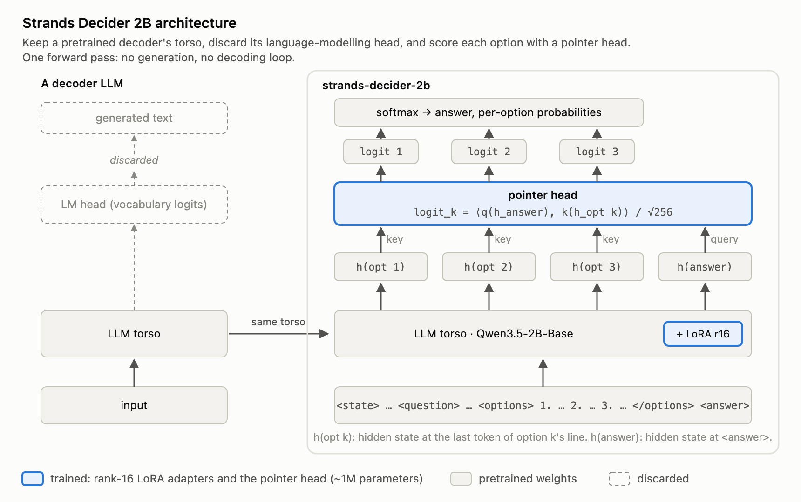
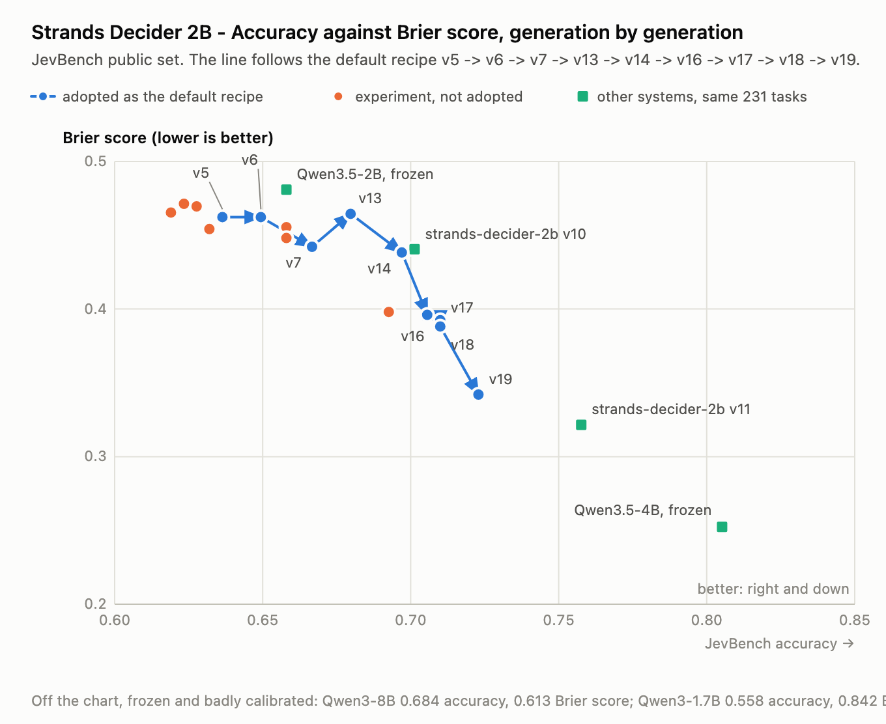
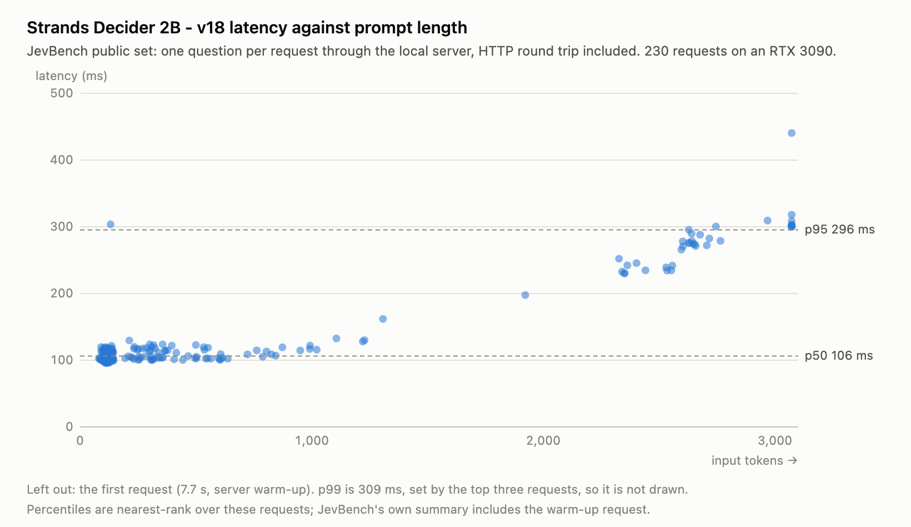

Earlier this year, we announced [strands-labs](https://aws.amazon.com/blogs/opensource/introducing-strands-labs-get-hands-on-today-with-state-of-the-art-experimental-approaches-to-agentic-development/), a place to get hands-on with state-of-the-art approaches to agentic AI. Today, we’re excited to add Strands Decider 2B: a small decision model optimized for fast experimentation, local development, and innovation. 

Strands decider is one of a new class of decision models or system one models, a type of model that has been gaining a lot of attention since TypeSafe AI’s launch of Jev earlier this month. Unlike LLMs that can generate arbitrary output, decision models are designed to pick between sets of options (e.g. “Is the string ‘turn on the lights’ about the coffee machine? Yes or no.”, “What language is the phrase ‘sihamba ngokushesha’ in? English, Zulu, or Dutch.”) and assign simple numerical scores (e.g. “Is the phrase ‘this is the best doc I’ve ever read’ a positive sentiment? Between 0 and 1.”).  

In exchange for this reduction in flexibility, decision models are faster and more capable at a given size, always produce an answer from the selected options, and can run with very low latency.  

The flip side is that this approach (generating all outputs in a single parallel pass) makes it significantly worse at solving complex problems than reasoning models, and its lack of ability to generate text makes it unsuited for coding, chatbots, document summarization, and other common LLM tasks. 

In addition, decision models give each decision a high-quality reliability score (i.e. “how sure can I be that this yes/no is correct?”), which is not available through frontier LLM inference APIs. They also make it highly efficient to ask multiple questions about the same prompt. This combination of properties makes them perfect for driving the types of agentic workflows we see many developers building with the Strands Harness SDK, and the recently launched Strands harness. We expect that this class of model is going to lead to a lot of interesting innovation in agentic AI over the next few weeks, months, and years. 

Strands Decider 2B is our first contribution to that innovation. It’s a 2 billion parameter model, suitable for running on a local CPU or GPU, which can return answers to meaningful questions in tens of milliseconds. Its accuracy and calibration is competitive with the other models we know of in this class. We’ve released `strands-decider-2b` as open source on [GitHub](https://github.com/strands-labs/strands-decider), with the weights on [Hugging Face](https://huggingface.co/StrandsAgents), including all the training data and scripts we used to build the model, making it a great place to start on your own innovation journey. 

## Model Architecture 

The core idea is that we take a pre-trained LLM torso (Qwen3.5-2B), and remove the LM head, taking away its ability to generate text. The LM head is replaced with a pointer head which scores the answers offered by the torso for each option. It does this by scoring the hidden state at each option position against the hidden state at the `<answer>` position. This head is pretty small, just over a million total parameters. The torso is fine-tuned with a rank-16 LoRA adapter. 



_Figure 1: The Strands Decider 2B architecture._

As you browse through the repo, you’ll find that this is the second major iteration of the architecture. The first one was similar, but used a slot head that we found performed significantly worse. In fact, the model we’re releasing today is v19, with lots of iterations under the covers. Everything we changed in each version is covered in the repo, and you can follow along with the work we did. 

## How does it perform? 

For models of this type, we’re interested in three performance targets: accuracy (how well it answers questions), calibration (how trustworthy its confidence scores are), and latency (how quickly it can make decisions). We’ve been measuring the first two together: accuracy on JevBench’s public set, and calibration using the Brier score on the same set. We’ve found that `strands-decider-2b` performs well on accuracy and calibration ([3rd of 33 in the 2B class, and 1st of 30 excluding the just-over-2B models](https://benchmarkheaven.com/jev-models)). As we’ve evolved the architecture our scores are getting better, and we have many ideas for future improvements. We hope the community joins us, in the spirit of Strands labs, in contributing new ideas of your own.



_Figure 2: Accuracy and calibration (Brier score) across the training trajectory. As the architecture evolved over successive versions, both metrics improved on JevBench's public set._

On latency, `strands-decider-2b` can make local decisions in a median of around 115ms on widely available hardware. The time taken to decide depends on the task size, approximately linearly increasing as the task size gets larger. The results in the graph here are on a local Nvidia RTX3090, but the performance on an M3 MacBook isn’t much worse, with a median latency for small tasks around 153ms. As with accuracy and calibration, we have a lot of ideas for getting better here, especially in reducing the floor. 



_Figure 3: Decision latency as a function of task size (in tokens), measured on a local Nvidia RTX 3090 against v18 of the model. Latency increases approximately linearly with task size._

## Why 2B? 

We chose to make Strands decider available as a small model for two reasons. One is that we want to encourage experimentation. You can use, and even train, `strands-decider-2b` on hardware you already have. This makes it easy, fast, and low risk to try things out. The other is that two billion total parameters, seems like something of a sweet spot: small enough for experimentation, large enough to do meaningful work. Strands decider performs 100% of the easy tasks on JevBench correctly, for example, and these types of problems map well to some of the easier problems we see people tackle with agents.

## What can I do with Strands decider? 

Whatever you want! More seriously, we’re seeing early success using this class of model for model routing, tool selection, evaluations, guardrails, memory, context management, and policy classification. We’ve also seen exciting innovation around building hybrid agents, using LLMs to make the hardest decisions and using decider models to make the easier rote decisions, reducing cost and latency. We’re seeing experiments combining decider models with fixed workflow languages to build another kind of hybrid workflow. Folks are also using these kinds of models to play games, automate tasks, navigate mazes, and more. The speed of innovation in this space is astonishing. 

## Trying it out 

The easiest place to get started is through the `strands-decider` CLI:

```bash
pip install strands-decider
```
### Choice question
You can ask the model to choose based on some state and a question:
```bash
strands-decider ask StrandsAgents/strands-decider-2B-hobson-v19 \
  --state "Help! My payouts have been failing for 3 days! " \
  --choice "Which team should handle this?=billing,sales,retail" 
```
Example output:

```bash
choice_0 -> billing (confidence 0.768)
  billing                  0.845
  retail                   0.091
  sales                    0.064
```

In this output we can see that the model is predicting `billing` as the answer with the highest probability score.

The repo also includes examples using `strands-decider-2b` inside a Strands agent, under `examples/strands/`. The agent itself runs locally, connects to Strands decider also running locally, and then uses the default LLM from Amazon Bedrock. 

It’s a deliberately small scenario. The agent has the (obligatory) demo `get_weather` tool and a system prompt that makes it deliberately eager, so that when the user asks "What's the weather?" without saying where, the agent guesses a city and calls the tool anyway. However, before that call runs, `strands-decider-2b` will read the conversation and the proposed tool call and answers two yes/no questions about it: are these argument values grounded in anything the user actually said (spoiler: no!) and is it too early to call this tool anyway. A few lines of Python turn the predictions into a decision, and the agent goes back to ask which city you meant instead of confidently reporting the weather somewhere nobody mentioned. 

```python
QUESTIONS = {
    "args_grounded": Decider.noul(
        "Are the tool's argument values grounded in facts the user actually provided?",
        {
            "true": "every argument value traces back to something the user said",
            "false": "an argument value was guessed or invented, not stated by the user",
        },
    ),
    "premature": Decider.noul(
        "Is it premature to call this tool now, before clarifying with the user?",
        {
            "true": "the assistant should ask a clarifying question before calling the tool",
            "false": "there is nothing left to clarify; calling now is appropriate",
        },
    ),
}
```

The pattern here is Strands' intervention system. We use the `InterventionHandler` with a `before_tool_call` method, pass it to `Agent(interventions=[...])`, and it runs before any tool executes. What it returns is a typed action: `Proceed`, `Deny`, `Confirm` (stop and ask a person), or `Guide`, which hands the model back its turn with feedback rather than blocking the call outright. This existing handler is a Python class and Strands has no opinion about what goes inside it, so the same shape holds whether you're calling our decision model, a Cedar policy, or another agent. (There are equivalent hooks around the model call and around the whole invocation.) This example is an illustration rather than a recommendation, so the questions, the threshold and the policy were all picked by hand. The point is that a decision this cheap can sit in a path where an LLM call never could. 

The Strands team is working on libraries for decision model integration, so watch the repo for updates soon. 

## Conclusion 

You can download, use, or build off `strands-decider-2b` today. All the data is available, along with everything you need to get started. You can grab the code from [GitHub](https://github.com/strands-labs/strands-decider), and the latest snapshots from [Hugging Face](https://huggingface.co/StrandsAgents). Now go experiment!
