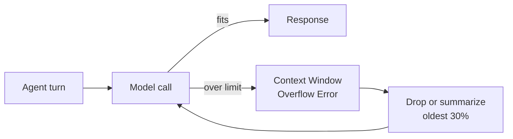
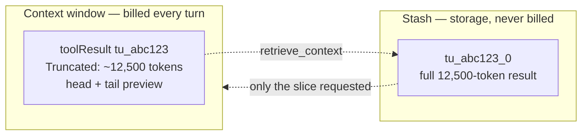
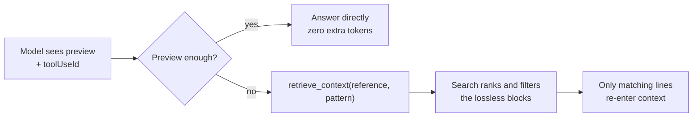
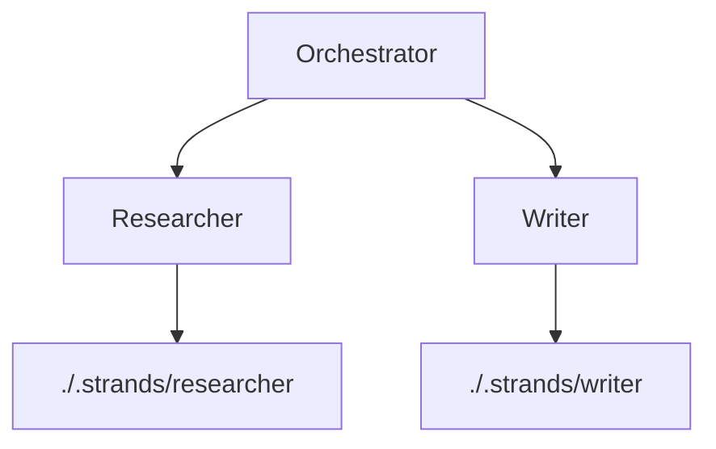

When developing agentic systems, the limited width of the context window quickly becomes one of your most sacred and scarce resources. The Strands team has come to know this well: Model performance degrades under context bloat, causing bugs to bubble up in code; Applications hit context window overflows and crash; Agents get stuck in loops attempting to access the context they just shrunk. Meanwhile, token costs continue to rise.

With this in mind, we developed a tiered approach to the curation of the model's context window, ensuring context is dropped, but never forgotten. These are the defaults behind [Strands harness](/blog/introducing-strands-harness/), and a large part of why it costs 28% less than other harnesses across six benchmarks.

## Philosophy

Historically, at their inception, agentic systems relied upon rudimentary "Conversation Managers", which acted as a stopgap between the application and the dreaded Context Window Overflow Error. In Strands, a Conversation Manager would merely catch a Context Window Overflow Error returned by the model call once the context window had surpassed its limit, then either it would drop (or summarize) the oldest 30% of its context to be able to free up space in the context window, reinvoke the model, and recover gracefully.



While this approach enabled the advent of model-driven applications, it was far from ideal. Each Context Window Overflow Error meant that an entire turn was wasted, requiring re-invocation of the model at a high token cost.

Applying the Just-In-Time standard to context management, we hypothesized that in an ideal world, the context window would exclusively contain only the information that is purely sufficient and necessary for the next model call. Any information that is not necessary for the current turn, would remain accessible and lossless outside of the limited context window space. This would minimize not only token spending, but the "lost-in-the-middle effect" where model performance degrades (especially over information located in the middle of a data source) when faced with larger inputs.

## Context Compression

The first step in our methodology required determining representations of data in the context window. Depending on the type of data in the context window, one must determine a representation that optimizes its compactness in comparison to its lossiness. This representation often varies depending on use case. For instance, command-line agents can simply use truncated versions of the previous context, whereas conversational agents may condense conversation history in summaries, and coding agents may use Tree-sitter or language-native APIs to maintain only function headers.

```python
from strands import Agent
from strands.experimental.context_manager import Offload

agent = Agent(
    context_manager={
        "strategies": [
            # Bulky tool output collapses to a head/tail preview once a block exceeds 1,500 tokens
            Offload.truncate("tool_results", {"preview_tokens": 750}).when(threshold=1500),
            # Conversation history condenses into a summary once the window is 85% full
            Offload.summarize("*").when(utilization=0.85, preserve_recent=4),
        ],
    },
)
```

```text
[Truncated: 1 block, ~12,500 tokens]

$ pytest tests/
============================= test session starts ==============================
collected 219 items

tests/test_agent.py ....................................................  [ 24%]

[... 47,000 chars elided ...]

=========================== short test summary info ============================
FAILED tests/test_streaming.py::test_partial_chunk_reassembly
FAILED tests/test_tools.py::test_concurrent_tool_execution
======================== 2 failed, 217 passed in 41.28s ========================
```

## Context Persistence

Although compressing context clears out room for further conversations, it loses critical data, leading to forgetfulness, duplicate tool calls, and increased token usage.

We resolved this in Strands by maintaining a lossless copy of any context that has been sent to the agent in a log colloquially known as the "stash". Since this "stash" is maintained in storage independently of the agent's context window, the agent is able to empty its context window without sacrificing any information. Now, the compacted versions of context are able to act as previews for the agent to retrieve the full context blocks as needed.



```python
from strands import Agent
from strands.storage import LocalFileStorage

# The stash needs no configuration: it is on by default, and falls back to the
# agent's own storage, then to in-memory. Name a backend to make it durable.
agent = Agent(
    context_manager={
        "stash": {"storage": LocalFileStorage()},
    },
)
```

## Context Relevance

Yet, this begets a new set of problems: how does the agent know what full context to retrieve? Today, the agent narrows a block by pattern or line range, paying for the lines it needs instead of the whole result. In Strands, our built-in Search Strategies handle this on your behalf, vending algorithms to return the top-k relevant results, including BM25, lexical search, and with extension support for any custom search. Surfacing these on the Context Manager, so your agent can search and retrieve relevant context to its current work, is landing next.

```python
from strands.storage import LocalFileStorage
from strands.storage.search import Bm25SearchStrategy

# Indexed on write, ranked best-first on read
storage = LocalFileStorage(
    "./.strands/artifacts",
    search_strategy=Bm25SearchStrategy(),
)
```



## Context Isolation

Once the context window has been curated specifically for a task, an orchestrator agent may launch sub-agents for isolated tasks, allowing the context window to remain task-specific and minimal. In Strands, Storage is decoupled from any one construct, so a user can isolate their agent's context across sessions, multi-agent patterns, or sub-agents simply through passing a different path into the Context Manager.

```python
from strands import Agent
from strands.storage import LocalFileStorage

storage = LocalFileStorage("./.strands")

researcher = Agent(
    agent_id="researcher",
    storage=storage.namespace("researcher"),
    context_manager="auto",
)

writer = Agent(
    agent_id="writer",
    storage=storage.namespace("writer"),
    context_manager="auto",
)
```



The Context Window Overflow Error was never the problem; it was the symptom of treating the context window as the only place context could live. Once context has somewhere else to go, the window stops being the bottleneck of agentic capability and becomes what it always should have been: a working set, assembled for the turn in front of it.

Storage is cheap and the context window is not. The tiered approach then becomes a relevance classification problem of keeping each piece of context in whichever tier it belongs to this turn. In Strands, start with `context_manager="auto"` and drop down to fine-grained context configurations as you determine what your agentic workflow needs at each step.
