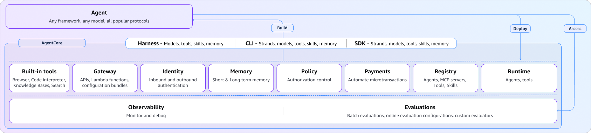

<YouTube id="S_ZRZFDJ6wE" title="Lesson 14: Deploying Agents to the Cloud" />
*[Watch on YouTube](https://www.youtube.com/watch?v=S_ZRZFDJ6wE&list=PLDzwjhH-4yhU&index=14)*

:::note[About this lesson]
The videos in this course are a snapshot in time. Strands is under active development, so the code featured on this page reflects the most up-to-date patterns, but the concepts covered in the video still apply. When in doubt, trust the code.
:::

*Code for this lesson: [`samples/14-deploy`](https://github.com/aws-samples/sample-building-with-strands-course/tree/main/samples/14-deploy)*

## From Local to Production

Everything so far has run on a local machine. A Strands agent is just Python, so you can containerize it and run it anywhere. This lesson deploys it to AWS using Amazon Bedrock AgentCore: Runtime for isolated execution, Memory for persistent and long-term recall, and Observability for automatic tracing.



## Making Your Agent Deployable

Wrap the agent in a `BedrockAgentCoreApp` and give it an entrypoint. The agent itself doesn't change; the customer service agent below is the same one built across the previous lessons, with an AgentCore Memory session manager swapped in for persistence:

```python
from strands import Agent
from bedrock_agentcore.runtime import BedrockAgentCoreApp
from bedrock_agentcore.memory.integrations.strands.config import (
    AgentCoreMemoryConfig, RetrievalConfig
)
from bedrock_agentcore.memory.integrations.strands.session_manager import (
    AgentCoreMemorySessionManager
)

app = BedrockAgentCoreApp()

MEMORY_ID = os.environ.get("BEDROCK_AGENTCORE_MEMORY_ID", "")

def create_agent(actor_id: str, session_id: str):
    # AgentCore Memory for persistence + long-term recall
    session_manager = None
    if MEMORY_ID:
        config = AgentCoreMemoryConfig(
            memory_id=MEMORY_ID,
            session_id=session_id,
            actor_id=actor_id,
            retrieval_config={
                "/users/{actorId}/facts": RetrievalConfig(),
                "/users/{actorId}/preferences": RetrievalConfig(),
            },
        )
        session_manager = AgentCoreMemorySessionManager(
            agentcore_memory_config=config,
            region_name="us-east-1",
        )

    return Agent(
        tools=[lookup_customer, get_order_history, process_refund],
        plugins=[AgentSkills(skills=["./skills"]), RefundWorkflowHandler(), tone_handler],
        system_prompt=SYSTEM_PROMPT,
        context_manager="auto",
        session_manager=session_manager,
    )
```

📂 [main.py](https://github.com/aws-samples/sample-building-with-strands-course/tree/main/samples/14-deploy/main.py) · [lambda-deployment/](https://github.com/aws-samples/sample-building-with-strands-course/tree/main/samples/14-deploy/lambda-deployment) (alternative: AWS Lambda)

The `retrieval_config` namespaces tell AgentCore Memory which long-term memory strategies to pull from on each turn, so the agent recalls facts and preferences about a returning user without replaying old conversations.

## Deployment Commands

```bash
# Install CLI
npm install -g @aws/agentcore

# Scaffold project
agentcore create

# Add memory
agentcore add memory --name CustomerServiceMemory --strategies SEMANTIC,USER_PREFERENCE

# Deploy
agentcore deploy

# Invoke
SESSION_ID="<SESSION ID HERE>"
agentcore invoke --session-id "$SESSION_ID" \
  '{"prompt": "I need help returning my order", "actor_id": "sarah"}'
```

## What AgentCore Provides

| Component | What It Does |
| --- | --- |
| **Runtime** | Isolated microVMs, maintains state across requests |
| **Memory** | Conversation persistence + semantic long-term recall |
| **Observability** | Automatic traces, logs, execution telemetry |
| **Gateway** | Expose APIs as MCP-compatible tools |
| **Identity** | IAM or OAuth authentication gate |

AgentCore has more capabilities beyond these. See the [AgentCore developer guide](https://docs.aws.amazon.com/bedrock-agentcore/latest/devguide/what-is-bedrock-agentcore.html) for the full picture.

## What You Still Need

The deployed agent is only part of a production architecture. You still need API gateways, rate limiting, retries, security controls, monitoring, and error handling around it. The surrounding architecture matters as much as the agent.

## Resources

- 📖 [Strands Deployment Guide](/docs/user-guide/sdk/deploy/)
- 📖 [Amazon Bedrock AgentCore Developer Guide](https://docs.aws.amazon.com/bedrock-agentcore/latest/devguide/what-is-bedrock-agentcore.html)
- 📖 [AgentCore Runtime](https://docs.aws.amazon.com/bedrock-agentcore/latest/devguide/runtime.html)
- 📖 [AgentCore Memory](https://docs.aws.amazon.com/bedrock-agentcore/latest/devguide/memory.html)
- 📖 [AgentCore Observability](https://docs.aws.amazon.com/bedrock-agentcore/latest/devguide/observability.html)
- 📖 [AgentCore CLI Reference](https://docs.aws.amazon.com/bedrock-agentcore/latest/devguide/cli-reference.html)
- 📖 [Blog: What Is an Agent Harness?](https://dev.to/aws/what-is-an-agent-harness-a-hands-on-guide-with-agentcore-harness-1h33)
