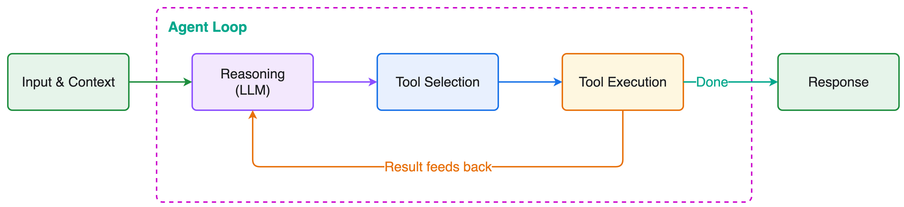

<YouTube id="ZpXWGjISMs8" title="Lesson 1: How Agents Really Work" />
*[Watch on YouTube](https://www.youtube.com/watch?v=ZpXWGjISMs8&list=PLDzwjhH-4yhU)*

:::note[About this lesson]
The videos in this course are a snapshot in time. Strands is under active development, so the code featured on this page reflects the most up-to-date patterns, but the concepts covered in the video still apply. When in doubt, trust the code.
:::

*Code for this lesson: [`samples/01-agent-loop`](https://github.com/aws-samples/sample-building-with-strands-course/tree/main/samples/01-agent-loop)*

## Why Agents?

Models are stateless. They process one request, produce a completion, and forget. They can't take action, access live data, or coordinate multi-step workflows alone. Agents solve this by wrapping a model in a runtime system that gives it tools, memory, and a reasoning loop.

## The Agent Loop



1. Model receives **context** (system prompt + user input + tool list + history)
2. Model **reasons** and decides whether to call a tool
3. Tool **executes**, result feeds back into context
4. Loop **repeats** until the task is complete

## Agent = Model + Harness

The **harness** is the system that surrounds the model and turns it into an agent. It handles the agent loop, tool execution, context management, memory, lifecycle control, observability, and verification.

Together, **model + harness = agent.**

## Three Layers of Engineering

**Prompt Engineering:** Instructions and constraints sent to the model

**Context Engineering:** What information enters the context window, when, and how

**Harness Engineering:** The runtime system orchestrating everything

## Strands Harness SDK

The Strands Harness SDK is an open-source SDK for building agent harnesses. It provides composable primitives like tools, context management, lifecycle hooks, memory, sessions, evals, and observability that you assemble into whatever system your use case requires.

**Design philosophy:** Let the model drive. You define the environment and boundaries; the model reasons through the task.

## Code: A Simple Agent

This is already a working agent with a loop, just without tools.

```python
from strands import Agent

agent = Agent()

response = agent("What are the key differences between REST and GraphQL APIs?")
print(response)
```

📂 [simple_agent.py](https://github.com/aws-samples/sample-building-with-strands-course/tree/main/samples/01-agent-loop/simple_agent.py)

## Code: Agent with Tools

The `web_fetch` vended tool pulls in an HTML parser, so install the SDK with that extra: `pip install 'strands-agents[web-fetch]'`.

```python
from strands import Agent, tool
from strands.vended_tools import file_editor, web_fetch

@tool
def query_product_database(query: str) -> str:
    """Query the internal product database for inventory and pricing information.

    Args:
        query: Search query for products (e.g., "wireless headphones", "USB-C hub")
    """
    products = {
        "wireless headphones": "SKU-WH100: Wireless Headphones Pro - $79.99, 142 in stock, 4.5★ rating, launched 2025-03",
        "usb-c hub": "SKU-UC200: USB-C Hub 7-in-1 - $45.00, 89 in stock, 4.2★ rating, launched 2024-11",
        "mechanical keyboard": "SKU-MK300: Mechanical Keyboard RGB - $149.99, 23 in stock, 4.8★ rating, launched 2025-01",
        "noise cancelling": "SKU-NC400: Noise Cancelling Earbuds - $129.99, 67 in stock, 4.6★ rating, launched 2025-05",
    }
    key = query.lower()
    matches = [info for product_key, info in products.items() if product_key in key]
    if matches:
        return "\n".join(matches)
    return f"No products found matching '{query}'. Available: wireless headphones, usb-c hub, mechanical keyboard, noise cancelling"

SYSTEM_PROMPT = """You are a product research analyst. You help the team understand
market positioning by comparing competitor pricing with our internal catalog.

When given a research task:
1. Use web_fetch to gather public market data from the web
2. Use query_product_database to check our internal pricing and inventory
3. Write a brief competitive analysis and save it to report.md using file_editor"""

agent = Agent(
    tools=[web_fetch, file_editor, query_product_database],
    system_prompt=SYSTEM_PROMPT,
)

result = agent("Research what wireless headphones are trending on the market and compare it against our offerings. "
               "Write a short competitive positioning summary and save it to report.md")
```

Key concepts:

- **`@tool` decorator** turns any Python function into an agent-callable tool
- **Docstrings** become the tool description the model sees
- **Type hints** auto-generate the input schema
- **System prompt** defines agent identity and behavior

After a run, `agent.messages` shows every step the loop took: user turns, assistant text, tool calls, and tool results. This is the first place to look when you want to know why the agent did what it did.

📂 [agent_with_tools.py](https://github.com/aws-samples/sample-building-with-strands-course/tree/main/samples/01-agent-loop/agent_with_tools.py)

## Out of the Box Components

Strands also ships preconfigured components that give you a capable agent out of the box:

- **Vended tools** for file operations, shell access, and web fetching
- **Automatic context management** that offloads large results, compresses old messages, and fires proactive compression before the window fills
- **Plugin system** for extending behavior

You can start with these defaults and customize from there, or build from scratch using the primitives.

```python
from strands import Agent
from strands.models import BedrockModel
from strands.vended_tools import file_editor, shell
from strands.vended_tools.web_fetch import web_fetch

agent = Agent(
    model=BedrockModel(
        model_id="us.anthropic.claude-sonnet-5",
    ),
    # Vended tools for file ops, shell, and web fetching
    tools=[file_editor, shell, web_fetch],
    # Auto context management: offloads large tool results, compresses old
    # messages into summaries, and fires proactive compression at 85% usage.
    context_manager="auto",
)

# Give it a research task
agent("Research the current state of AI agent deployment patterns in production, including common architectures, challenges teams face, and best practices. Write a summary to report.md")
```

📂 [agent_with_defaults.py](https://github.com/aws-samples/sample-building-with-strands-course/tree/main/samples/01-agent-loop/agent_with_defaults.py)

## Resources

- 📖 [Getting Started](/docs/user-guide/sdk/quickstart/python/)
- 📖 [Agent Loop](/docs/user-guide/sdk/agents/agent-loop/)
- 📖 [Tools](/docs/user-guide/sdk/tools/)
- 📖 [Custom Tools](/docs/user-guide/sdk/tools/custom-tools/)
- 📖 [Connect your AI coding assistant (Strands MCP Server)](/docs/user-guide/sdk/quickstart/python/#connect-your-ai-coding-assistant)
