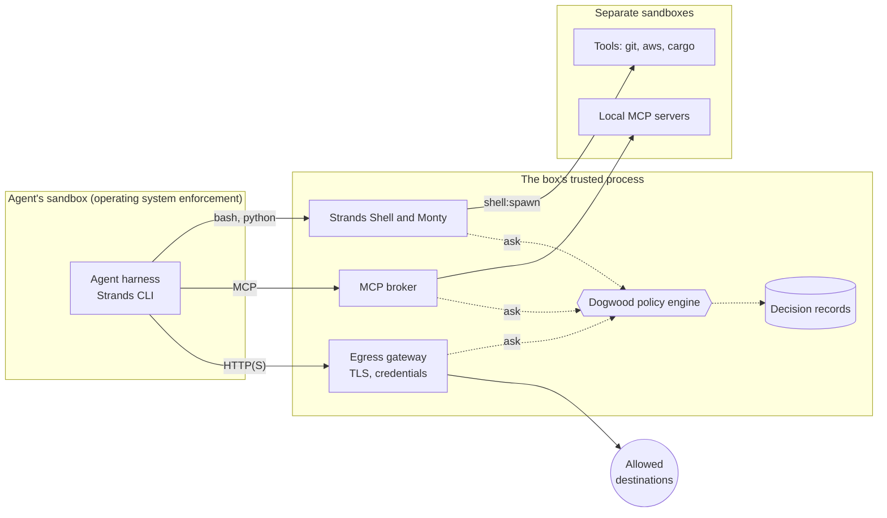

import { CardGrid, LinkCard } from '@astrojs/starlight/components'

:::caution[Pre-release]
Strands Box is pre-release software (0.1.x). Configuration keys, policy actions, and
CLI flags can change between releases. Pin a release with `BOX_VERSION` when you
download, and read the release notes before you upgrade.
:::

Coding agents read files, run shell commands, execute code they wrote, and call APIs.
Run one with every action approved and it can wander out of its project, run a
destructive command, or reach a credential it was never meant to see. Strands Box puts
the agent in a sandbox the operating system enforces and a policy behind it, so you
decide what it can reach and what it can do there.

Box is harness-agnostic. You choose the agent program to run, configure its access in
`box.toml`, and write its policies in `policy.dw`.

Box runs on your own machine, beside the tools you already use. There's no guest
operating system to provision, and no container image to keep in sync with your
project. The source is on [GitHub](https://github.com/strands-agents/box).

## Two layers: operating system enforcement and policy

**Sandbox grants** set which files and programs a process's own system calls can reach.
Box builds them from your `box.toml`, and Seatbelt, the macOS sandbox, enforces them.
The sandbox also sends the box's network traffic to Box's egress gateway, unless a tool
or local MCP server you declare sets `network.contain_egress = false`.

**Policy** decides the actions that go through Box: shell commands and the files they
touch, Python file operations, network requests, tool starts, and MCP calls. You write
it in [Dogwood](https://dogwood-policy.github.io/dogwood/), a Cedar-compatible language
with temporal operators. A rule can depend on what the agent already did, in what order,
and how long ago. Policy is deny-by-default: an action no `permit` matches is refused.

## What Box contains

A box runs one **workload**, usually an agent harness such as the
[Strands CLI](https://github.com/strands-agents/harness-sdk/tree/main/strands-cli),
Claude Code, or Codex CLI, in **the agent's sandbox**. Beside it, **the box's trusted
process** holds the policy, in the embedded Dogwood Local Engine:

- **Strands Shell and Monty.** The agent's `zsh`, `bash`, `sh`, `python3`, and `python`
  are interpreters inside Box. Each file a command touches and each program it starts
  is a policy decision.
- **Tools.** A host binary such as `git` or `aws` runs in its own sandbox, a **tool's
  sandbox**, with its own filesystem grants, after a policy permit. A tool's sandbox
  has no route back to Box's shell or Python.
- **Credentials.** The box is the credential boundary. The agent, each tool, and each
  MCP server can use every credential binding `box.toml` declares, so a process that
  must not get a credential belongs in another box.
- **The egress gateway.** The agent's traffic always goes through it, and so does each
  tool's and MCP server's unless its table sets `network.contain_egress = false`. It
  terminates TLS, asks policy about each connection and request, and replaces credential
  placeholders with the real values.
- **The MCP broker.** Box starts each local MCP server in its own sandbox and decides
  MCP requests such as `tools/list` and `tools/call`.
- **Decision records.** Box writes permits and denials as OTLP JSON records to a local
  file, by default `<box_dir>/private/telemetry/records.jsonl`.

Policy sees what goes through Box. An agent's own file tools, such as a harness's built-in
Read and Write tools, open files from the agent's process: the sandbox grants bound
what they reach, but no policy rule sees those reads and writes. To have the policy
decide every file change, give the agent a shell as its only file tool. The
[getting started guide](getting-started.md) does this with the Strands CLI, the
[Strands harness guide](guides/run-strands-harness.md) with an agent you build, and the
[Claude Code](guides/run-claude-code.md) and [Codex CLI](guides/run-codex-cli.md) guides
do it for those harnesses.



## Shared actions and history

The shell and Python report a file read the same way, as `fs:read`. The gateway reports
an HTTP request from `curl` or from the agent's model client as `http:request`. One
policy engine and one history see all of them, so a rule can connect an earlier action
with a later one. This rule blocks requests to hosts other than the model after the box
reads a customer file:

```text
@id("no_upload_after_reading_customers")
forbid (principal, action == Box::Action::"http:request", resource)
when { context.input.host != "bedrock-runtime.us-west-2.amazonaws.com" }
when temporal {
    formerly within 1h (
        Box::Action::"fs:read"::response{
            input.path: "~/data/customers.csv",
            input.operation: Box::FsReadOperation::"read_content"
        }
    )
};
```

The [action reference](reference/policy-actions.md) lists every action and its fields.

## Platform support

| Platform | Status |
|---|---|
| macOS 15 or later on Apple silicon | Supported |
| Linux | Not supported yet |
| Windows | Unsupported |

## Next steps

<CardGrid>
  <LinkCard
    title="Getting started"
    href="getting-started/"
    description="Download Box, put the Strands CLI in a box, and watch the policy decide."
  />
  <LinkCard
    title="Write a policy"
    href="guides/write-a-policy/"
    description="Permit actions, add a temporal rule, and read what policy decided."
  />
  <LinkCard
    title="Security model"
    href="security/"
    description="What Box protects, what it trusts, and the residual risks."
  />
  <LinkCard
    title="box.toml reference"
    href="reference/configuration/"
    description="Every box.toml key, its values, its default, and what it means."
  />
</CardGrid>

The reasoning behind the design is in the
[Box design guide](https://github.com/strands-agents/box/tree/main/docs/design) in the
Box repository. Start with
[policy](https://github.com/strands-agents/box/blob/main/docs/design/policy.md),
[containment](https://github.com/strands-agents/box/blob/main/docs/design/containment.md),
[limitations](https://github.com/strands-agents/box/blob/main/docs/design/limitations.md),
[macOS enforcement](https://github.com/strands-agents/box/blob/main/docs/design/macos-enforcement.md),
and [the Box binaries](https://github.com/strands-agents/box/blob/main/docs/design/binaries.md).
