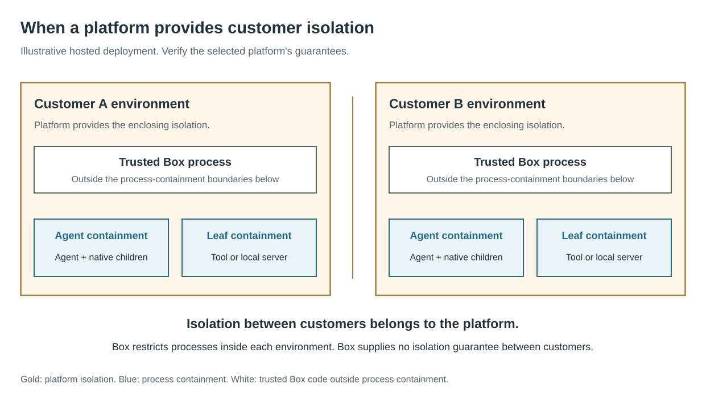

This page states what Strands Box protects, what it trusts, how it enforces your
configuration, and the risks it leaves for you to manage. The reasoning behind the
design is in the
[Box design guide](https://github.com/strands-agents/box/tree/main/docs/design).

:::caution[Pre-release]
Box is pre-release software (0.1.x), and its behavior can change between releases.
Evaluate it against your own threat model before you run untrusted agents with it.
:::

## What Box protects

Box limits what the workload can do to your machine: your files, your credentials,
your network, and your other processes. It assumes the workload can be steered by
untrusted content it reads.

Box doesn't protect the box's own contents from the workload. Anything you grant the
agent, it can read, change, or send to a destination the policy permits.

## What Box trusts

| Trusted | Untrusted |
|---|---|
| The operating system and its kernel | The workload, including the agent harness and the model's output |
| The Box binaries and the box's trusted process they run | Tools and MCP servers, and everything they return |
| You, the operator, and what you author: `box.toml`, the policy, credential references, and every tool and MCP server you declare | Remote content the workload fetches |
| | The alias (`strands-box-sock-alias`) inside the box, which only forwards requests |

## Who owns what

Box's security depends on three parties. Each owns a different part:

| Owner | What it owns |
|---|---|
| Box | Correct enforcement: the OS restrictions it builds from `box.toml`, and the policy decision on each request through the box's trusted process. A bypass of either is a Box defect. |
| You, the operator | Your access choices: the workload, its direct grants, the policy, each `contain_egress = false` exception, and which programs share the box's credentials. You also own whether an allowed action fits the task. |
| You, or your hosting platform | The environment: the machine's accounts, installation, configuration, and updates. In a hosted deployment, the platform owns isolation between tenants. Box supplies none. |

When something unwanted happens, find the control that allowed it. If a direct grant or a
broad `permit` allowed it, the result follows your access choice. If Box allowed an
access that no grant or permit covers, that is an enforcement defect:
[report it](#report-a-vulnerability).

For multi-tenant deployments, run each session's box inside its own VM or microVM, so
the platform keeps tenants apart and a kernel exploit stays inside one session.

## How Box enforces your configuration

- **Operating system enforcement.** The operating system limits each process's own
  system calls to the paths `box.toml` grants it. Box prints the agent's and each tool's
  grants on stderr before the agent starts. A local MCP server's sandbox is applied when
  it starts, and isn't printed. Nor is the sandbox of a program that runs under one of the agent's
  `exec` entries with no tool table.
- **Refusals.** Box refuses to start a box on a platform it doesn't support, and stops
  the run when the policy doesn't load. An error while evaluating a rule denies the
  action.
- **Network.** Box points the box's proxy settings at its egress gateway, and the
  operating system blocks direct connections from the agent, and from each tool and MCP
  server unless its table sets `network.contain_egress = false`. Such a process connects
  directly to IP hosts, with no policy decision and no credential injection.
- **Credentials.** The box is the credential boundary. Every process in the box, meaning
  the agent, each tool, and each stdio MCP server, holds a placeholder for every
  credential binding in `box.toml`: the variable for an `env://` secret, or placeholder
  AWS keys for an `aws://` or `credsd://` route. On a permitted TLS request to the bound
  destination, the gateway swaps in the real value or signs the request with SigV4.
- **Fixed refusals.** Box refuses grants on the roots of system trees, on machine
  secrets, and on trees that enclose a credential store. Box's shell and Python can't
  touch Box's own state or the `box.toml` and policy file the run loaded, and a write
  grant can't reach the policy file.
- **Records.** Box writes each permit and denial as a record that names the action,
  the resource, and the deciding rule.

## Residual risks

These risks remain with a correctly configured box. Plan for them.

**Permitted destinations are exfiltration channels.** Anything the agent can read, it
can send to any destination the policy permits. Scope `http:request` rules by host,
method, and path, and consider a temporal rule that closes egress after the agent reads
sensitive data.

**Cloud metadata is reachable unless the policy forbids it.** The gateway keeps no list
of refused destinations. Forbid metadata hosts and addresses on `net:connect` in every
policy; the
[action reference](../reference/policy-actions.md#refuse-cloud-metadata-endpoints) has the
rules. They don't cover a tool or MCP server with `network.contain_egress = false`,
because its connections raise no `net:connect`.

**Every process in the box can use every credential.** The gateway can't tell which
process sent a request, so a tool or a third-party stdio MCP server can use any credential
binding the box declares. Run a process that must not get a credential in another box.

**Direct grants carry no decisions.** A path in `box.toml` is reachable through the
agent's or a tool's own system calls with no policy decision and no record. Only
operations through Box's shell and Python are decided.

**The interpreters don't refuse credential stores on their own.** An `fs:read` permit
with no path condition lets a shell command read `~/.aws` and `~/.ssh`. Always give
`fs:read` permits a path condition. A `box.toml` entry can also name a credential store
directly; Box allows it and prints `exposes …` at startup.

**Tools and MCP servers are wider than the agent.** A `shell:spawn` permit covers the
tool's whole process tree. Inside its own sandbox a tool can touch any file its grants
reach. On macOS it can also run any binary it can reach, load code it writes into its
writable grants, and see which paths exist across your home. A tool or MCP server with
`network.contain_egress = false` has direct network access. The agent picks a tool's
arguments, so a native tool is direct egress the agent can aim: don't set it on `curl`
or an interpreter. See [Agent and tool sandboxes](agent-and-tool-containment.md).

**Policy decisions aren't confidential.** A denial message names the deciding rule,
and a `forbid` rule's `@description`, so the workload can learn the shape of the
policy.

**A temporal rule keyed on `::request` counts denied attempts.** Key preconditions on
`::response` instead; see [Write a policy](../guides/write-a-policy.md).

**Resources aren't limited.** Box sets no limit on processes, CPU, memory, or disk.
A workload can exhaust them.

**File timestamps can't be set inside a write grant.** A sandboxed process, the agent or
a tool or MCP server, can write a file's contents in its write grants but can't restore
its timestamps. `touch -t` fails with `Operation not permitted`, and `cp -p`, `rsync -a`,
`tar -x`, Node's `fs.utimes`, and Python's `os.utime` fail the same way or leave the
current time. A copy or extraction can fail after writing part of its output. Check
timestamps as well as contents when a build or sync depends on them.

**Stop a box with a signal Box handles.** `box run` forwards `SIGINT` to the workload,
and stops the workload on `SIGTERM` or `SIGHUP`. Don't use `SIGKILL` on `box run`.

**A box's loopback ports serve any of your processes.** The egress gateway and the
telemetry collector listen on `127.0.0.1` and don't check which process connected. A
program outside the box, running as you, can send requests through the box's gateway:
the box's policy still decides each one, and the decision record attributes it to the
box, and a `secret.inject = "always"` binding attaches its credential to it. The same
program can post telemetry to the collector, where it's recorded as the agent's own,
though it can't forge a decision record. Don't run untrusted programs under your account
while a box runs.

**Boxes under one parent can reach each other.** A broad grant or `fs:read` permit
that covers another box's configuration directory exposes that box's policy. Keep each
box's configuration outside the trees other boxes are granted.

**The interpreters run in the box's trusted process.** Strands Shell, its embedded Lua,
Monty, the gateway, and the policy engine run outside every sandbox, beside the
credentials and the TLS key. No sandbox contains their defects, so a
memory-safety bug in one of them is a bug in the trusted process. Box still owns that
failure.

**Decision records are best effort, and aren't tamper-proof.** Records can be lost without
notice, nothing signs a record or chains it to the next, and Box doesn't rotate the record
file. Anything that can write the file can edit it afterwards. The box's telemetry port is
an unauthenticated loopback listener, so any local process, including the workload, can
send records to it. Don't rely on records as an audit trail.

**Kernel and side-channel attacks are out of scope.** Operating system enforcement depends
on the kernel, and a compromised OS defeats it. Run Box inside a VM when you need
protection from kernel exploits or side channels.

**Remote services aren't contained.** Box decides each request to a remote MCP server
or web service, but it can't contain the service or control what it does with an
allowed request. Code the agent writes and someone later runs outside Box isn't
contained either.

### On macOS 15

Box's Seatbelt profile denies `file-graft` and `file-ungraft` by name. Those
operations aren't defined before macOS 26, so on macOS 15 Box doesn't apply
those two denials, and doesn't warn.

### Choices that widen the box

| Choice | What it gives up | How Box reports it |
|---|---|---|
| `secret.inject = "always"` | The gateway attaches the real credential to requests without the placeholder | Nothing: each such request is an ordinary permit in the decision record, and no warning is printed |
| `network.contain_egress = false` on an MCP server | Policy and credential injection for that server's traffic | An `egress:native` record when the server starts |
| `network.contain_egress = false` on a tool | Policy, credential injection, and traffic records for that tool | A `native egress` line at startup, and an `egress:native` record each time the tool runs |
| A program with no tool table, run under an agent `exec` entry | The startup report for its sandbox's wider reach | Nothing |
| The same path under `exec` and `write` | The workload can replace that program | A warning at startup |
| A credential store named in a `box.toml` list | The credential-store refusal for that path | An `exposes …` line at startup |
| An agent or tool command inside a writable grant | The process can replace the program it runs | A warning at startup |

The Box design guide's
[limitations page](https://github.com/strands-agents/box/blob/main/docs/design/limitations.md#how-access-choices-change-the-risk)
explains each choice.

`box policy generate-schema` starts each stdio MCP server without a sandbox to list
its tools, and calls remote servers with their real credentials. Run it only for
servers you trust.

## Report a vulnerability

Don't open a public GitHub issue for a security concern. Report it to the AWS
Vulnerability Disclosure Program, as the Box repository's
[SECURITY.md](https://github.com/strands-agents/box/blob/main/SECURITY.md) describes.

## Go deeper

- [Security model and shared responsibility](https://github.com/strands-agents/box/blob/main/docs/design/security.md):
  what Box enforces, where its protection ends, and who owns each part.
- [Credentials](https://github.com/strands-agents/box/blob/main/docs/design/credentials.md):
  how Box keeps credentials out of the box, for each `secret.ref` scheme.
- [Design tenets](https://github.com/strands-agents/box/blob/main/docs/design/tenets.md):
  how we think an agent sandbox should work, in priority order.
- [Design decisions](https://github.com/strands-agents/box/blob/main/docs/design/decisions.md):
  why each part of Box is the way it is.
- [Terminology](https://github.com/strands-agents/box/blob/main/docs/design/terminology.md):
  the precise meaning of box, sandbox, workload, grant, and policy.
- [Policy](https://github.com/strands-agents/box/blob/main/docs/design/policy.md):
  where policy sits, how history is kept, and what refuses a policy at load.
- [How Box contains a process](https://github.com/strands-agents/box/blob/main/docs/design/containment.md):
  what a box guarantees, where its reach comes from, and how the agent's sandbox
  differs from a tool's.
- [Limitations](https://github.com/strands-agents/box/blob/main/docs/design/limitations.md):
  what is still at risk once the box and the policy do their jobs.
- [macOS enforcement](https://github.com/strands-agents/box/blob/main/docs/design/macos-enforcement.md):
  the Seatbelt profiles for the agent and for tools, and how to diagnose a refusal.
- [Binaries](https://github.com/strands-agents/box/blob/main/docs/design/binaries.md):
  `strands-box`, the trampoline, and the alias.
