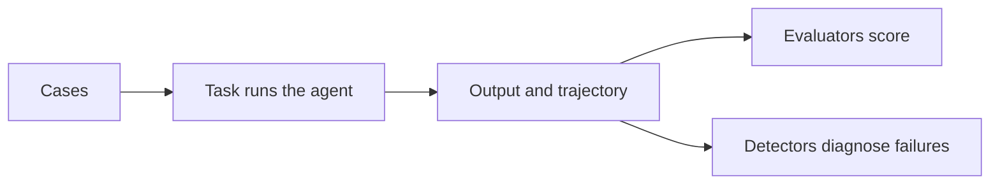

Before you wire up scorers, it helps to hold the shape of an evaluation in your
head. Strands Evals is built from four pieces that fit together the same way every
time: an experiment groups the cases you want to test, a task turns each case into
an agent run, evaluators score what the run produced, and detectors explain why a
run went wrong. Once you can name those four, every page in this section is a
detail of one of them.

## What an evaluation is made of

An **experiment** is the unit you run. It holds a list of cases and the evaluators
you want to apply to each one.

A **case** is one input paired with what you expect back. It carries the prompt to
send, an optional `expected_output` to compare against, and metadata you can filter
and group by later.

A **task** turns a case into a result. It runs your agent (or any function) on the
case's input and returns the output, and optionally the trajectory: the ordered
record of the model responses and tool calls the agent produced along the way. The
[`@eval_task` decorator](how-to/eval_task.md) handles the wiring so your task can
just return an `Agent`.

An **evaluator** scores one result. It takes the output, or the whole trajectory,
and returns a score, a pass or fail, and the reasoning behind the call. Some
evaluators run a model as the judge; others are plain code (see
[Deterministic evaluators](evaluators/deterministic_evaluators.md)).

A **detector** works the other direction. Instead of scoring against a bar, it
reads a run that failed and tells you what broke and why.

## The three levels an evaluator scores at

Evaluators differ in how much of a run they look at. Each one operates at one of
three levels, and picking the right level matters as much as picking the right
check.

| Level | Scope | Answers |
|-------|-------|---------|
| OUTPUT_LEVEL | A single response | Was this one answer good? |
| TRACE_LEVEL | A single turn | Was this turn correct, on topic, and safe? |
| SESSION_LEVEL | A full conversation | Did the agent reach the user's goal end to end? |

An output-level check like `OutputEvaluator` needs nothing but the final text. A
session-level check like `GoalSuccessRateEvaluator` needs the full trajectory,
which is why trajectory-aware tasks collect spans. When you combine evaluators in
one experiment, you are usually mixing levels on purpose: a fast output check plus
a trajectory check that reads the whole run. The
[evaluators overview](evaluators/index.md) lists every built-in evaluator with its
level.

## Where simulators and detectors fit

Two pieces sit on either side of scoring.

**Simulators** generate the interactions an evaluator needs. A single prompt gives
you one turn; a real agent faces a back-and-forth. A [simulator](simulators/index.md)
plays the user, or stands in for a tool the agent calls, so you can score
multi-turn behavior without a human in the loop.

**Detectors** run after a case fails. An evaluator tells you a run scored 0.2; a
[detector](detectors/index.md) reads that run's trace, finds the span where things
went wrong, and proposes a root cause. Scoring tells you *whether* a run failed;
diagnosis tells you *why*.

## How it fits together

For a single case, the flow runs left to right: the task produces output and a
trajectory, evaluators score them, and detectors diagnose any failures.

The experiment repeats this for every case, then aggregates the scores into a
report you can print, save, and compare against a later run.

## Next steps

- Run the flow end to end in the [quickstart](quickstart.md).
- Pick scorers from the [evaluators overview](evaluators/index.md).
- Diagnose failing runs with [detectors](detectors/index.md).
- Drive multi-turn runs with [simulators](simulators/index.md).
