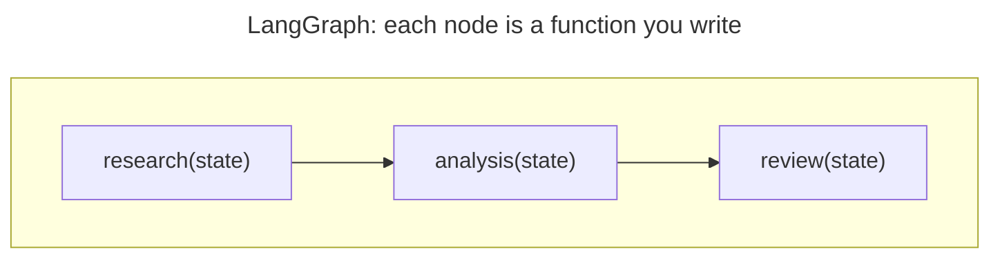
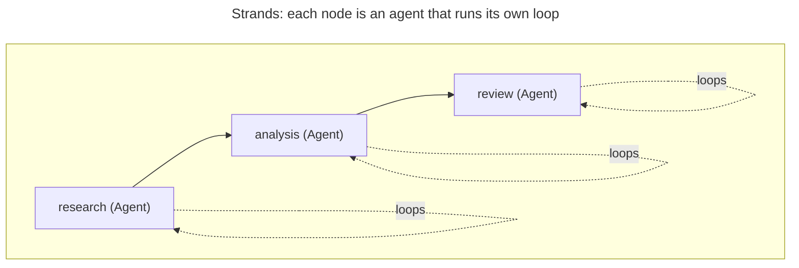
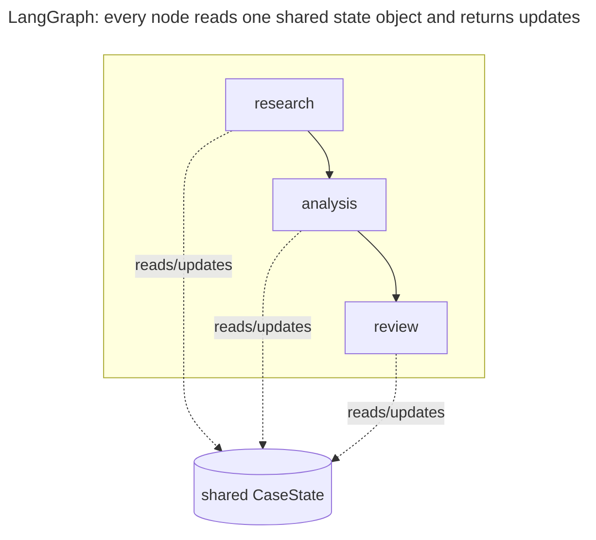
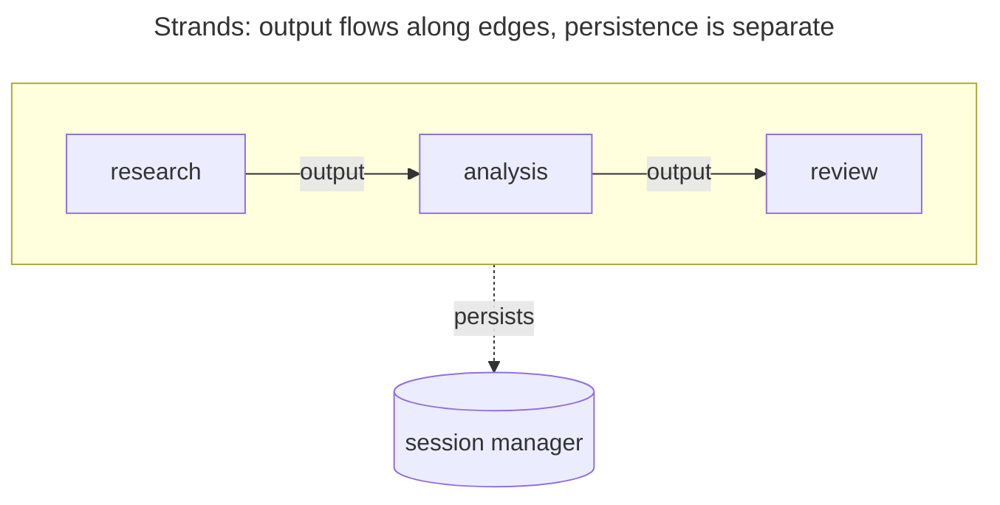
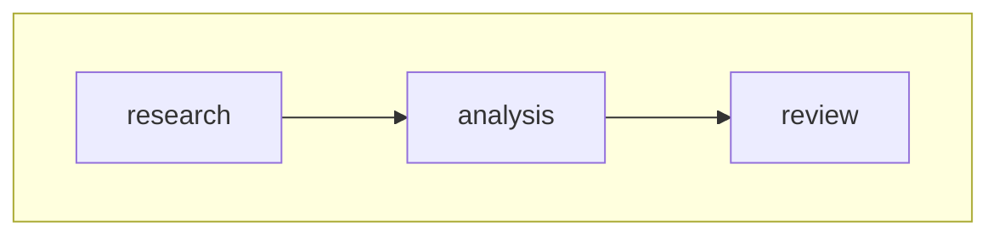

If you currently have a LangGraph application, you can migrate it to Strands Agents without rewriting the code that calls your graph (your callers), and keep the same external IDs for persistence and resumption.

This guide maps the two models concept for concept, then migrates a small example graph (three stages that research, analyze, and review a request) from its LangGraph form to a Strands equivalent. You'll keep the same public entrypoint and external IDs, and port interrupts, run limits, and tracing to their Strands equivalents, with traces going to an existing OpenTelemetry backend.

This guide assumes you are comfortable with LangGraph's `StateGraph` and checkpointer model. For the Strands graph model itself, read the [Graph pattern](../sdk/multi-agent/graph.md) first.

## How LangGraph concepts map to Strands

A LangGraph agent is built from a few moving parts, and this migration guide maps each one onto its Strands counterpart. The sections that follow walk through the important changes to be aware of, ending with a full comparison table.

Before getting started, let's discuss two important differences for Strands: what a node is, and where state lives.

### A node is an agent, not a function

In LangGraph, a node is a plain function you write. It takes the state, does one thing (e.g., call a model, transform data, check a condition), returns an update, and control goes back to the graph. The reasoning, if any, is code you wrote.



In Strands, a node is an agent that runs its own agent loop. When the node executes, it can reason, call tools, and iterate until it's done, before handing off to the next node. A single Strands node therefore contains the kind of loop you would have written inside a LangGraph function.



The practical rule when migrating: a LangGraph node that called a model becomes an agent, and a node that only did deterministic work (validating input, reshaping state) becomes a [custom node](../sdk/multi-agent/graph.md#custom-node-types), a callable added to the graph with no agent loop around it, so you don't wrap pure logic in an unnecessary agent loop.

### State is passed along edges, not shared

State works differently. In LangGraph you define one shared state object, and every node reads from it and returns a partial update that a reducer merges back in. State is a single structure threaded through the entire graph, and the checkpointer snapshots that structure to persist it.



Strands has no shared state object that nodes write to. Each node passes its output to the nodes that depend on it, and a session manager attached to the graph persists the run separately. Instead of one graph-wide state dict, each agent holds its own conversation for the duration of the run, and the session manager records the graph's progress so an interrupted run can resume.



In practice, you stop modeling state as a single typed object and let each agent carry its own context. The cutover requires no data migration: your public entrypoint and external IDs stay the same, and there is no checkpoint format to translate. Point the new session store at a fresh location and let it fill as cases run.

:::note[Note]
Once your graph has a join (a node with more than one incoming edge), the Strands SDK behaves differently depending on the language. The Python SDK uses OR semantics, firing a node when any incoming edge from the completed batch is satisfied; TypeScript uses AND semantics, waiting for all incoming edges. See [Waiting for All Dependencies](../sdk/multi-agent/graph.md#waiting-for-all-dependencies) to make a Python join wait for every branch.
:::

With those in mind, most other LangGraph concepts have a direct Strands counterpart.

| Concept | LangGraph | Strands |
| --- | --- | --- |
| Graph construction | `StateGraph`, <Syntax py="add_node" ts="addNode" />, <Syntax py="add_edge" ts="addEdge" />, <Syntax py="add_conditional_edges" ts="addConditionalEdges" /> | <Syntax py="GraphBuilder" ts="new Graph({ nodes, edges })" /> |
| Entry point | <Syntax py="set_entry_point" ts="setEntryPoint" />, edge from `START` | <Syntax py="set_entry_point()" ts="sources" /> |
| Persistence | Checkpointer (`SqliteSaver`, <Syntax py="InMemorySaver" ts="MemorySaver" />) | session manager on the graph |
| Tools | `@tool`, LangChain <Syntax py="bind_tools" ts="bindTools" />, `ToolNode`, <Syntax py="tools_condition" ts="toolsCondition" /> | <Syntax py="Agent(tools=[...])" ts="new Agent({ tools: [...] })" /> |
| Interrupts | `interrupt()`, <Syntax py="interrupt_before" ts="interruptBefore" /> | interrupts raised from a hook or a tool |
| Run limits | <Syntax py="recursion_limit" ts="recursionLimit" /> | invocation limits plus node caps (<Syntax py="set_max_node_executions()" ts="maxSteps" />) |
| Streaming | `.stream()`, `astream_events` | <Syntax py="stream_async()" ts="stream()" /> |
| Tracing | LangSmith | OpenTelemetry via <Syntax py="StrandsTelemetry" ts="setupTracer()" /> |


## Set up the Strands SDK

Before starting the migration, install the SDK:

<Tabs>
<Tab label="Python">

```bash
pip install strands-agents
```
</Tab>
<Tab label="TypeScript">

```bash
npm install @strands-agents/sdk
```
</Tab>
</Tabs>

## Migrating an example graph

The example for this guide is a small three-stage graph for handling a legal case: a research stage that gathers the facts, an analysis stage that weighs the options, and a review stage that recommends a decision. Each stage feeds the next. The snippets below are abbreviated; complete, runnable versions of both the LangGraph and the Strands programs are in the samples repository, for [Python](https://github.com/strands-agents/samples/tree/main/python/migration/langgraph) and [TypeScript](https://github.com/strands-agents/samples/tree/main/typescript/migration/langgraph). The pipeline is linear, so the migration is easier to follow, and the stages are the same in both frameworks.



The LangGraph version wires three node functions into a `StateGraph` and compiles it with a checkpointer, keyed per case by `thread_id`:

<Tabs>
<Tab label="Python">

```python {57,59}
import sqlite3
from typing import Annotated, TypedDict

from langchain_core.messages import AnyMessage
from langchain_core.tools import tool
from langgraph.checkpoint.sqlite import SqliteSaver
from langgraph.graph import END, START, StateGraph
from langgraph.graph.message import add_messages
from langgraph.prebuilt import ToolNode, tools_condition


@tool
def fetch_case_record(case_id: str) -> str:
    """Fetch the filed record for a case."""
    ...


@tool
def search_precedent(question: str) -> str:
    """Search prior decisions for relevant precedent."""
    ...


class CaseState(TypedDict):
    messages: Annotated[list[AnyMessage], add_messages]
    prompt: str
    research: str
    analysis: str
    review: str


def research(state: CaseState) -> dict: ...
def analysis(state: CaseState) -> dict: ...
def review(state: CaseState) -> dict: ...


builder = StateGraph(CaseState)
builder.add_node("research", research)
builder.add_node("research_tools", ToolNode([fetch_case_record]))
builder.add_node("analysis", analysis)
builder.add_node("analysis_tools", ToolNode([search_precedent]))
builder.add_node("review", review)
builder.add_edge(START, "research")
builder.add_conditional_edges("research", tools_condition,
                              {"tools": "research_tools", END: "analysis"})
builder.add_edge("research_tools", "research")
builder.add_conditional_edges("analysis", tools_condition,
                              {"tools": "analysis_tools", END: "review"})
builder.add_edge("analysis_tools", "analysis")
builder.add_edge("review", END)

conn = sqlite3.connect("cases.db", check_same_thread=False)
graph = builder.compile(checkpointer=SqliteSaver(conn))


# Entrypoint: this signature is what your callers use, and it stays the same
def run_case(case_id: str, prompt: str):
    # External ID: case_id keys the conversation, and becomes the Strands session id
    config = {"configurable": {"thread_id": case_id}}
    return graph.invoke({"prompt": prompt}, config)
```
</Tab>
<Tab label="TypeScript">

```typescript {60,62}
--8<-- "user-guide/migrate/langgraph_before_imports.ts:graph_before_imports"

--8<-- "user-guide/migrate/langgraph_before.ts:graph_before"
```
</Tab>
</Tabs>

Pay close attention to the highlighted lines above. Migrating without breaking your callers means holding both of them stable while you swap the internals:

1. Public function: keep the function your callers invoke unchanged. <Syntax py="run_case(case_id, prompt)" ts="runCase(caseId, prompt)" /> keeps that exact signature, and only its body changes. Nothing that calls it has to change.

2. External ID: keep the ID your callers already pass. Both frameworks use an ID to recognize that a call belongs to existing persisted state. LangGraph calls this a `thread_id`; Strands calls it a session ID. Pass the same <Syntax py="case_id" ts="caseId" /> to Strands as the session ID, so callers do not change and a run interrupted in Strands resumes under the same ID. Strands session IDs must use only lowercase letters, digits, `_` and `-`. The TypeScript SDK rejects anything else; Python rejects only path separators. A `thread_id` outside that set has to be mapped before it becomes a session ID.

The Strands version keeps <Syntax py="run_case(case_id, prompt)" ts="runCase(caseId, prompt)" /> intact. Each node becomes
an agent with a system prompt, the pipeline edges stay the same, and the checkpointer
becomes a session manager keyed by the case ID:

<Tabs>
<Tab label="Python">

```python {26,50}
--8<-- "user-guide/migrate/langgraph_imports.py:graph_migrated_imports"

--8<-- "user-guide/migrate/langgraph.py:graph_migrated"
```
</Tab>
<Tab label="TypeScript">

```typescript {24,50}
--8<-- "user-guide/migrate/langgraph_imports.ts:graph_migrated_imports"

--8<-- "user-guide/migrate/langgraph.ts:graph_migrated"
```
</Tab>
</Tabs>

The result object reports the run status and which nodes ran, through
<Syntax py="execution_order" ts="results" />, so you can assert the
pipeline ran end to end. For conditional routing, give an edge a condition
function, the equivalent of LangGraph's
<Syntax py="add_conditional_edges" ts="addConditionalEdges" />. For more information, see the [conditional edges documentation](../sdk/multi-agent/graph.md#conditional-edges).

## Port your tools

In LangGraph, tools sit outside the model call: you bind them to the model,
execute them in a `ToolNode`, and route back with a <Syntax py="tools_condition" ts="toolsCondition" /> edge, which
adds a cycle to the graph. A Strands agent runs that loop itself, so the tools
move onto the agent and both the tool node and its edges disappear.

| Concept | LangGraph | Strands |
| --- | --- | --- |
| Define a tool | plain function, or <Syntax py="@tool from langchain_core.tools" ts="tool() from @langchain/core/tools" /> | <Syntax py="@tool" ts="tool()" /> |
| Attach it | <Syntax py="bind_tools([...])" ts="bindTools([...])" /> | <Syntax py="Agent(tools=[...])" ts="new Agent({ tools: [...] })" /> |
| Execute the call | `ToolNode` | the agent loop |
| Route back to the model | <Syntax py="tools_condition" ts="toolsCondition" /> edge | automatic |

Not every node needs tools. The review stage above works from what the earlier
stages produced, so it has none.

<Tabs>
<Tab label="Python">
:::caution[Parameter descriptions start reaching the model]
LangChain parses a docstring's `Args:` section only when you pass
`parse_docstring=True`, and it defaults to `False`. Strands always parses it, so
parameter descriptions your LangGraph tool never sent to the model will start
being sent. That changes the tool schema the model sees.
:::
</Tab>
<Tab label="TypeScript">
:::note[Parameter descriptions reach the model the same way]
Both frameworks take the tool's parameter schema from zod, so a `.describe()` on
a field reaches the model the same way in each. The schema the model sees does
not change.
:::
</Tab>
</Tabs>

For class-based and module-format tools, see
[Create custom tools](../sdk/tools/custom-tools.md).

## Managing state and persistence

LangGraph's checkpointer serializes the shared state object per super-step, and
because a node is a function that writes its messages into that state, saving the
state saves the conversation with it. A Strands node is an agent running its own
loop, so its messages belong to the agent and never enter the graph. Strands uses
a session manager attached to the graph, so what it persists is the run: which
nodes completed, what each one returned, and which are still pending.

In the migrated example above, we attached a session manager directly to the
graph:

<Tabs>
<Tab label="Python">

```python
builder.set_session_manager(
    FileSessionManager(session_id=case_id, storage_dir="./cases/")
)
```

Attach a `FileSessionManager`, `S3SessionManager` or `SnapshotSessionManager`
(with a `storage` argument) to the graph with `set_session_manager`. An agent
inside the graph must **not** carry its own session manager; `add_node` raises
`ValueError` if it does.
</Tab>
<Tab label="TypeScript">

```typescript
import { LocalFileStorage } from '@strands-agents/sdk/storage'

const graph = new Graph({
  // ...nodes, edges, and sources
  sessionManager: new SessionManager({
    sessionId: caseId,
    storage: new LocalFileStorage('./cases/'),
  }),
})
```

One `SessionManager` covers both single agents and graphs, and it is
passed to the graph through the `sessionManager` field. A node agent may also
carry its own `SessionManager`, in which case its conversation is persisted
alongside the graph's run. By default a graph node restores the agent to its
pre-run state when it completes, so `agent.messages` is unchanged in memory and
the persisted conversation lives only in the session store. Pass
`preserveContext: true` on the node to let the agent accumulate state across
executions instead.
</Tab>
</Tabs>

What that session manager saves decides what a repeat call sees. Take the same
case run twice:

<Tabs>
<Tab label="Python">
```python
run_case("case-4127", "Assess the dispute and recommend a decision.")
run_case("case-4127", "Assess the dispute and recommend a decision.")
```
</Tab>
<Tab label="TypeScript">
```typescript
await runCase('case-4127', 'Assess the dispute and recommend a decision.')
await runCase('case-4127', 'Assess the dispute and recommend a decision.')
```
</Tab>
</Tabs>

In LangGraph the second call starts with the first call's `messages` already in
`CaseState`, because the checkpointer restored them. In Strands the second call
assesses the case again from research through review. The session store holds
what each node returned last time, not the conversation that produced it, so
every agent starts empty (in TypeScript, unless the node agent carries its own
`SessionManager`). If a caller needs those earlier messages, keep them
yourself and pass them in with <Syntax py="Agent(messages=...)" ts="new Agent({ messages: ... })" />
when <Syntax py="run_case" ts="runCase" /> rebuilds the graph.

The stored run does matter when the first call did not finish. If the process
dies after research completes, the next call with that case ID reuses research's
result and runs only analysis and review. The restored node still appears in
the result's node list (<Syntax py="execution_order" ts="results" />),
so check its tool calls rather than that list to confirm it was not re-run.
Resumption works from a separate process, which is what lets an approval gate be
answered elsewhere.

Both frameworks leave concurrency to you. Neither takes a distributed lock.
Strands' built-in stores write without a lock and without a version check, so a
write never detects that another writer has changed the same record. Two writers
on the same session ID can overwrite each other's turns, the last write wins,
and neither call errors. Give each
case its own session ID, run one live writer per case, and add locking in the
backend or the caller if concurrent writers are possible. See
[Sessions, agents, and concurrency](../sdk/agents/session-management.md#sessions-agents-and-concurrency)
and [Storage](../sdk/storage.md) for backend configuration and tradeoffs.

## Add approval gates with interrupts

LangGraph pauses a run with `interrupt()` or <Syntax py="interrupt_before" ts="interruptBefore" />. Strands raises
an interrupt from a hook or a tool, hands control back with the pending
interrupt, and resumes when you pass a response. To gate a node in a graph,
raise the interrupt from a `BeforeNodeCallEvent` hook and loop until the run
stops interrupting:

```python {16}
import json

from strands import Agent
from strands.hooks import BeforeNodeCallEvent, HookProvider, HookRegistry
from strands.multiagent import GraphBuilder, Status


class ReviewApproval(HookProvider):
    def register_hooks(self, registry: HookRegistry, **kwargs) -> None:
        registry.add_callback(BeforeNodeCallEvent, self.approve)

    def approve(self, event: BeforeNodeCallEvent) -> None:
        if event.node_id != "review":
            return
        # Pauses the run here and returns the caller's answer when it resumes
        approval = event.interrupt("review-approval", reason={"node": event.node_id})
        if approval.lower() != "y":
            event.cancel_node = "Reviewer declined to proceed"


builder = GraphBuilder()
builder.add_node(Agent(name="analysis"), "analysis")
builder.add_node(Agent(name="review"), "review")
builder.add_edge("analysis", "review")
builder.set_entry_point("analysis")
builder.set_hook_providers([ReviewApproval()])
graph = builder.build()

result = graph("Assess the tenant dispute in the record.")
while result.status == Status.INTERRUPTED:
    responses = []
    for interrupt in result.interrupts:
        answer = input(f"Approve {interrupt.reason['node']}? (y/N): ")
        responses.append(
            {"interruptResponse": {"interruptId": interrupt.id, "response": answer}}
        )
    result = graph(responses)

print(json.dumps(result.results["review"].result.message, indent=2))
```

TypeScript follows the same shape. You raise from a `BeforeNodeCallEvent` hook,
check for the interrupted status, and resume with the responses. However the API
differs in a few areas: hooks attach via `graph.addHook()` rather than a
`HookProvider`, `event.interrupt()` takes an options object, cancelling a node is
`event.cancel`, responses resume through `graph.invoke()` as
`InterruptResponseContent` instances, and `result.results` is an array of node
results carrying a `nodeId` rather than a dictionary keyed by node ID. For
runnable examples in both languages,
see [Interrupts in multi-agent systems](../sdk/interrupts-multi-agent.md).

## Bound a run

LangGraph gives you <Syntax py="recursion_limit" ts="recursionLimit" /> to cap a run. Strands has no single setting
that does the same, because a Strands node is an agent that runs its own loop.
The graph counts the nodes it runs, but it cannot see what happens inside them,
so one node execution can use any number of turns. That means there are two
places to set a limit: on the graph, with a node cap and a timeout, and on agent
calls you make yourself, with turn and token budgets. Agents inside a graph are
bounded by the graph's cap and timeout; the graph does not pass invocation limits
to its nodes.

### Node caps

The main example above sets a node cap when it builds the graph. A timeout goes
in the same place:

<Tabs>
<Tab label="Python">

```python
# ...nodes and edges
builder.set_max_node_executions(10)
builder.set_execution_timeout(300)  # seconds
```
</Tab>
<Tab label="TypeScript">

```typescript
const graph = new Graph({
  // ...nodes, edges, and sources
  maxSteps: 10,
  timeout: 300_000, // milliseconds
})
```
</Tab>
</Tabs>

Without a node cap or an execution timeout, the SDK logs a warning that the
graph has no execution limit.

Because LangGraph executes a graph in super-steps, where every node scheduled
together runs in parallel within a single step, the two counts are not equivalent.
A node cap counts every node that runs, while <Syntax py="recursion_limit" ts="recursionLimit" /> counts the steps.
Reusing the same number will not give the same bound. TypeScript checks
`maxSteps` as each node is scheduled. Python checks its cap between batches, so
a parallel batch can carry the run past the configured value before it stops.

When a run reaches the limit, LangGraph and Strands report it differently.
LangGraph raises `GraphRecursionError`. Strands in Python completes the run and
reports a failed status on the result when it next checks the cap; if the batch
that exceeded the cap is the last one, the run reports completed. Strands in
TypeScript throws a plain `Error` whose message reads
`steps=<10> | max steps reached`, with no dedicated type to catch.

### Invocation limits

Invocation limits apply to a single agent call. Pass a budget for turns, output tokens, and total tokens:

<Tabs>
<Tab label="Python">

```python
from strands import Agent

agent = Agent()

result = agent(
    "Summarize the case file",
    limits={"turns": 5, "output_tokens": 2000, "total_tokens": 10000},
)

if result.stop_reason == "limit_turns":
    print("Hit turn budget")
elif result.stop_reason == "limit_output_tokens":
    print("Hit output budget")
elif result.stop_reason == "limit_total_tokens":
    print("Hit token budget")
```
</Tab>
<Tab label="TypeScript">

```typescript
--8<-- "user-guide/migrate/langgraph_imports.ts:limits_imports"

--8<-- "user-guide/migrate/langgraph.ts:limits"
```
</Tab>
</Tabs>

These are checked at turn boundaries rather than mid-response, so treat them as
soft ceilings: tools already in flight finish, and a run can overshoot its token
budget by one turn.

### Cancellation

To stop a run from outside, such as on a client disconnect or a timeout, pass a
cancellation signal:

<Tabs>
<Tab label="Python">

```python
import threading

from strands import Agent

agent = Agent()

cancel_signal = threading.Event()
threading.Timer(30.0, cancel_signal.set).start()  # fire the signal after 30s, bounding the run

result = agent("Assess the case file", cancel_signal=cancel_signal)

if result.stop_reason == "cancelled":
    print("Run cancelled: exceeded time budget")
```
</Tab>
<Tab label="TypeScript">

```typescript
--8<-- "user-guide/migrate/langgraph_imports.ts:cancellation_imports"

--8<-- "user-guide/migrate/langgraph.ts:cancellation"
```
</Tab>
</Tabs>

Every result carries a typed <Syntax py="result.stop_reason" ts="result.stopReason" />
that tells you why the run ended. You compare it directly instead of matching
on an error message. Python defines the values as a closed set; TypeScript names
the same values but the type also admits other strings, so handle an unknown
value rather than assuming the list is complete.

Beyond the limit and cancellation values above, common reasons include
<Syntax py="end_turn" ts="endTurn" /> (the agent finished) and
<Syntax py="guardrail_intervened" ts="guardrailIntervened" />. The three limit
values mean the run used up the turns or tokens you allowed in `limits`. Nothing
is raised and the run stops at a turn boundary. You can call the agent again with
larger numbers. A single model response that hits the provider's output cap is
not reported as a stop reason: it raises <Syntax py="MaxTokensReachedException" ts="MaxTokensError" />.
See [Stop reasons](../sdk/agents/agent-loop.md#stop-reasons).

## Tracing

If your LangGraph app reports to LangSmith, point Strands at the same
OpenTelemetry backend instead. Strands emits spans predominantly under the
OpenTelemetry GenAI semantic conventions (`gen_ai.*`), so any OTLP-compatible
collector receives them.

Install the tracing dependencies:

<Tabs>
<Tab label="Python">

```bash
pip install 'strands-agents[otel]'
```
</Tab>
<Tab label="TypeScript">

```bash
npm install @opentelemetry/api @opentelemetry/sdk-trace-node @opentelemetry/sdk-trace-base @opentelemetry/sdk-metrics @opentelemetry/resources @opentelemetry/exporter-trace-otlp-http
```

Install the SDK before these packages. The SDK declares the versions it
accepts, and installing them first can resolve to a newer release than the SDK
allows.
</Tab>
</Tabs>

Point the exporter at your collector with the standard OpenTelemetry variables,
the same ones a LangSmith OTLP setup uses:

```bash
export OTEL_EXPORTER_OTLP_ENDPOINT="http://collector.example.com:4318"
export OTEL_EXPORTER_OTLP_HEADERS="key1=value1,key2=value2"
```

Register a tracer provider once at startup. Tracing then turns on
automatically. Attributes you pass to an agent are added to the spans that agent
starts: in Python every span, in TypeScript the agent span, with graph and node
spans carrying the attributes passed to the graph as a separate setting:

<Tabs>
<Tab label="Python">

```python
from strands import Agent
from strands.telemetry import StrandsTelemetry

telemetry = StrandsTelemetry()
telemetry.setup_otlp_exporter()     # export to your OTLP endpoint
telemetry.setup_console_exporter()  # print spans to the console

agent = Agent(
    system_prompt="You review casework.",
    trace_attributes={"case.id": "case-4127"},
)
```
</Tab>
<Tab label="TypeScript">

```typescript
--8<-- "user-guide/migrate/langgraph_imports.ts:telemetry_imports"

--8<-- "user-guide/migrate/langgraph.ts:telemetry"
```
</Tab>
</Tabs>

If a global tracer provider already exists in your process, Strands uses it and
you can skip the setup call. See [Traces](../sdk/observability-evaluation/traces.md)
for the full span structure and attribute list.

## Verify the migration

Before finalizing the migration, confirm the port preserved behavior:

- **The public API is unchanged.** Callers invoke the same entrypoint with the
  same arguments and the same external IDs.
- **Resumption works.** Stop a run partway, then call the entrypoint again with
  the same case ID. A restored node still appears in the result's node list, so
  confirm resumption by checking that the completed node made no new tool calls.
  Calling twice after a successful run does not demonstrate resumption, because a
  completed graph starts again from the beginning.
- **Transcripts are equivalent.** Run representative cases through both systems
  and compare outputs for parity. Responses are non-deterministic, so check that
  each stage does its job rather than expecting identical text.
- **Bounds hold.** Trip a turn or token limit and confirm the run stops with the
  expected stop reason instead of running away.
- **Traces arrive.** Run one case and confirm spans reach your collector with the
  attributes you attached.

The complete before and after programs for the example in this guide are in the samples repository, for [Python](https://github.com/strands-agents/samples/tree/main/python/migration/langgraph) and [TypeScript](https://github.com/strands-agents/samples/tree/main/typescript/migration/langgraph). Each pair runs the same two cases, so you can use them to try the checks above before applying them to your own graph.
