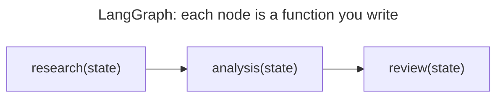
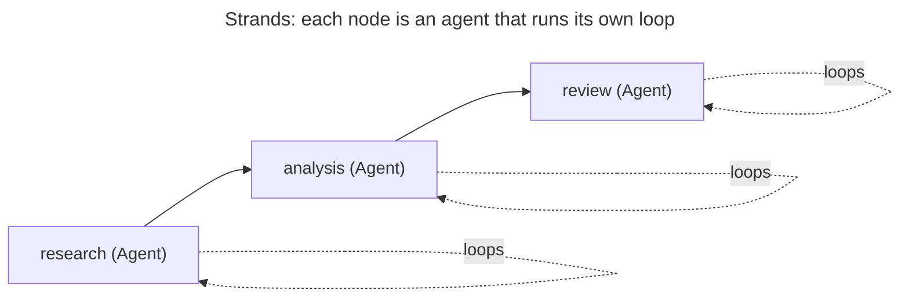
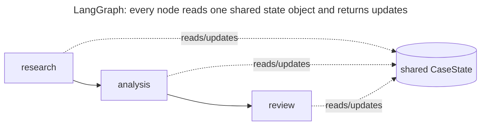
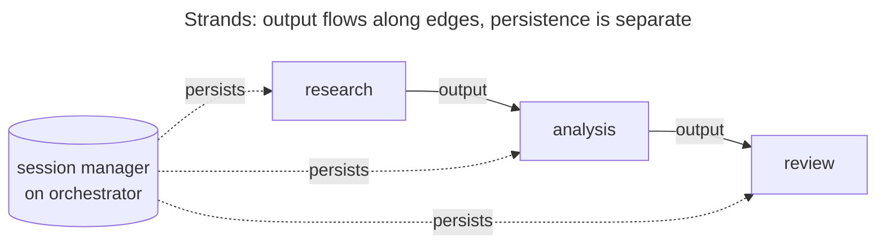
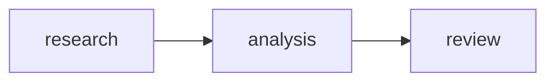

If you currently have a LangGraph application, you can migrate it to Strands Agents without rewriting your callers, and with conversation state that persists and resumes the same way.

This guide maps the two models concept for concept, then migrates a small example graph (three stages that research, analyze, and review a request) from its LangGraph form to a Strands equivalent. You'll keep the same public entrypoint and external IDs, but also have interrupts, run limits, and traces flowing to an existing OpenTelemetry backend.

This guide assumes you are comfortable with LangGraph's `StateGraph` and checkpointer model. For the Strands graph model itself, read the [Graph pattern](../sdk/multi-agent/graph.md) first.

## How LangGraph concepts map to Strands

A LangGraph agent is built from a few moving parts, and the migration maps each one onto its Strands counterpart. The sections that follow walk through the important changes to be aware of, ending with a full comparison table.

To start, it's important to internalize two key differences about the graph before you port anything: what a node is, and where state lives.

### A node is an agent, not a function

In LangGraph a node is a plain function you write. It takes the state, does one thing (call a model, transform data, check a condition), returns an update, and control goes back to the graph. The reasoning, if any, is code you wrote.



In Strands a node is an agent that runs its own agent loop. When the node executes it can reason, call tools, and iterate until it's done, all on its own, before handing off to the next node. A single Strands node therefore contains the kind of loop you would have written inside a LangGraph function.



The practical rule when migrating: a LangGraph node that called a model becomes an agent, and a node that only did deterministic work (validating input, reshaping state) becomes a custom node, so you don't wrap pure logic in an unnecessary agent loop.

### State is passed along edges, not shared

State works differently. In LangGraph you define one shared state object, and every node reads from it and returns a partial update that a reducer merges back in. State is a single structure threaded through the entire graph, and the checkpointer snapshots that structure to persist it.



Strands has no shared state object. Each node passes its output to the nodes that depend on it, and conversation state is persisted separately by a session manager attached to the orchestrator. Instead of one graph-wide state dict, each agent holds its own conversation, and the session manager handles persistence and resumption across runs.



Practically, you stop modeling state as one big typed object and let each agent carry its own context. The cutover is clean: your public entrypoint and external IDs stay the same, and there's no checkpoint format to translate, since the session manager rebuilds state as runs execute. Any in-flight conversation from the old system simply re-creates on its next call under the same ID.

:::note[Note]
Once your graph has a join (a node with more than one incoming edge), the Strands Harness SDK behaves differently depending on the language. The Python SDK uses OR semantics, firing a node when any single incoming edge completes; TypeScript uses AND semantics, waiting for all incoming edges.
:::

With those in mind, most other LangGraph concepts have a direct Strands counterpart.

| Concept | LangGraph | Strands |
| --- | --- | --- |
| Graph construction | `StateGraph`, `add_node`, `add_edge`, `add_conditional_edges` | <Syntax py="GraphBuilder" ts="new Graph({ nodes, edges })" /> |
| Entry point | `set_entry_point`, edge from `START` | <Syntax py="set_entry_point()" ts="sources" /> |
| Persistence | Checkpointer (`SqliteSaver`, `MemorySaver`) | session manager on the orchestrator |
| Human-in-the-loop | `interrupt()`, `interrupt_before` | interrupts raised from a hook or a tool |
| Run limits | `recursion_limit` | invocation limits plus node caps (<Syntax py="set_max_node_executions()" ts="maxSteps" />) |
| Streaming | `.stream()`, `astream_events` | <Syntax py="stream_async()" ts="stream()" /> |
| Tracing | LangSmith | OpenTelemetry via <Syntax py="StrandsTelemetry" ts="setupTracer()" /> |


## Set up the Strands Harness SDK

Before starting the migration, install the SDK:

<Tabs>
<Tab label="Python">

```bash
pip install strands-agents
```
</Tab>
<Tab label="TypeScript">

```bash
npm install @strands-agents/sdk
```
</Tab>
</Tabs>

## Migrating an example graph

The example for this guide is a small three-stage graph for handling a case: a research stage that gathers the facts, an analysis stage that weighs the options, and a review stage that recommends a decision. Each stage feeds the next. It is deliberately linear so the migration stays easy to follow, and the shape is the same in both frameworks.



The LangGraph version wires three node functions into a `StateGraph` and compiles it with a checkpointer, keyed per case by `thread_id`:

```python {34,36}
import sqlite3
from typing import TypedDict

from langgraph.checkpoint.sqlite import SqliteSaver
from langgraph.graph import END, START, StateGraph


class CaseState(TypedDict):
    prompt: str
    research: str
    analysis: str
    review: str


def research(state: CaseState) -> dict: ...
def analysis(state: CaseState) -> dict: ...
def review(state: CaseState) -> dict: ...


builder = StateGraph(CaseState)
builder.add_node("research", research)
builder.add_node("analysis", analysis)
builder.add_node("review", review)
builder.add_edge(START, "research")
builder.add_edge("research", "analysis")
builder.add_edge("analysis", "review")
builder.add_edge("review", END)

conn = sqlite3.connect("cases.db", check_same_thread=False)
graph = builder.compile(checkpointer=SqliteSaver(conn))


# Entrypoint: this signature is what your callers use, and it stays the same
def run_case(case_id: str, prompt: str):
    # External ID: case_id keys the conversation, and carries over unchanged
    config = {"configurable": {"thread_id": case_id}}
    return graph.invoke({"prompt": prompt}, config)
```

Those last two lines are important, and migrating without breaking your callers means holding both of them stable while you swap the internals:

1. Entrypoint: keep the function your callers invoke unchanged. `run_case(case_id, prompt)` keeps that exact signature, and only its body changes. Nothing that calls it has to change.

2. External ID: keep the ID you use to resume a conversation the same. Both frameworks need an ID to recognize that a run belongs to an existing conversation so it can pick up where it left off. LangGraph calls this a `thread_id`; Strands calls it a session ID. Pass the same `case_id` you gave LangGraph to Strands as the session ID, and each conversation keeps resuming correctly after the migration.

The Strands version keeps `run_case(case_id, prompt)` intact. Each node becomes
an agent with a system prompt, the edges stay the same, and the checkpointer
becomes a session manager keyed by the case ID:

<Tabs>
<Tab label="Python">

```python {6,21}
--8<-- "user-guide/migrate/langgraph_imports.py:graph_migrated_imports"

--8<-- "user-guide/migrate/langgraph.py:graph_migrated"
```
</Tab>
<Tab label="TypeScript">

```typescript
--8<-- "user-guide/migrate/langgraph_imports.ts:graph_migrated_imports"

--8<-- "user-guide/migrate/langgraph.ts:graph_migrated"
```
</Tab>
</Tabs>

The result object reports the run status and the order in which nodes executed,
so you can assert the pipeline ran end to end. For conditional routing, replace an edge
with a condition function, the equivalent of LangGraph's
`add_conditional_edges`. For more information, see the [conditional edges documentation](../sdk/multi-agent/graph.md#conditional-edges).

## Managing state and persistence

LangGraph's checkpointer serializes the shared state object per super-step. A
Strands session manager persists the agent's conversation history and state
instead. There is no checkpoint data to migrate: on the next call with the same
session ID, the
session manager restores the prior conversation and the graph continues from
there. Point the new session store at a fresh location and let it rebuild state
as cases run, rather than translating the old checkpoint format.

The session manager attaches to the orchestrator only. Agents inside the graph
must not carry their own session manager.

In the migrated example above, persistence was the one thing attached to the
graph itself:

<Tabs>
<Tab label="Python">

```python
builder.set_session_manager(
    FileSessionManager(session_id=case_id, storage_dir="./cases/")
)
```

Attach a `FileSessionManager` or `S3SessionManager` to the graph with
`set_session_manager`. The recommended single-agent `SnapshotSessionManager`
does **not** support graphs and raises `NotImplementedError` if you attach it to
one, so graphs use the repository-based managers.
</Tab>
<Tab label="TypeScript">

```typescript
const graph = new Graph({
  // ...nodes, edges, and sources
  sessionManager: new SessionManager({
    sessionId: caseId,
    storage: new LocalFileStorage('./cases/'),
  }),
})
```

One `SessionManager` covers both single agents and orchestrators, and it is
passed to the graph through the `sessionManager` field.
</Tab>
</Tabs>

Both SDKs persist through a pluggable storage backend, and neither takes a
distributed lock. The built-in stores overwrite unconditionally, so two writers
on the same session ID can overwrite each other's turns, the last write simply
wins, and neither call errors. Give each case its own session ID, run one live
writer per case, and add locking in the backend or the caller if concurrent
writers are possible. See
[Sessions, agents, and concurrency](../sdk/agents/session-management.md#sessions-agents-and-concurrency)
and [Storage](../sdk/storage.md) for backend configuration and tradeoffs.

## Add approval gates with interrupts

LangGraph pauses a run with `interrupt()` or `interrupt_before`. Strands raises
an interrupt from a hook or a tool, hands control back with the pending
interrupt, and resumes when you pass a response. To gate a node in a graph,
raise the interrupt from a `BeforeNodeCallEvent` hook and loop until the run
stops interrupting:

```python {16}
import json

from strands import Agent
from strands.hooks import BeforeNodeCallEvent, HookProvider, HookRegistry
from strands.multiagent import GraphBuilder, Status


class ReviewApproval(HookProvider):
    def register_hooks(self, registry: HookRegistry, **kwargs) -> None:
        registry.add_callback(BeforeNodeCallEvent, self.approve)

    def approve(self, event: BeforeNodeCallEvent) -> None:
        if event.node_id != "review":
            return
        # Pauses the run here and returns the caller's answer when it resumes
        approval = event.interrupt("review-approval", reason={"node": event.node_id})
        if approval.lower() != "y":
            event.cancel_node = "Reviewer declined to proceed"


builder = GraphBuilder()
builder.add_node(Agent(name="analysis"), "analysis")
builder.add_node(Agent(name="review"), "review")
builder.add_edge("analysis", "review")
builder.set_entry_point("analysis")
builder.set_hook_providers([ReviewApproval()])
graph = builder.build()

result = graph("Assess the tenant dispute in the record.")
while result.status == Status.INTERRUPTED:
    responses = []
    for interrupt in result.interrupts:
        answer = input(f"Approve {interrupt.reason['node']}? (y/N): ")
        responses.append(
            {"interruptResponse": {"interruptId": interrupt.id, "response": answer}}
        )
    result = graph(responses)

print(json.dumps(result.results["review"].result.message, indent=2))
```

TypeScript follows the same shape. You raise from a `BeforeNodeCallEvent` hook,
check for the interrupted status, and resume with the responses. However the API
differs in a few areas: hooks attach via `graph.addHook()` rather than a
`HookProvider`, `event.interrupt()` takes an options object, cancelling a node is
`event.cancel`, and responses resume through `graph.invoke()` as
`InterruptResponseContent` instances. For runnable examples in both languages,
see [Interrupts in multi-agent systems](../sdk/interrupts-multi-agent.md).

## Bound a run

LangGraph caps work with `recursion_limit`. Strands splits this into two
controls. Node caps bound the orchestrator: set
<Syntax py="set_max_node_executions()" ts="maxSteps" /> on the graph to stop
runaway loops. Invocation limits bound a single agent call. Pass a budget for
turns, output tokens, and total tokens. These are checked at turn boundaries
rather than mid-response, so treat them as soft ceilings: tools already in
flight finish, and a run can overshoot its token budget by one turn.

<Tabs>
<Tab label="Python">

```python
from strands import Agent

agent = Agent()

result = agent(
    "Summarize the case file",
    limits={"turns": 5, "output_tokens": 2000, "total_tokens": 10000},
)

if result.stop_reason == "limit_turns":
    print("Hit turn budget")
elif result.stop_reason == "limit_output_tokens":
    print("Hit output budget")
elif result.stop_reason == "limit_total_tokens":
    print("Hit token budget")
```
</Tab>
<Tab label="TypeScript">

```typescript
--8<-- "user-guide/migrate/langgraph_imports.ts:limits_imports"

--8<-- "user-guide/migrate/langgraph.ts:limits"
```
</Tab>
</Tabs>

To stop a run from outside, such as on a client disconnect or a timeout, pass a
cancellation signal:

<Tabs>
<Tab label="Python">

```python
import threading

from strands import Agent

agent = Agent()

cancel_signal = threading.Event()
threading.Timer(30.0, cancel_signal.set).start()  # fire the signal after 30s to act as a timeout

result = agent("Assess the case file", cancel_signal=cancel_signal)

if result.stop_reason == "cancelled":
    print("Run cancelled: exceeded time budget")
```
</Tab>
<Tab label="TypeScript">

```typescript
--8<-- "user-guide/migrate/langgraph_imports.ts:cancellation_imports"

--8<-- "user-guide/migrate/langgraph.ts:cancellation"
```
</Tab>
</Tabs>

Every result carries a typed <Syntax py="result.stop_reason" ts="result.stopReason" />
that tells you why the run ended, so you can branch instead of parsing text.
Beyond the limit and cancellation values above, common reasons include
<Syntax py="end_turn" ts="endTurn" /> (the agent finished),
<Syntax py="max_tokens" ts="maxTokens" /> (a single response was truncated), and
<Syntax py="guardrail_intervened" ts="guardrailIntervened" />. The limit stop
reasons signal graceful budget exhaustion: the message history stays valid, so
you can reinvoke with a higher budget. A single model response that overshoots
the token limit instead raises <Syntax py="MaxTokensReachedException" ts="MaxTokensError" />.
See [Stop reasons](../sdk/agents/agent-loop.md#stop-reasons).

## Tracing

If your LangGraph app reports to LangSmith, point Strands at the same
OpenTelemetry backend instead. Strands emits spans predominantly under the
OpenTelemetry GenAI semantic conventions (`gen_ai.*`), so any OTLP-compatible
collector receives them.

Install the tracing dependencies:

<Tabs>
<Tab label="Python">

```bash
pip install 'strands-agents[otel]'
```
</Tab>
<Tab label="TypeScript">

```bash
npm install @opentelemetry/api @opentelemetry/sdk-trace-node @opentelemetry/sdk-trace-base @opentelemetry/resources @opentelemetry/exporter-trace-otlp-http
```
</Tab>
</Tabs>

Point the exporter at your collector with the standard OpenTelemetry variables,
the same ones a LangSmith OTLP setup uses:

```bash
export OTEL_EXPORTER_OTLP_ENDPOINT="http://collector.example.com:4318"
export OTEL_EXPORTER_OTLP_HEADERS="key1=value1,key2=value2"
```

Register a tracer provider once at startup. Tracing then turns on
automatically, and per-agent attributes ride along on every span:

<Tabs>
<Tab label="Python">

```python
from strands import Agent
from strands.telemetry import StrandsTelemetry

telemetry = StrandsTelemetry()
telemetry.setup_otlp_exporter()     # export to your OTLP endpoint
telemetry.setup_console_exporter()  # print spans to the console

agent = Agent(
    system_prompt="You review casework.",
    trace_attributes={"case.id": "case-4127"},
)
```
</Tab>
<Tab label="TypeScript">

```typescript
--8<-- "user-guide/migrate/langgraph_imports.ts:telemetry_imports"

--8<-- "user-guide/migrate/langgraph.ts:telemetry"
```
</Tab>
</Tabs>

If a global tracer provider already exists in your process, Strands uses it and
you can skip the setup call. See [Traces](../sdk/observability-evaluation/traces.md)
for the full span structure and attribute list.

## Verify the migration

Before you cut over, confirm the port preserved behavior:

- **The public API is unchanged.** Callers invoke the same entrypoint with the
  same arguments and the same external IDs.
- **Resumption works.** Call the entrypoint twice with one case ID and confirm
  the second call restores the first call's conversation from the session store.
- **Transcripts are equivalent.** Run representative cases through both systems
  and compare outputs for parity. Responses are non-deterministic, so check that
  each stage does its job rather than expecting identical text.
- **Bounds hold.** Trip a turn or token limit and confirm the run stops with the
  expected stop reason instead of running away.
- **Traces arrive.** Run one case and confirm spans reach your collector with the
  attributes you attached.
