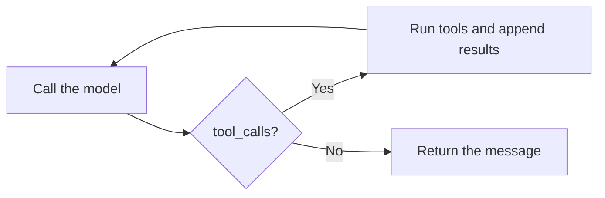

If you build on OpenAI today, you are in one of two places: you wrote your own
loop over the OpenAI SDK (`chat.completions` or the Responses API), or you use the
OpenAI Agents SDK. This guide moves either one to Strands Agents without changing
which model you call or where your API key lives, and without rewriting your
callers.

Both migrations keep OpenAI as the model provider through Strands'
[OpenAI provider](../sdk/model-providers/openai.md), so the model id, API
route, and key stay exactly as they are. What changes is the layer above the
model: the loop, tools, handoffs, and controls become first-class Strands APIs
instead of code you maintain.

## Keep your OpenAI models

Wrap your OpenAI model in the SDK's `OpenAIModel` provider and hand it to an
`Agent`. Your model id and API key stay exactly as they are:

<Tabs>
<Tab label="Python">

```python
# pip install 'strands-agents[openai]'
from strands import Agent
from strands.models.openai import OpenAIModel

agent = Agent(model=OpenAIModel(model_id="gpt-5.4"))
```
</Tab>
<Tab label="TypeScript">

```typescript
// npm install @strands-agents/sdk openai
import { Agent } from '@strands-agents/sdk'
import { OpenAIModel } from '@strands-agents/sdk/models/openai'

const agent = new Agent({ model: new OpenAIModel({ modelId: 'gpt-5.4' }) })
```
</Tab>
</Tabs>

Set your `OPENAI_API_KEY` in the environment. For the model id, provider options,
and the Responses API, see the
[OpenAI](../sdk/model-providers/openai.md) and
[OpenAI Responses](../sdk/model-providers/openai-responses.md) provider pages.

## From a hand-written OpenAI loop

The most common OpenAI app is a `while` loop around `chat.completions`: call the
model, check for `tool_calls`, run each tool, append the results to `messages`,
and call again until the model stops asking. You own the loop, the message
bookkeeping, and every control that wraps it.



Strands *is* that loop, tested and maintained. You describe the tools and the
model; the [agent loop](../sdk/agents/agent-loop.md) runs the
call-tool-append cycle for you and returns when the model is done.

### How the pieces map

| Hand-written loop | Strands |
| --- | --- |
| `client.chat.completions.create(...)` | the agent loop (<Syntax py="agent(...)" ts="agent.invoke(...)" />) |
| `tools=[...]` JSON schema you hand-write | <Syntax py="@tool" ts="tool()" /> from a typed function |
| `while` over `tool_calls`, dispatch by name | run automatically inside the loop |
| appending tool results to `messages` | managed conversation history |
| tracking `messages` across requests | a [session manager](../sdk/agents/session-management.md) |
| a turn counter to stop runaways | [invocation limits](../sdk/agents/agent-loop.md#invocation-limits) |

### Before: the OpenAI loop

A single-tool assistant, written directly against the OpenAI SDK:

```python
import json
from openai import OpenAI

client = OpenAI()

tools = [{
    "type": "function",
    "function": {
        "name": "get_weather",
        "description": "Get the weather for a city.",
        "parameters": {
            "type": "object",
            "properties": {"city": {"type": "string"}},
            "required": ["city"],
        },
    },
}]

def get_weather(city: str) -> str:
    return f"It's sunny in {city}."

def run(prompt: str) -> str:
    messages = [{"role": "user", "content": prompt}]
    while True:
        response = client.chat.completions.create(
            model="gpt-5.4", messages=messages, tools=tools,
        )
        message = response.choices[0].message
        messages.append(message)
        if not message.tool_calls:
            return message.content
        for call in message.tool_calls:
            args = json.loads(call.function.arguments)
            result = get_weather(**args)
            messages.append({
                "role": "tool", "tool_call_id": call.id, "content": result,
            })
```

### After: the Strands agent

The tool schema comes from the function's type hints and docstring, and the loop
is gone:

<Tabs>
<Tab label="Python">

```python
from strands import Agent, tool
from strands.models.openai import OpenAIModel


@tool
def get_weather(city: str) -> str:
    """Get the weather for a city."""
    return f"It's sunny in {city}."


agent = Agent(model=OpenAIModel(model_id="gpt-5.4"), tools=[get_weather])


def run(prompt: str) -> str:
    return str(agent(prompt))
```
</Tab>
<Tab label="TypeScript">

```typescript
import { Agent, tool } from '@strands-agents/sdk'
import { OpenAIModel } from '@strands-agents/sdk/models/openai'
import { z } from 'zod'

const getWeather = tool({
  name: 'get_weather',
  description: 'Get the weather for a city.',
  inputSchema: z.object({ city: z.string() }),
  callback: ({ city }) => `It's sunny in ${city}.`,
})

const agent = new Agent({
  model: new OpenAIModel({ modelId: 'gpt-5.4' }),
  tools: [getWeather],
})

async function run(prompt: string): Promise<string> {
  const result = await agent.invoke(prompt)
  return result.text
}
```
</Tab>
</Tabs>

Multi-turn conversations no longer mean threading a `messages` array through your
code. Attach a [session manager](../sdk/agents/session-management.md) and
reuse a session id to persist and resume history automatically.

## From the OpenAI Agents SDK

The OpenAI Agents SDK (`openai-agents`) already gives you agents, a runner,
handoffs, guardrails, and sessions. Strands has a counterpart for each, so the
migration is a rename of concepts rather than a redesign.

### How the concepts map

| OpenAI Agents SDK | Strands |
| --- | --- |
| `Agent(instructions=...)` | <Syntax py="Agent(system_prompt=...)" ts="new Agent({ systemPrompt })" /> |
| `Runner.run(agent, input)` | <Syntax py="agent(input)" ts="await agent.invoke(input)" /> |
| `@function_tool` | <Syntax py="@tool" ts="tool()" /> |
| `max_turns=` | invocation [limits](../sdk/agents/agent-loop.md#invocation-limits) (<Syntax py='limits={"turns": n}' ts='limits: {turns: n}' plain />) |
| `handoffs=[...]` | [agents as tools](../sdk/multi-agent/agents-as-tools.md) or a [swarm](../sdk/multi-agent/swarm.md) |
| `input_guardrails` / `output_guardrails` | [interventions](../sdk/agents/interventions/index.md) |
| `RunHooks` / `AgentHooks` | [hook events](../sdk/agents/hooks.md) |
| `SQLiteSession` | a [session manager](../sdk/agents/session-management.md) |
| Built-in tracing (OpenAI dashboard) | [OpenTelemetry](../sdk/observability-evaluation/traces.md) |

### Before: an Agents SDK app with a handoff

A triage agent that hands off to a specialist, guarded on input:

```python
from agents import (
    Agent, Runner, function_tool, input_guardrail,
    GuardrailFunctionOutput,
)


@function_tool
def search_docs(query: str) -> str:
    """Search the product docs."""
    return f"results for {query}"


@input_guardrail
def block_pii(ctx, agent, user_input):
    tripped = "ssn" in user_input.lower()
    return GuardrailFunctionOutput(output_info=None, tripwire_triggered=tripped)


support = Agent(name="support", instructions="Answer product questions.",
                tools=[search_docs])
triage = Agent(name="triage", instructions="Route the user to the right agent.",
               handoffs=[support], input_guardrails=[block_pii])

result = Runner.run_sync(triage, "How do I reset my password?", max_turns=8)
print(result.final_output)
```

### After: the Strands version

A handoff becomes a specialist agent passed in as a tool; the input guardrail
becomes an intervention; `max_turns` becomes a turn limit:

<Tabs>
<Tab label="Python">

```python
from strands import Agent, tool
from strands.models.openai import OpenAIModel
from strands.vended_interventions.hitl import HumanInTheLoop


@tool
def search_docs(query: str) -> str:
    """Search the product docs."""
    return f"results for {query}"


support = Agent(
    name="support",
    description="Answers product questions using the docs.",
    system_prompt="Answer product questions.",
    tools=[search_docs],
)

triage = Agent(
    model=OpenAIModel(model_id="gpt-5.4"),
    system_prompt="Route the user to the right specialist.",
    tools=[support],  # the specialist agent becomes a callable tool
    interventions=[HumanInTheLoop(ask="stdio")],  # approve tool calls before they run
)

result = triage("How do I reset my password?", limits={"turns": 8})
print(result)
```
</Tab>
<Tab label="TypeScript">

```typescript
import { Agent, tool } from '@strands-agents/sdk'
import { OpenAIModel } from '@strands-agents/sdk/models/openai'
import { HumanInTheLoop } from '@strands-agents/sdk/vended-interventions/hitl'
import { z } from 'zod'

const searchDocs = tool({
  name: 'search_docs',
  description: 'Search the product docs.',
  inputSchema: z.object({ query: z.string() }),
  callback: ({ query }) => `results for ${query}`,
})

const support = new Agent({
  name: 'support',
  description: 'Answers product questions using the docs.',
  systemPrompt: 'Answer product questions.',
  tools: [searchDocs],
})

const triage = new Agent({
  model: new OpenAIModel({ modelId: 'gpt-5.4' }),
  systemPrompt: 'Route the user to the right specialist.',
  tools: [support], // the specialist agent becomes a callable tool
  interventions: [new HumanInTheLoop({ ask: 'stdio' })], // approve tool calls before they run
})

const result = await triage.invoke('How do I reset my password?', { limits: { turns: 8 } })
console.log(result.text)
```
</Tab>
</Tabs>

Two mapping notes worth calling out:

- **Handoffs vs. agents as tools.** The Agents SDK transfers control of the
  conversation to the target agent. Passing a specialist agent in `tools` keeps
  the router in control and treats the specialist as a callable. For a true transfer of control,
  use a [swarm](../sdk/multi-agent/swarm.md); to compose specialists directly
  on the SDK, see [agents as tools](../sdk/multi-agent/agents-as-tools.md).
- **Guardrails vs. interventions.** An Agents SDK guardrail is a tripwire that
  aborts the run. A Strands [intervention](../sdk/agents/interventions/index.md)
  is richer: it can deny, guide, transform, or ask a human before a tool runs.
  Use `HumanInTheLoop` for approval gates, or write a handler for
  deterministic policy.

### Pick the OpenAI Agents SDK when

Migration is not always the right call. Stay on the Agents SDK when you are
all-in on OpenAI and want the tightest integration with its platform: built-in
tracing in the OpenAI dashboard, the hosted tools (web search, file search,
computer use), and Realtime voice agents. Strands earns its place when you want
model portability across providers, one agent core in both Python and
TypeScript, or the broader control surface (interventions, OpenTelemetry, graphs
and swarms). The
[choosing an agent foundation](./choosing-an-agent-foundation.md)
guide lays out the tradeoff in full.

## Verify the migration

Before you cut over, confirm the port preserved behavior:

- **The model is unchanged.** Same OpenAI model (your `openai/...` string), same
  API key, same API route (Chat Completions or Responses).
- **The public API is unchanged.** Callers invoke the same entrypoint with the
  same arguments.
- **Tools behave identically.** Each tool receives the same arguments and returns
  the same results as its hand-written or `@function_tool` version.
- **Bounds hold.** Trip a turn limit and confirm the run stops with a typed
  [stop reason](../sdk/agents/agent-loop.md#stop-reasons) instead of running
  away, in place of the loop's turn counter or `max_turns`.
- **Transcripts are equivalent.** Run representative prompts through both systems
  and compare. Responses are non-deterministic, so check that each tool fires and
  the answer is on-task rather than expecting identical text.
