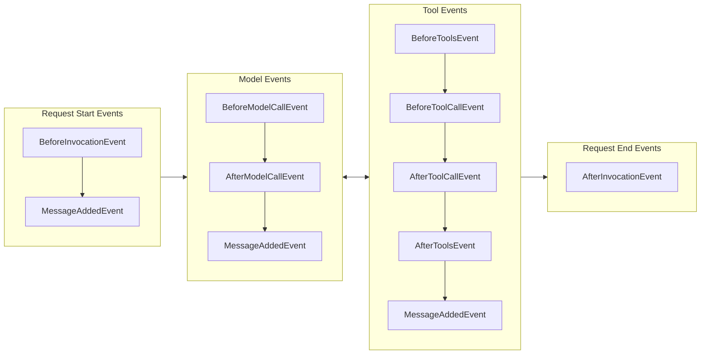
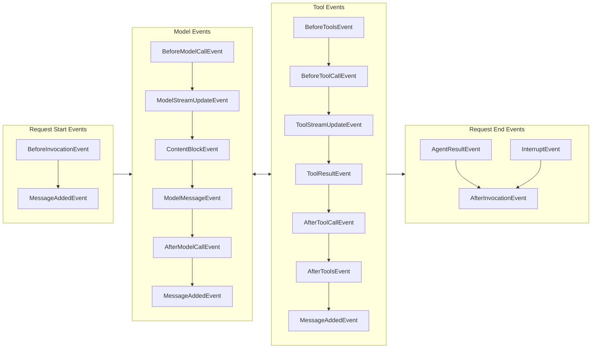
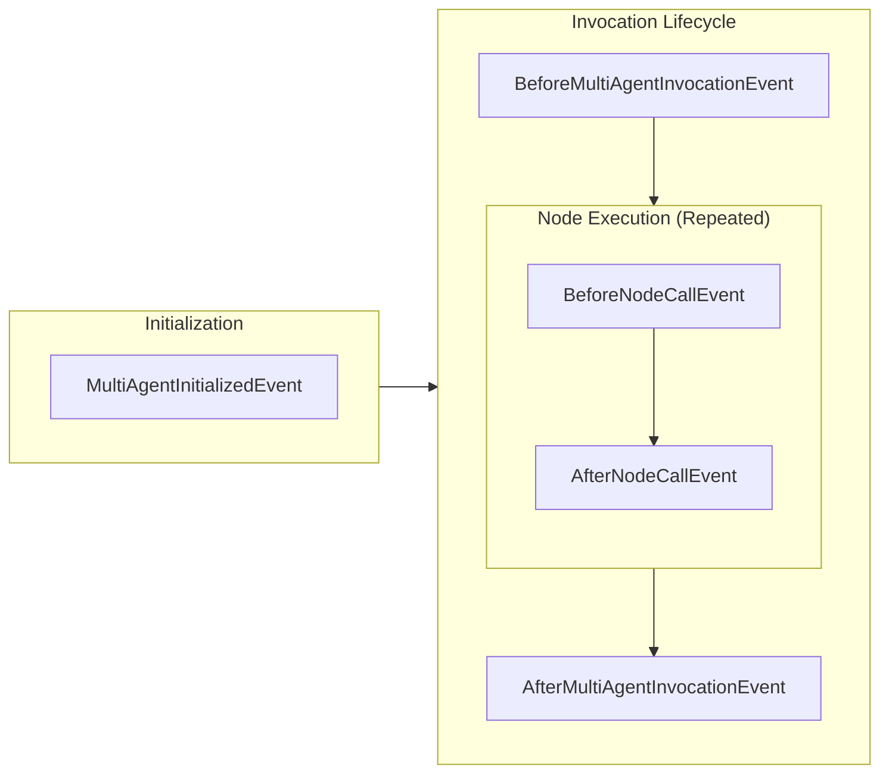
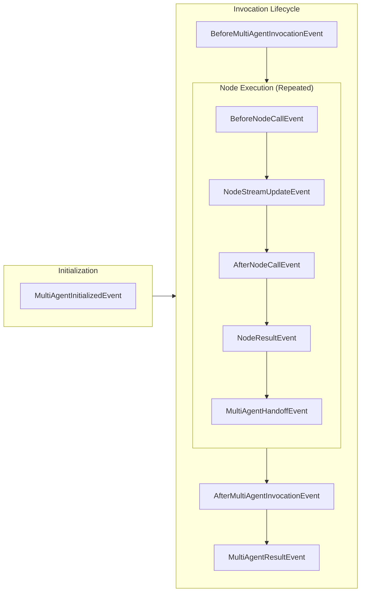

A hook callback subscribes to a specific event type and runs when that event fires during agent execution. This page is the reference for every event: when each one fires across the lifecycle, the full catalogue of event types, and which properties you can modify to change agent behavior. To write and register a callback, see [Hooks](hooks.md).

## Hook Event Lifecycle

### Single-Agent Lifecycle

The following diagram shows when hook events are emitted during a typical agent invocation where tools are invoked:

<Tabs>
<Tab label="Python">

</Tab>
<Tab label="TypeScript">

</Tab>
</Tabs>

### Multi-Agent Lifecycle

The following diagram shows when multi-agent hook events are emitted during orchestrator execution:

<Tabs>
<Tab label="Python">

</Tab>
<Tab label="TypeScript">

</Tab>
</Tabs>

### Available Events

<Tabs>
<Tab label="Python">

| Event                              | Description                                                                                                   |
|------------------------------------|---------------------------------------------------------------------------------------------------------------|
| `AgentInitializedEvent`            | Triggered when an agent has been constructed and finished initialization at the end of the agent constructor. |
| `BeforeInvocationEvent`            | Triggered at the beginning of a new agent invocation request                                                  |
| `AfterInvocationEvent`             | Triggered at the end of an agent request, regardless of success or failure. Uses reverse callback ordering    |
| `MessageAddedEvent`                | Triggered when a message is added to the agent's conversation history                                         |
| `BeforeModelCallEvent`             | Triggered before the model is invoked for inference                                                           |
| `AfterModelCallEvent`              | Triggered after model invocation completes. Uses reverse callback ordering                                    |
| `BeforeToolsEvent`                 | Triggered before tools are executed in a batch                                                                |
| `BeforeToolCallEvent`              | Triggered before a tool is invoked                                                                            |
| `AfterToolCallEvent`               | Triggered after tool invocation completes. Uses reverse callback ordering                                     |
| `AfterToolsEvent`                  | Triggered after tools are executed in a batch. Uses reverse callback ordering                                 |
| `MultiAgentInitializedEvent`       | Triggered when multi-agent orchestrator is initialized                                                        |
| `BeforeMultiAgentInvocationEvent`  | Triggered before orchestrator execution starts                                                                |
| `AfterMultiAgentInvocationEvent`   | Triggered after orchestrator execution completes. Uses reverse callback ordering                              |
| `BeforeNodeCallEvent`              | Triggered before individual node execution starts                                                             |
| `AfterNodeCallEvent`               | Triggered after individual node execution completes. Uses reverse callback ordering                           |
</Tab>
<Tab label="TypeScript">

All events extend `HookableEvent`, making them both streamable via `agent.stream()` and subscribable via hook callbacks.

| Event                    | Description                                                                                                   |
|--------------------------|---------------------------------------------------------------------------------------------------------------|
| `AgentInitializedEvent`  | Triggered when an agent has been constructed and finished initialization at the end of the agent constructor. |
| `BeforeInvocationEvent`  | Triggered at the beginning of a new agent invocation request                                                  |
| `AfterInvocationEvent`   | Triggered at the end of an agent request, regardless of success or failure. Uses reverse callback ordering    |
| `MessageAddedEvent`      | Triggered when a message is added to the agent's conversation history                                         |
| `BeforeModelCallEvent`   | Triggered before the model is invoked for inference                                                           |
| `AfterModelCallEvent`    | Triggered after model invocation completes. Uses reverse callback ordering                                    |
| `ModelStreamUpdateEvent` | Wraps each transient streaming delta from the model during inference. Access via `.event`                     |
| `ContentBlockEvent`      | Wraps a fully assembled content block (TextBlock, ToolUseBlock, ReasoningBlock). Access via `.contentBlock`   |
| `ModelMessageEvent`      | Wraps the complete model message after all blocks are assembled. Access via `.message`                        |
| `BeforeToolCallEvent`    | Triggered before a tool is invoked                                                                            |
| `AfterToolCallEvent`     | Triggered after tool invocation completes. Uses reverse callback ordering                                     |
| `BeforeToolsEvent`       | Triggered before tools are executed in a batch                                                                |
| `AfterToolsEvent`        | Triggered after tools are executed in a batch. Uses reverse callback ordering                                 |
| `ToolStreamUpdateEvent`  | Wraps streaming progress events from tool execution. Access via `.event`                                      |
| `ToolResultEvent`        | Wraps a completed tool result. Access via `.result`                                                           |
| `AgentResultEvent`       | Wraps the final agent result at the end of the invocation. Access via `.result`                               |
| `InterruptEvent`         | Fires once per unanswered interrupt when the agent halts to wait for responses. Access via `.interrupt`       |
| `MultiAgentInitializedEvent`       | Triggered when a multi-agent orchestrator has finished initialization                                |
| `BeforeMultiAgentInvocationEvent`  | Triggered before orchestrator execution starts                                                       |
| `AfterMultiAgentInvocationEvent`   | Triggered after orchestrator execution completes. Uses reverse callback ordering                     |
| `BeforeNodeCallEvent`              | Triggered before individual node execution starts                                                    |
| `NodeStreamUpdateEvent`            | Wraps an inner streaming event from a node with the node's identity. Access via `.event`             |
| `NodeCancelEvent`                  | Triggered when a node is cancelled via `BeforeNodeCallEvent.cancel`                                  |
| `AfterNodeCallEvent`               | Triggered after individual node execution completes. Uses reverse callback ordering                  |
| `NodeResultEvent`                  | Wraps a completed node result. Access via `.result`                                                  |
| `MultiAgentHandoffEvent`           | Triggered when execution transitions between nodes                                                   |
| `MultiAgentResultEvent`            | Wraps the final multi-agent result at the end of orchestration. Access via `.result`                 |
</Tab>
</Tabs>

## Event Properties

Most event properties are read-only to prevent unintended modifications. However, certain properties can be modified to influence agent behavior:

<Tabs>
<Tab label="Python">

- [`BeforeInvocationEvent`](@api/python/strands.hooks.events#BeforeInvocationEvent)
    - `messages` - Mutable. Inspect, modify, replace, or remove the normalized input
      messages before they enter conversation history. `None` when fired from
      `structured_output`. See
      [Modify invocation messages](hooks.md#modify-invocation-messages).

- [`AfterModelCallEvent`](@api/python/strands.hooks.events#AfterModelCallEvent)
    - `retry` - Request a retry of the model invocation. See [Model Call Retry](hooks.md#model-call-retry).

- [`BeforeToolsEvent`](@api/python/strands.hooks.events#BeforeToolsEvent)
    - `cancel` - Cancel all tool calls in the batch with a message. See [Limit Tool Counts](hooks.md#limit-tool-counts).

- [`BeforeToolCallEvent`](@api/python/strands.hooks.events#BeforeToolCallEvent)
    - `cancel_tool` - Cancel tool execution with a message. See [Limit Tool Counts](hooks.md#limit-tool-counts).
    - `selected_tool` - Replace the tool to be executed. See [Tool Interception](hooks.md#tool-interception).
    - `tool_use` - Modify tool parameters before execution. See [Fixed Tool Arguments](hooks.md#fixed-tool-arguments).

- [`AfterToolCallEvent`](@api/python/strands.hooks.events#AfterToolCallEvent)
    - `result` - Modify the tool result. See [Result Modification](hooks.md#result-modification).
    - `retry` - Request a retry of the tool invocation. See [Tool Call Retry](hooks.md#tool-call-retry).
    - `exception` *(read-only)* - The original exception if the tool raised one, otherwise `None`. See [Exception Handling](hooks.md#exception-handling).

- [`AfterToolsEvent`](@api/python/strands.hooks.events#AfterToolsEvent)
    - `end_turn` - Halt the agent loop after the tool batch without calling the model again. Set `True` for a default final assistant message, a string to use as the final assistant message, or a list of content blocks to use as the final assistant message content directly. The returned result has `stop_reason="end_turn"`.

- [`AfterInvocationEvent`](@api/python/strands.hooks.events#AfterInvocationEvent)
    - `resume` - Trigger a follow-up agent invocation with new input. See [Invocation resume](hooks.md#invocation-resume).

</Tab>
<Tab label="TypeScript">

- [`BeforeInvocationEvent`](@api/typescript/BeforeInvocationEvent)
    - `messages` - Mutable. Inspect, modify, replace, or remove the normalized input
      messages before they enter conversation history. See
      [Modify invocation messages](hooks.md#modify-invocation-messages).
    - `cancel` - Cancel the agent invocation with a message.

- `BeforeModelCallEvent`
    - `cancel` - Cancel the model call with a message.

- `BeforeToolsEvent`
    - `cancel` - Cancel all tool calls in a batch with a message. See [Limit Tool Counts](hooks.md#limit-tool-counts).

- `BeforeToolCallEvent`
    - `cancel` - Cancel tool execution with a message. See [Limit Tool Counts](hooks.md#limit-tool-counts).
    - `selectedTool` - Replace the tool to be executed with a different `Tool` instance. See [Tool Interception](hooks.md#tool-interception).
    - `toolUse` - Mutable. Rewrite `name`, `toolUseId`, or `input` before execution. Renaming `name` re-resolves the tool from the registry when `selectedTool` is not set. See [Fixed Tool Arguments](hooks.md#fixed-tool-arguments).

- `AfterModelCallEvent`
    - `retry` - Request a retry of the model invocation.

- `AfterToolCallEvent`
    - `retry` - Request a retry of the tool invocation.
    - `result` - Mutable. Rewrite the `ToolResultBlock` before it propagates to the model. See [Result Modification](hooks.md#result-modification).

- `AfterToolsEvent`
    - `endTurn` - Halt the agent loop after the tool batch without calling the model again. Set `true` for a default final assistant message, a string to use as the final assistant message, or a list of content blocks to use as the final assistant message content directly. The returned result has `stopReason="endTurn"`.

- `AfterInvocationEvent`
    - `resume` - Trigger a follow-up agent invocation with new input. Setting it re-enters the agent loop under the same invocation lock. See [Invocation resume](hooks.md#invocation-resume).
</Tab>
</Tabs>

## Next Steps

- Write and register a callback against any of these events in [Hooks](hooks.md).
- Bundle several callbacks together with [Plugins](../plugins/index.md).
- See the Agent API Reference for complete method documentation: [Python](@api/python/strands.agent.agent) | [TypeScript](@api/typescript/Agent)
