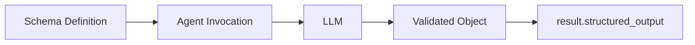
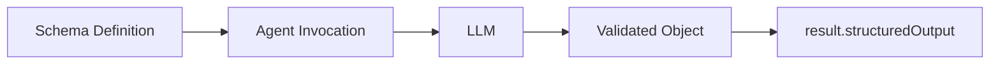

Use structured output when your application needs an object with specific fields.
Define a schema, pass it to the agent, and read the validated object from the result.

<Tabs>
<Tab label="Python">



</Tab>
<Tab label="TypeScript">



</Tab>
</Tabs>

## Basic Usage

To request structured output, pass a schema with
<Syntax py="structured_output_model" ts="structuredOutputSchema" />.
Read the validated object from
<Syntax py="result.structured_output" ts="result.structuredOutput" />.

<Tabs>
<Tab label="Python">

Define the output fields with a
[Pydantic model](https://docs.pydantic.dev/latest/concepts/models/):

```python
from pydantic import BaseModel, Field
from strands import Agent


class PersonInfo(BaseModel):
    name: str = Field(description="Name of the person")
    age: int = Field(description="Age of the person")
    occupation: str = Field(description="Occupation of the person")


agent = Agent()
result = agent(
    "John Smith is a 30 year-old software engineer",
    structured_output_model=PersonInfo
)

person_info: PersonInfo = result.structured_output
print(person_info.model_dump_json(indent=2))
```

Example output:

```json
{
  "name": "John Smith",
  "age": 30,
  "occupation": "software engineer"
}
```

For async code, pass `structured_output_model` to `await agent.invoke_async(...)`.

<div id="migration-from-legacy-api">

**Migrating from deprecated methods:** Pass `structured_output_model` to the
agent invocation instead of calling `Agent.structured_output()` or
`Agent.structured_output_async()`. Read the model from `result.structured_output`.

</div>
</Tab>
<Tab label="TypeScript">

Define the output fields with a [Zod schema](https://zod.dev/) for runtime
validation and type inference:

```typescript
--8<-- "user-guide/sdk/agents/structured-output_imports.ts:basic_usage_imports"

--8<-- "user-guide/sdk/agents/structured-output.ts:basic_usage"
```

Example output:

```json
{
  "name": "John Smith",
  "age": 30,
  "occupation": "software engineer"
}
```

</Tab>
</Tabs>

## How It Works

Structured output converts your schema into a tool specification that guides the model toward a correctly formatted response. Every model provider Strands supports works with structured output.

Strands accepts the <Syntax py="structured_output_model" ts="structuredOutputSchema" /> parameter in agent invocations, which manages the conversion, validation, and response processing automatically. The validated result is available in the <Syntax py="AgentResult.structured_output" ts="AgentResult.structuredOutput" /> field.


## Error Handling

When structured output validation fails, Strands throws a custom exception that can be caught and handled appropriately:

<Tabs>
<Tab label="Python">

```python
from pydantic import ValidationError
from strands.types.exceptions import StructuredOutputException

try:
    result = agent(prompt, structured_output_model=MyModel)
except StructuredOutputException as e:
    print(f"Structured output failed: {e}")
```
</Tab>
<Tab label="TypeScript">

```typescript
--8<-- "user-guide/sdk/agents/structured-output.ts:error_handling"
```
</Tab>
</Tabs>

## Best Practices

- **Keep schemas focused**: Define specific schemas for clear purposes
- **Use descriptive field names**: Include helpful descriptions with field metadata
- **Handle errors gracefully**: Implement proper error handling strategies with fallbacks

## Related Documentation

<Tabs>
<Tab label="Python">

- [Models and schema definition](https://docs.pydantic.dev/latest/concepts/models/)
- [Field types and constraints](https://docs.pydantic.dev/latest/concepts/fields/)
- [Custom validators](https://docs.pydantic.dev/latest/concepts/validators/)

</Tab>
<Tab label="TypeScript">

- [Zod documentation](https://zod.dev/)
- [Schema types](https://zod.dev/?id=primitives)
- [Schema methods](https://zod.dev/?id=strings)

</Tab>
</Tabs>

## Cookbook

### Auto Retries with Validation

Automatically retry validation when initial extraction fails due to schema validation:

<Tabs>
<Tab label="Python">

```python
from strands.agent import Agent
from pydantic import BaseModel, field_validator


class Name(BaseModel):
    first_name: str

    @field_validator("first_name")
    @classmethod
    def validate_first_name(cls, value: str) -> str:
        if not value.endswith('abc'):
            raise ValueError("You must append 'abc' to the end of my name")
        return value


agent = Agent()
result = agent("What is Aaron's name?", structured_output_model=Name)
```
</Tab>
<Tab label="TypeScript">

```typescript
--8<-- "user-guide/sdk/agents/structured-output.ts:auto_retries"
```
</Tab>
</Tabs>

### Streaming Structured Output

Stream agent execution while using structured output. The structured output is available in the final result:

<Tabs>
<Tab label="Python">

```python
from strands import Agent
from pydantic import BaseModel, Field

class WeatherForecast(BaseModel):
    """Weather forecast data."""
    location: str
    temperature: int
    condition: str
    humidity: int
    wind_speed: int
    forecast_date: str

streaming_agent = Agent()

async for event in streaming_agent.stream_async(
    "Generate a weather forecast for Seattle: 68°F, partly cloudy, 55% humidity, 8 mph winds, for tomorrow",
    structured_output_model=WeatherForecast
):
    if "data" in event:
        print(event["data"], end="", flush=True)
    elif "result" in event:
        print(f'The forecast for today is: {event["result"].structured_output}')
```
</Tab>
<Tab label="TypeScript">

```typescript
--8<-- "user-guide/sdk/agents/structured-output.ts:streaming"
```
</Tab>
</Tabs>

### Combining with Tools

Combine structured output with tool usage to format tool execution results:

<Tabs>
<Tab label="Python">

```python
from strands import Agent
from strands.vended_tools import notebook
from pydantic import BaseModel, Field

class NotesResult(BaseModel):
    notebook_name: str = Field(description="the notebook that was updated")
    item_count: int = Field(description="the number of items added")

tool_agent = Agent(
    tools=[notebook]
)
res = tool_agent(
    'Create a notebook named "ideas" and add three project ideas.',
    structured_output_model=NotesResult,
)
```
</Tab>
<Tab label="TypeScript">

```typescript
--8<-- "user-guide/sdk/agents/structured-output.ts:combining_tools"
```
</Tab>
</Tabs>

### Multiple Output Types

Reuse a single agent instance with different structured output schemas for varied extraction tasks:

<Tabs>
<Tab label="Python">

```python
from strands import Agent
from pydantic import BaseModel, Field
from typing import Optional

class Person(BaseModel):
    """A person's basic information"""
    name: str = Field(description="Full name")
    age: int = Field(description="Age in years", ge=0, le=150)
    email: str = Field(description="Email address")
    phone: Optional[str] = Field(description="Phone number", default=None)

class Task(BaseModel):
    """A task or todo item"""
    title: str = Field(description="Task title")
    description: str = Field(description="Detailed description")
    priority: str = Field(description="Priority level: low, medium, high")
    completed: bool = Field(description="Whether task is completed", default=False)


agent = Agent()
person_res = agent("Extract person: John Doe, 35, john@test.com", structured_output_model=Person)
task_res = agent("Create task: Review code, high priority, completed", structured_output_model=Task)
```
</Tab>
<Tab label="TypeScript">

```typescript
--8<-- "user-guide/sdk/agents/structured-output.ts:multiple_types"
```
</Tab>
</Tabs>

### Using Conversation History

Extract structured information from prior conversation context without repeating questions:

<Tabs>
<Tab label="Python">

```python
from strands import Agent
from pydantic import BaseModel
from typing import Optional

agent = Agent()

# Build up conversation context
agent("What do you know about Paris, France?")
agent("Tell me about the weather there in spring.")

class CityInfo(BaseModel):
    city: str
    country: str
    population: Optional[int] = None
    climate: str

# Extract structured information from the conversation
result = agent(
    "Extract structured information about Paris from our conversation",
    structured_output_model=CityInfo
)

print(f"City: {result.structured_output.city}")     # "Paris"
print(f"Country: {result.structured_output.country}") # "France"
```
</Tab>
<Tab label="TypeScript">

```typescript
--8<-- "user-guide/sdk/agents/structured-output.ts:conversation_history"
```
</Tab>
</Tabs>


### Agent-Level Defaults

You can also set a default structured output schema that applies to all agent invocations:

<Tabs>
<Tab label="Python">

```python
class PersonInfo(BaseModel):
    name: str
    age: int
    occupation: str

# Set default structured output model for all invocations
agent = Agent(structured_output_model=PersonInfo)
result = agent("John Smith is a 30 year-old software engineer")

print(f"Name: {result.structured_output.name}")      # "John Smith"
print(f"Age: {result.structured_output.age}")        # 30
print(f"Job: {result.structured_output.occupation}") # "software engineer"
```
</Tab>
<Tab label="TypeScript">

```typescript
--8<-- "user-guide/sdk/agents/structured-output.ts:agent_defaults"
```
</Tab>
</Tabs>

:::note
Because you set the schema at the agent-init level rather than per invocation, the agent attempts structured output on every invocation.
:::


### Overriding Agent Defaults

Even when you set a default schema at the agent initialization level, you can override it for specific invocations:

<Tabs>
<Tab label="Python">

```python
class PersonInfo(BaseModel):
    name: str
    age: int
    occupation: str

class CompanyInfo(BaseModel):
    name: str
    industry: str
    employees: int

# Agent with default PersonInfo model
agent = Agent(structured_output_model=PersonInfo)

# Override with CompanyInfo for this specific call
result = agent(
    "TechCorp is a software company with 500 employees",
    structured_output_model=CompanyInfo
)

print(f"Company: {result.structured_output.name}")      # "TechCorp"
print(f"Industry: {result.structured_output.industry}") # "software"
print(f"Size: {result.structured_output.employees}")    # 500
```
</Tab>
<Tab label="TypeScript">

```typescript
--8<-- "user-guide/sdk/agents/structured-output.ts:overriding_defaults"
```
</Tab>
</Tabs>
