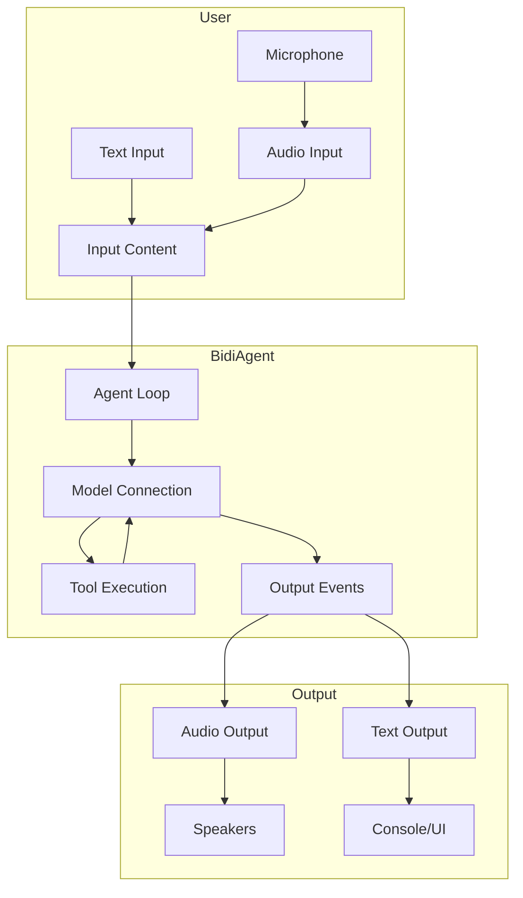
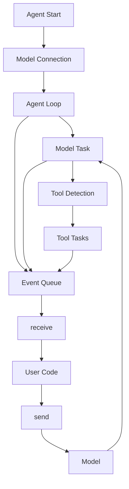
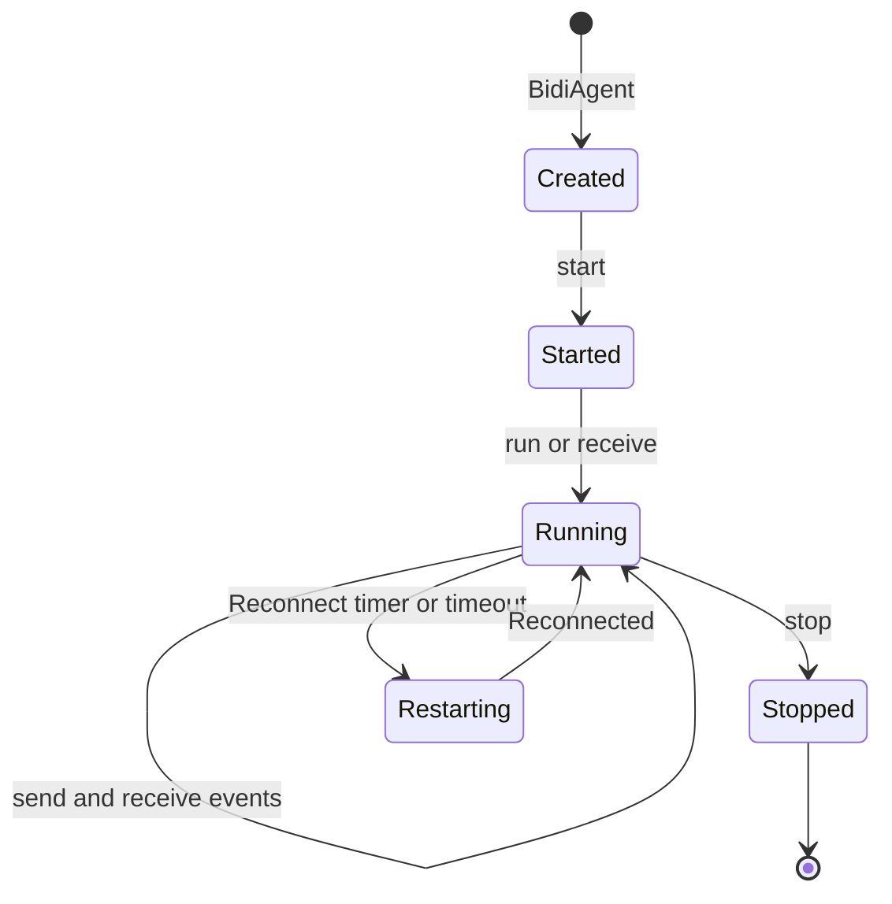

The `BidiAgent` is a specialized agent designed for real-time bidirectional streaming conversations. Unlike the standard `Agent` that follows a request-response pattern, `BidiAgent` maintains persistent connections that enable continuous audio and text streaming, real-time barge-ins, and concurrent tool execution.




## Agent vs BidiAgent

While both `Agent` and `BidiAgent` share the same core purpose of enabling AI-powered interactions, they differ significantly in their architecture and use cases.

### Standard Agent (Request-Response)

The standard `Agent` follows a traditional request-response pattern:

```python
from strands import Agent
from strands.vended_tools import notebook

agent = Agent(tools=[notebook])

# Single request-response cycle
result = agent('Create a notebook named "ideas" and add three project ideas.')
print(result.message)
```

**Characteristics:**

- **Synchronous interaction**: One request, one response
- **Discrete cycles**: Each invocation is independent
- **Message-based**: Operates on complete messages
- **Tool execution**: Sequential, blocking the response

### BidiAgent (Bidirectional Streaming)

`BidiAgent` maintains a persistent, bidirectional connection:

```python
import asyncio
from strands.experimental.bidi.agent import BidiAgent
from strands.experimental.bidi.io import AudioIO
from strands.experimental.bidi.models import BedrockNovaSonicModel

model = BedrockNovaSonicModel(model_id="amazon.nova-2-sonic-v1:0")
agent = BidiAgent(model=model, tools=[notebook])
audio_io = AudioIO()

async def main():
    # Persistent connection with continuous streaming
    await agent.run(
        inputs=[audio_io.input()],
        outputs=[audio_io.output()]
    )

asyncio.run(main())
```

**Characteristics:**

- **Asynchronous streaming**: Continuous input/output
- **Persistent connection**: Single connection for multiple turns
- **Event-based**: Operates on streaming events
- **Tool execution**: Concurrent, non-blocking

### When to Use Each

**Use `Agent` when:**

- Building chatbots or CLI applications
- Processing discrete requests
- Implementing API endpoints
- Working with text-only interactions
- Simplicity is preferred

**Use `BidiAgent` when:**

- Building voice assistants
- Requiring real-time audio streaming
- Needing natural conversation barge-ins
- Implementing live transcription
- Building interactive, multi-modal applications


## The Bidirectional Agent Loop

The bidirectional agent loop is fundamentally different from the standard agent loop. Instead of processing discrete messages, it continuously streams events in both directions while managing connection state and concurrent operations.

### Architecture Overview



### Event Flow

#### Startup Sequence

**Agent Initialization**

```python
agent = BidiAgent(model=model, tools=[notebook])
```

Creates tool registry, initializes agent state, and sets up hook registry.

**Connection Start**

```python
await agent.start()
```

Calls `model.start(system_prompt, tools, messages)`, establishes WebSocket/SDK connection, sends conversation history if provided, spawns background task for model communication, and enables sending capability.

**Event Processing**

```python
async for event in agent.receive():
    # Process events
```

Dequeues events from internal queue, yields to user code, and continues until stopped.

#### Tool Execution

Tools execute concurrently without blocking the conversation. When a tool is invoked:

1. The tool use and a dispatch acknowledgement are appended together to conversation history before execution.
2. The tool executor streams events as the tool runs.
3. The tool use is appended again alongside the actual result, which is sent to the model.

Each tool use stays adjacent to its result even when conversation continues or tools finish out of order. Both pairs retain the original tool-use ID, and the repeated tool use does not execute again. Dispatch acknowledgements stay in history and are not sent to the model.

Tool-result messages identify their purpose in `metadata["custom"]["bidi"]`: `kind` is `tool_dispatch` or `tool_result`, and `tool_use_id` links to the original request.

The agent loop checks for `request_state["stop_event_loop"]` to trigger graceful
shutdown instead of sending tool results back to the model. Any tool can set this
flag to stop the conversation. The SDK's experimental `stop` tool uses this mechanism.

### Connection Lifecycle

#### Normal Operation

```
User → send() → Model → receive() → Model Task → Event Queue → receive() → User
                  ↓
              Tool Use
                  ↓
            Tool Task → Event Queue → receive() → User
                  ↓
            Tool Result → Model
```

## Configuration

Configure a `BidiAgent` with a model, tools, a system prompt, and optional conversation history.

### Basic Configuration

```python
from strands.experimental.bidi.agent import BidiAgent
from strands.experimental.bidi.models import BedrockNovaSonicModel

model = BedrockNovaSonicModel(model_id="amazon.nova-2-sonic-v1:0")

agent = BidiAgent(
    model=model,
    tools=[notebook, weather],
    system_prompt="You are a helpful voice assistant.",
    messages=[],  # Optional conversation history
    agent_id="voice_assistant_1",
    name="Voice Assistant",
    description="A voice-enabled AI assistant"
)
```

### Model Configuration

Each model provider has specific configuration options:

```python
from strands.experimental.bidi.models import BedrockNovaSonicModel

model = BedrockNovaSonicModel(
    model_id="amazon.nova-2-sonic-v1:0",
    region="us-east-1",
    voice="matthew",
    audio={
        "input": {"sample_rate": 16000},
        "output": {"sample_rate": 16000},
    },
)
```

See [Model Providers](models/bedrock.md) for provider-specific options.

`BidiAgent` supports many of the same constructs as `Agent`:

- **[Tools](../tools/index.md)**: Function calling works identically
- **[Hooks](hooks.md)**: Lifecycle event handling with bidirectional-specific events
- **[Session Management](session-management.md)**: Conversation persistence across sessions
- **[Tool Executors](../tools/executors.md)**: Concurrent and custom execution patterns


## Lifecycle Management

The `BidiAgent` lifecycle governs how connections open, run, and close. Managing it correctly is what keeps resources cleaned up and errors handled.

### Lifecycle States



### State Transitions

#### 1. Creation

```python
agent = BidiAgent(model=model, tools=[notebook])
# Tool registry initialized, agent state created, hooks registered
# NOT connected to model yet
```

#### 2. Starting

```python
await agent.start(invocation_state={...})
# Model connection established, conversation history sent
# Background tasks spawned, ready to send/receive
```

#### 3. Running

```python
# Option A: Using run()
await agent.run(inputs=[...], outputs=[...])

# Option B: Manual send/receive
await agent.send("Hello")
async for event in agent.receive():
    # Process events - events streaming, tools executing, messages accumulating
    pass
```

#### 4. Stopping

```python
await agent.stop()
# Background tasks cancelled, model connection closed, resources cleaned up
```

### Lifecycle Patterns

#### Using run()

```python
agent = BidiAgent(model=model)
audio_io = AudioIO()

await agent.run(
    inputs=[audio_io.input()],
    outputs=[audio_io.output()]
)
```

Simplest for I/O-based applications - handles start/stop automatically.

#### Context Manager

```python
agent = BidiAgent(model=model)

async with agent:
    await agent.send("Hello")
    async for event in agent.receive():
        if isinstance(event, BidiResponseStopEvent):
            break
```

Automatic `start()` and `stop()` with exception-safe cleanup. To pass `invocation_state`, call `start()` manually before entering the context.

#### Manual Lifecycle

```python
agent = BidiAgent(model=model)

try:
    await agent.start()
    await agent.send("Hello")
    
    async for event in agent.receive():
        if isinstance(event, BidiResponseStopEvent):
            break
finally:
    await agent.stop()
```

Explicit control with custom error handling and flexible timing.

### Sending Multiple Content Blocks

Send a list to group text and images into one user message, preserving block order.
With a running OpenAI or Gemini agent:

```python
from strands.experimental.bidi.agent import BidiAgent
from strands.types.media import ImageBlock

async def describe_image(agent: BidiAgent, image_bytes: bytes) -> None:
    await agent.send([
        ImageBlock(format="jpeg", source={"bytes": image_bytes}),
        "What is in this image?",
    ])
```

Lists accept strings, `TextBlock`, `ImageBlock`, and their dictionary forms.
Send audio deltas individually; tool results are managed by the agent.
Nova Sonic supports text only and joins blocks with newlines.

### Connection Restart

Every provider caps how long a single connection stays open. `BidiAgent` reconnects on two paths, both of which preserve the conversation:

- **Proactive (scheduled)**: a timer fires ahead of the provider's limit, and the agent reconnects before the connection drops. This is the normal path.
- **Reactive (timeout)**: if the connection times out first, the agent reconnects after the provider reports the timeout.

Both paths emit a `BidiConnectionRestartEvent`. Read `event.reason` (`"scheduled"` or `"timeout"`) to tell them apart, and `event.turn_interrupted` to detect when a restart cut an in-progress turn:

```python
async for event in agent.receive():
    if isinstance(event, BidiConnectionRestartEvent):
        print(f"Reconnecting (reason={event.reason})")
        if event.turn_interrupted:
            # The provider replays history as context, but this turn was not answered.
            # Re-prompt or notify the user.
            pass
        # Conversation history is preserved; keep processing events normally.
```

Ahead of a proactive reconnect, the agent also emits a `BidiConnectionWarningEvent` carrying `time_left_s`, the approximate seconds until the swap. It is informational, useful for surfacing a "reconnecting shortly" hint in a UI. The full event catalog is on the [Events](events.md) page.

The restart sequence: reconnect timer fires (or a timeout is reported) → `BidiConnectionRestartEvent` emitted → sending blocked → hooks invoked → model restarted with history → new receiver task spawned → sending unblocked → conversation continues.

#### Tuning Reconnect Timing

Each provider declares its reconnect timing as a `ConnectionConfig`. Override it, or
opt out of automatic reconnect with the model's `connection` argument:

```python
from strands.experimental.bidi.models import BedrockNovaSonicModel

model = BedrockNovaSonicModel(
    model_id="amazon.nova-2-sonic-v1:0",
    connection={
        "restart_after_s": 360,  # Reconnect this many seconds after a connection opens
        "auto_reconnect": True,  # Set False to disable automatic reconnect
    },
)
```

`restart_after_s` should sit at least ~10 seconds below the provider's own connection limit, because the reconnect may wait briefly for the current turn to finish before swapping. Setting `auto_reconnect=False` turns off both the proactive timer and reactive reconnect, so the connection closes at the provider's limit.

### Error Handling

#### Handling Connection Errors

```python
try:
    await agent.start()
    async for event in agent.receive():
        # Handle connection restart events
        if isinstance(event, BidiConnectionRestartEvent):
            print("Connection restarting, please wait...")
            continue  # Connection restarts automatically
        
        # Process other events
        pass
except Exception as e:
    print(f"Unexpected error: {e}")
finally:
    await agent.stop()
```

**Note:** Reconnects are handled automatically, whether scheduled by the reconnect timer or triggered by a timeout. The agent emits `BidiConnectionRestartEvent` when reconnecting.

#### Graceful Shutdown

```python
import signal

agent = BidiAgent(model=model)
audio_io = AudioIO()

async def main():
    # Setup signal handler
    loop = asyncio.get_event_loop()
    
    def signal_handler():
        print("\nShutting down gracefully...")
        loop.create_task(agent.stop())
    
    loop.add_signal_handler(signal.SIGINT, signal_handler)
    loop.add_signal_handler(signal.SIGTERM, signal_handler)
    
    try:
        await agent.run(
            inputs=[audio_io.input()],
            outputs=[audio_io.output()]
        )
    except asyncio.CancelledError:
        print("Agent stopped")

asyncio.run(main())
```

### Resource Cleanup

The agent automatically cleans up background tasks, model connections, I/O streams,
and event queues, then invokes cleanup hooks.

### Best Practices

1. **Always Use try/finally**: Ensure `stop()` is called even on errors
2. **Prefer Context Managers**: Use `async with` for automatic cleanup
3. **Handle Restarts Gracefully**: Don't treat `BidiConnectionRestartEvent` as an error
4. **Monitor Lifecycle Hooks**: Use hooks to track state transitions
5. **Test Shutdown**: Verify cleanup works under various conditions
6. **Avoid Calling stop() During receive()**: Only call `stop()` after exiting the receive loop

## Next Steps

- [Events](events.md) - Complete guide to bidirectional streaming events
- [I/O Streams](io.md) - Building custom input and output streams
- [Model Providers](models/bedrock.md) - Provider-specific configuration
- [Quickstart](quickstart.md) - Getting started guide
- [Python API Reference](@api/python/strands.experimental.bidi.agent) -
  Complete API documentation
