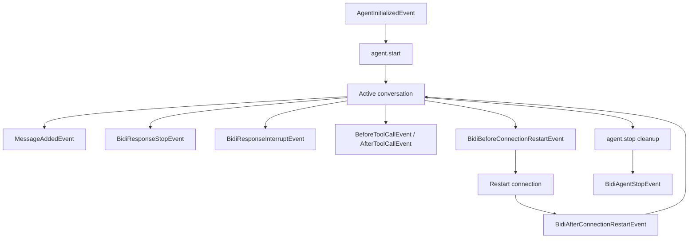

Hooks extend `BidiAgent` by subscribing to events across the bidirectional streaming lifecycle. Both built-in components and your own code react to agent behavior through strongly-typed event callbacks.

## Overview

The bidirectional streaming hooks system extends the standard agent hooks with additional events specific to real-time streaming conversations, such as connection lifecycle, interruptions, and connection restarts.

For an introduction to the hooks concept and general patterns, see the [Hooks documentation](../agents/hooks.md). This guide focuses on events specific to bidirectional streaming.

A **Hook Event** is a specific event in the lifecycle that callbacks can be associated with. A **Hook Callback** is a callback function that is invoked when the hook event is emitted.

Hooks enable use cases such as:

- Monitoring connection state and restarts
- Tracking interruptions and user behavior
- Logging conversation history in real-time
- Implementing custom analytics
- Managing session persistence

## Basic usage

Hook callbacks are registered against specific event types and receive strongly-typed event objects when those events occur during agent execution.

### Creating a hook provider

Register related hooks together by implementing `register_hooks()`:

```python
from strands import LocalAgent
from strands.experimental.bidi.agent import BidiAgent
from strands.experimental.bidi.hooks import BidiAgentStopEvent, BidiResponseStopEvent
from strands.hooks import AgentInitializedEvent, HookRegistry, MessageAddedEvent


class ConversationLogger:
    def register_hooks(self, registry: HookRegistry) -> None:
        registry.add_callback(AgentInitializedEvent, self.on_initialized)
        registry.add_callback(MessageAddedEvent, self.on_message_added)
        registry.add_callback(BidiResponseStopEvent, self.on_response_stop)
        registry.add_callback(BidiAgentStopEvent, self.on_stop)

    def on_initialized(self, event: AgentInitializedEvent[LocalAgent]) -> None:
        print(f"Agent {event.agent.agent_id} initialized")

    async def on_message_added(self, event: MessageAddedEvent[LocalAgent]) -> None:
        print(f"{event.message['role']}: {event.message['content']}")

    async def on_response_stop(self, event: BidiResponseStopEvent) -> None:
        print(f"Response {event.response_id} ended: {event.stop_reason}")

    async def on_stop(self, event: BidiAgentStopEvent) -> None:
        print(f"Agent {event.agent.name} stopped")


agent = BidiAgent(hooks=[ConversationLogger()])
```

Initialization hooks must be synchronous because construction is synchronous.
Register them through the constructor's `hooks` argument to observe initialization.

### Registering individual callbacks

Register a single hook with `add_hook()`, which infers the event type:

```python
from strands import LocalAgent
from strands.experimental.bidi.agent import BidiAgent
from strands.hooks import MessageAddedEvent


async def log_message(event: MessageAddedEvent[LocalAgent]) -> None:
    print(f"Message added: {event.message}")


agent = BidiAgent()
agent.add_hook(log_message)
```

`AgentInitializedEvent` and `MessageAddedEvent` are shared with `Agent`. Annotate
shared hooks with `AgentInitializedEvent[LocalAgent]` or
`MessageAddedEvent[LocalAgent]`. Use `BidiAgent` as the type parameter for hooks
that need bidi-specific methods. Unparameterized annotations retain `Agent` as
their default agent type.

To observe completed transcripts, subscribe to `MessageUpdatedEvent`. A transcript first appears as an empty message through `MessageAddedEvent` when the transcript starts. Its completion replaces that message at the reserved position. `event.tracking_id` identifies the message and `event.message` contains the replacement.

```python
from strands.experimental.bidi.agent import BidiAgent
from strands.hooks import MessageUpdatedEvent


async def log_update(event: MessageUpdatedEvent[BidiAgent]) -> None:
    print(f"Message {event.tracking_id} updated: {event.message}")


agent = BidiAgent()
agent.add_hook(log_update)
```

### Shared tool call hooks

`BidiAgent` uses the same `BeforeToolCallEvent` and `AfterToolCallEvent` types as
`Agent`. Callbacks and tools that support both agent types can use `LocalAgent`
for their agent type:

```python
from strands import LocalAgent, ToolContext, tool
from strands.experimental.bidi.agent import BidiAgent
from strands.hooks import AfterToolCallEvent, BeforeToolCallEvent


@tool(context=True)
def inspect_agent(tool_context: ToolContext[LocalAgent]) -> str:
    return tool_context.agent.name


def log_tool_call(event: BeforeToolCallEvent[LocalAgent]) -> None:
    print(f"Calling {event.tool_use['name']} on {event.agent.name}")


def retry_failed_tool(event: AfterToolCallEvent[LocalAgent]) -> None:
    if event.exception is not None:
        event.retry = True


agent = BidiAgent(tools=[inspect_agent])
agent.add_hook(log_tool_call)
agent.add_hook(retry_failed_tool)
```

`add_hook()` infers the event type from the callback annotation. You can also
pass an event type, or a list of event types, explicitly. For more registration
patterns and retry guidance, see the [Hooks documentation](../agents/hooks.md).

## Hook event lifecycle

Use initialization and stop hooks for the agent lifecycle, and response-complete
hooks to observe individual model responses:



Message, response, interruption, and tool hooks occur as their corresponding events
arrive. The diagram does not prescribe an order among them. There is no hook for
agent start or response start.

### Available events

Choose hooks according to the boundary you need to observe:

| Event | Timing |
|-------|--------|
| `AgentInitializedEvent` | After agent construction; synchronous hooks only |
| `MessageAddedEvent` | After the framework adds a message to conversation history |
| `MessageUpdatedEvent` | After the framework replaces a message |
| `BidiAgentStopEvent` | After attempting task and model cleanup, including failures |
| `BidiResponseStopEvent` | When the model reports that a response ended |
| `BeforeToolCallEvent` | Before executing a tool |
| `AfterToolCallEvent` | After tool execution; reverse callback ordering |
| `BidiResponseInterruptEvent` | When the model reports an interruption |
| `BidiBeforeConnectionRestartEvent` | Before a scheduled or timeout-driven restart |
| `BidiAfterConnectionRestartEvent` | After a restart attempt, including failures |

`BidiAgentStopEvent` carries `agent` and uses reverse callback ordering for cleanup.
The session manager uses this event for its final state sync.

`BidiResponseStopEvent` carries `agent`, `response_id`, and `stop_reason`. Hooks run in registration order and finish before the corresponding streaming event reaches the consumer. The hook mirrors model-reported completion: shutdown or a connection failure without a stop event does not emit it.

The hook and streaming event share a name but are separate classes. Import the hook
from `strands.experimental.bidi.hooks`. Import the streaming event from
`strands.experimental.bidi.types` when handling `agent.receive()` output.

## Cookbook

This section contains practical hook implementations for common use cases.

### Tracking interruptions

Count interruptions and record their reasons:

```python
from strands.experimental.bidi.agent import BidiAgent
from strands.experimental.bidi.hooks import BidiResponseInterruptEvent
from strands.hooks import HookRegistry


class InterruptionTracker:
    def __init__(self):
        self.interruption_count = 0

    def register_hooks(self, registry: HookRegistry) -> None:
        registry.add_callback(BidiResponseInterruptEvent, self.on_interruption)

    async def on_interruption(self, event: BidiResponseInterruptEvent) -> None:
        self.interruption_count += 1
        print(f"Interruption #{self.interruption_count}: {event.reason}")


tracker = InterruptionTracker()
agent = BidiAgent(hooks=[tracker])
```

### Connection restart monitoring

Track connection restart attempts and their outcomes:

```python
from strands.experimental.bidi.agent import BidiAgent
from strands.experimental.bidi.hooks import (
    BidiAfterConnectionRestartEvent,
    BidiBeforeConnectionRestartEvent,
)
from strands.hooks import HookRegistry


class ConnectionMonitor:
    def __init__(self):
        self.restart_count = 0

    def register_hooks(self, registry: HookRegistry) -> None:
        registry.add_callback(BidiBeforeConnectionRestartEvent, self.on_before_restart)
        registry.add_callback(BidiAfterConnectionRestartEvent, self.on_after_restart)

    async def on_before_restart(self, event: BidiBeforeConnectionRestartEvent) -> None:
        self.restart_count += 1
        print(f"Restart #{self.restart_count}: {event.reason}")

    async def on_after_restart(self, event: BidiAfterConnectionRestartEvent) -> None:
        if event.exception is not None:
            print(f"Restart failed: {event.exception}")
        else:
            print("Connection restarted")


agent = BidiAgent(hooks=[ConnectionMonitor()])
```

### Conversation analytics

Count model-reported response completions and report the total when the agent stops:

```python
from strands.experimental.bidi.agent import BidiAgent
from strands.experimental.bidi.hooks import BidiAgentStopEvent, BidiResponseStopEvent
from strands.hooks import HookRegistry


class ConversationAnalytics:
    def __init__(self):
        self.response_count = 0

    def register_hooks(self, registry: HookRegistry) -> None:
        registry.add_callback(BidiResponseStopEvent, self.on_response_stop)
        registry.add_callback(BidiAgentStopEvent, self.on_stop)

    async def on_response_stop(self, event: BidiResponseStopEvent) -> None:
        self.response_count += 1
        print(f"Response {event.response_id}: {event.stop_reason}")

    async def on_stop(self, event: BidiAgentStopEvent) -> None:
        print(f"Agent {event.agent.agent_id}: {self.response_count} responses ended")


agent = BidiAgent(hooks=[ConversationAnalytics()])
```

### Session persistence

Use `FileSessionManager` or `S3SessionManager` to persist messages and state. They
register shared initialization and message-added hooks, plus `BidiAgentStopEvent`
for the final sync. See [Session Management](session-management.md).

## Accessing invocation state

Pass context through `start(invocation_state=...)` or `run(..., invocation_state=...)`.
Tools and their hooks share the caller's dictionary until the agent stops, including
across connection restarts. Changes made by any of them are visible to the others.

```python
from strands import LocalAgent, tool
from strands.experimental.bidi.agent import BidiAgent
from strands.hooks import BeforeToolCallEvent


@tool
def get_weather(city: str) -> str:
    """Return example weather for a city."""
    return f"Sunny in {city}"


async def log_tool_context(event: BeforeToolCallEvent[LocalAgent]) -> None:
    user_id = event.invocation_state.get("user_id", "unknown")
    print(f"User {user_id}: calling {event.tool_use['name']}")


agent = BidiAgent(tools=[get_weather])
agent.add_hook(log_tool_context)
await agent.start(invocation_state={"user_id": "user_123"})
# Send inputs and consume agent.receive() during the conversation.
await agent.stop()
```

## Best practices

### Make your hook callbacks asynchronous

Use async hooks for work that awaits network or storage operations. Keep synchronous
hooks short so they do not delay event processing. Initialization hooks must be
synchronous; the registry rejects async initialization callbacks.

For more guidance on performance, errors, and composition, see the
[Hooks documentation](../agents/hooks.md).

## Next steps

- [Agent](agent.md) - Learn about BidiAgent configuration and lifecycle
- [Session Management](session-management.md) - Persist conversations across sessions
- [Events](events.md) - Complete guide to bidirectional streaming events
- [Python API Reference](@api/python/strands.experimental.bidi.agent) - Complete API documentation
