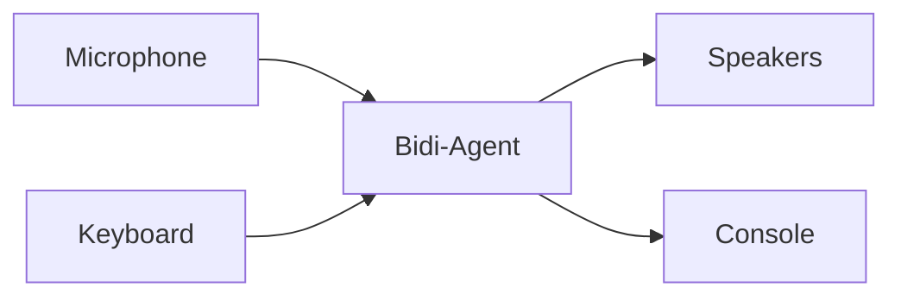

I/O streams handle the flow of data between your application and the bidi-agent.
They manage input sources (microphone, keyboard, WebSocket) and output destinations
(speakers, console, UI) while the agent focuses on conversation logic and model
communication.



## I/O Interfaces

The bidi agent uses two protocol interfaces that define how data flows in and out of
conversations:

- `InputStream`: A callable protocol for reading data from sources such as a microphone,
  keyboard, or WebSocket and returning `BidiAgentInput`.
- `OutputStream`: A callable protocol for receiving `BidiOutputEvent` objects from the
  agent and handling them appropriately.

Both protocols include optional lifecycle methods (`start` and `stop`) for resource
management.

Implementation of these protocols will look as follows:

```python
from strands.experimental.bidi.agent import BidiAgent
from strands.experimental.bidi.types import BidiAgentInput
from strands.experimental.bidi.types import BidiOutputEvent
from strands.experimental.bidi.types import InputStream, OutputStream


class MyInputStream(InputStream):
    async def start(self, agent: BidiAgent) -> None:
        # Initialize input resources or state, using agent as needed.
        return

    async def __call__(self) -> BidiAgentInput:
        # Read or generate input and return a BidiAgentInput value.
        return {"text": "Hello"}

    async def stop(self) -> None:
        # Clean up any input resources or state.
        return


class MyOutputStream(OutputStream):
    async def start(self, agent: BidiAgent) -> None:
        # Initialize output resources or state, using agent as needed.
        return

    async def __call__(self, event: BidiOutputEvent) -> None:
        # Process the event as needed for your application.
        print(event)

    async def stop(self) -> None:
        # Clean up any output resources or state.
        return
```

## I/O Usage

Pass your I/O streams to the agent's `run()` method to connect them to the agent loop.

```python
import asyncio

from strands.experimental.bidi.agent import BidiAgent
from strands.experimental.tools import stop


async def main():
    # stop tool allows user to verbally stop agent execution.
    agent = BidiAgent(tools=[stop])
    await agent.run(inputs=[MyInputStream()], outputs=[MyOutputStream()])


asyncio.run(main())
```

The `run()` method handles startup, execution, and shutdown for the agent and its I/O
streams. Inputs and outputs run concurrently, so you can mix and match implementations.
If an I/O task fails, `run()` cancels the remaining tasks, stops the streams, and
re-raises the exception.

## Audio I/O

Out of the box, Strands provides `AudioIO` to connect your microphone and speakers
to the bidi-agent. It captures microphone audio, streams it to the model in real time,
and plays responses through the speakers using
[PyAudio](https://pypi.org/project/PyAudio/).

:::note[Installation Required]
`AudioIO` requires the `bidi-io` and `bidi-pyaudio` extras plus the PortAudio
system library. Install PortAudio first, then install the extras:
```bash
pip install "strands-agents[bidi,bidi-io,bidi-pyaudio]"
```
PyAudio is excluded from the aggregate `bidi-all` extra because of its PortAudio system dependency, so install `bidi-pyaudio` explicitly even when you already have `bidi-all`.
:::

```python
import asyncio

from strands.experimental.bidi.agent import BidiAgent
from strands.experimental.bidi.io import AudioIO
from strands.experimental.tools import stop


async def main():
    # stop tool allows user to verbally stop agent execution.
    agent = BidiAgent(tools=[stop])
    audio_io = AudioIO(input_device_index=1)

    await agent.run(
        inputs=[audio_io.input()],
        outputs=[audio_io.output()],
    )


asyncio.run(main())
```

This creates a voice-enabled agent that captures audio from your microphone, streams
it to the model as `AudioDelta` inputs, and plays responses through your speakers.

By default, audio output displays only speech transcripts through `ConsoleIO`,
with `"Speak…"` as its input placeholder. Pass `console=console_io` to customize
the display.

### Configurations

`AudioIO` accepts the fields of `AudioIOConfig` as keyword arguments:

| Parameter | Description | Example | Default |
| --------- | ----------- | ------- | ------- |
| `audio_processor` | Enable microphone audio processing. Pass `True` for defaults or an `AudioProcessorConfig` for custom options. | `True` | None (disabled) |
| `console` | Console display | `console_io` | Transcripts only |
| `input_buffer_size` | Maximum number of audio chunks to buffer from the microphone before dropping the oldest. | `1024` | None (unbounded) |
| `input_device_index` | Specific microphone device ID to use for audio input. | `1` | None (system default) |
| `input_frames_per_buffer` | Number of audio frames to read per input callback (affects latency and performance). | `1024` | 512 |
| `output_buffer_size` | Maximum number of audio chunks to buffer for speaker playback before dropping the oldest. | `2048` | None (unbounded) |
| `output_device_index` | Specific speaker device ID to use for audio output. | `2` | None (system default) |
| `output_frames_per_buffer` | Number of audio frames to write per output callback (affects latency and performance). | `1024` | 512 |

### Audio Processing

To run a voice agent over open speakers without a headset, enable microphone audio processing. It applies acoustic echo cancellation, noise suppression, and automatic gain control so the agent's own playback does not feed back into the microphone and trigger a barge-in.

Audio processing depends on `pywebrtc-audio`, installed through the `bidi-aec` extra:

```bash
pip install "strands-agents[bidi,bidi-pyaudio,bidi-aec]"
```

Pass `audio_processor=True` for the defaults, or an `AudioProcessorConfig` to tune it:

```python
from strands.experimental.bidi.io import AudioIO, AudioProcessorConfig

# Echo cancellation, noise suppression, and auto gain control with defaults:
audio_io = AudioIO(audio_processor=True)

# Noise suppression and auto gain control without echo cancellation (for headset users):
audio_io = AudioIO(audio_processor=AudioProcessorConfig(echo_cancellation=False))
```

`AudioProcessorConfig` exposes two fields:

| Parameter | Description | Default |
| --------- | ----------- | ------- |
| `echo_cancellation` | Cancel the agent's speaker audio from the microphone input. | `True` |
| `stream_delay_ms` | Playback-to-capture delay hint in milliseconds for echo cancellation. `0` lets the canceller auto-estimate. Set a non-zero value only when echo cancellation measurably fails on hardware with large or fixed latency, such as Bluetooth. | `0` |

Echo cancellation coordinates the microphone and speaker streams, so it works only
when both come from the same `AudioIO` instance. It also requires a microphone sample
rate of 16000, 32000, or 48000 Hz, set through the model's audio config.

Configure voice and supported sample rates on the model. `AudioIO` reads
`model.get_audio_config()`, which returns separate `input` and `output` dictionaries,
each containing `sample_rate`, `channels`, and `format`. It uses those values to
configure capture and playback, so you do not need to repeat them on the I/O stream.

`AudioIO` requires signed 16-bit little-endian PCM. Starting a device stream with
another encoding raises `ValueError`. Use custom I/O for other encodings.

### Barge-in Handling

`AudioIO` automatically handles barge-in when users start speaking mid-response:

1. The agent emits a `BidiBargeInEvent`.
2. `AudioIO` clears its output buffer to stop playback.
3. The agent responds to the new user input.

## Console I/O

Use `ConsoleIO` to type messages while the agent streams text, reasoning, and speech
transcripts.

:::note[Installation Required]
`ConsoleIO` uses the `bidi-io` extra. The example below also needs `bidi-openai`:
```bash
pip install "strands-agents[bidi-io,bidi-openai]"
```
:::

```python
import asyncio

from strands.experimental.bidi.agent import BidiAgent
from strands.experimental.bidi.io import ConsoleIO
from strands.experimental.bidi.models import OpenAIRealtimeModel
from strands.experimental.tools import stop


async def main():
    model = OpenAIRealtimeModel(
        model_id="gpt-realtime-2.1",
        transcription_model_id=None,
        params={"output_modalities": ["text"]},
    )
    agent = BidiAgent(model=model, tools=[stop])
    console_io = ConsoleIO()

    await agent.run(
        inputs=[console_io.input()],
        outputs=[console_io.output()],
    )


try:
    asyncio.run(main())
except KeyboardInterrupt:
    pass
```

Set `OPENAI_API_KEY` before running this example. Press Enter to send a message or
Ctrl-C to exit.

### Configurations

| Parameter | Description | Example | Default |
| --------- | ----------- | ------- | ------- |
| `placeholder` | Hint for an empty input block | `"Type or speak…"` | `""` |
| `show_text` | Display agent text responses | `False` | `True` |
| `show_reasoning` | Display agent reasoning | `False` | `True` |
| `show_transcript` | Display speech transcripts | `False` | `True` |

### Type and Talk

To type and speak in the same conversation, pass a shared `ConsoleIO` to `AudioIO`.
This example uses Amazon Nova Sonic. Configure
[AWS credentials](quickstart.mdx#configuring-credentials) and install the
[audio extras](#audio-io) first:

```python
import asyncio

from strands.experimental.bidi.agent import BidiAgent
from strands.experimental.bidi.io import AudioIO, ConsoleIO
from strands.experimental.tools import stop


async def main():
    agent = BidiAgent(tools=[stop])
    console_io = ConsoleIO(placeholder="Type or speak…")
    audio_io = AudioIO(console=console_io)

    await agent.run(
        inputs=[console_io.input(), audio_io.input()],
        outputs=[audio_io.output()],
    )


try:
    asyncio.run(main())
except KeyboardInterrupt:
    pass
```

`audio_io.output()` handles both speaker playback and console display, so register
it as the only output. Both keyboard and microphone inputs remain active while the
agent responds.

## WebSocket I/O

WebSockets are a common I/O stream for bidi-agents. The following server example
shows how to use WebSockets with `run()`:

```python
# server.py
from fastapi import FastAPI, WebSocket, WebSocketDisconnect

from strands.experimental.bidi.agent import BidiAgent
from strands.experimental.bidi.models import OpenAIRealtimeModel

app = FastAPI()


@app.websocket("/text-chat")
async def text_chat(websocket: WebSocket) -> None:
    model = OpenAIRealtimeModel(
        model_id="gpt-realtime-2.1",
        transcription_model_id="gpt-transcribe",
        api_key="<OPENAI_API_KEY>",
    )
    agent = BidiAgent(model=model)

    try:
        await websocket.accept()
        await agent.run(inputs=[websocket.receive_json], outputs=[websocket.send_json])
    except* WebSocketDisconnect:
        print("client disconnected")
```

Start this server with `uvicorn server:app --reload`. To interact, open a separate terminal and run the following client script:

```python
# client.py
import asyncio
import json

import websockets


async def main():
    websocket = await websockets.connect("ws://localhost:8000/text-chat")

    input_content = {"text": "Hello, how are you?"}
    await websocket.send(json.dumps(input_content))

    while True:
        output_event = json.loads(await websocket.recv())
        if output_event["type"] == "bidi_transcript_block":
            print(output_event["transcript"])
            break

    await websocket.close()


if __name__ == "__main__":
    asyncio.run(main())
```
