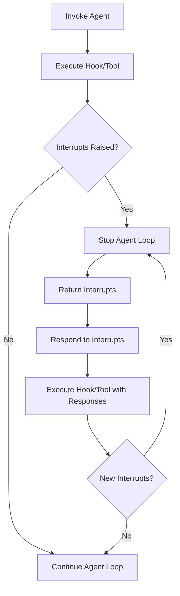

When your agent needs human approval or input before it continues, raise an interrupt. The agent stops its loop and hands control back to you along with the pending interrupt. You provide a response, and the agent resumes from the point where it stopped. You can raise interrupts from hook callbacks or from tool definitions. The general flow looks as follows:

<div class="interrupt-flow">



</div>

## Hooks

Raise interrupts inside your [hook callbacks](./agents/hooks.md) to pause the agent at specific lifecycle events in the [agent loop](./agents/agent-loop.md).

<Tabs>
<Tab label="Python">

Both `BeforeToolCallEvent` and `BeforeToolsEvent` are interruptible. Interrupting on a `BeforeToolCallEvent` intercepts an individual tool call before execution, while interrupting on `BeforeToolsEvent` pauses the entire batch of tool calls before any of them execute, which is useful for approving a whole set of tool calls at once.

#### BeforeToolCallEvent

```python
import json
from typing import Any

from strands import Agent, tool
from strands.hooks import BeforeToolCallEvent, HookProvider, HookRegistry


@tool
def delete_files(paths: list[str]) -> bool:
    # Implementation here
    pass


@tool
def inspect_files(paths: list[str]) -> dict[str, Any]:
    # Implementation here
    pass


class ApprovalHook(HookProvider):
    def __init__(self, app_name: str) -> None:
        self.app_name = app_name

    def register_hooks(self, registry: HookRegistry, **kwargs: Any) -> None:
        registry.add_callback(BeforeToolCallEvent, self.approve)

    def approve(self, event: BeforeToolCallEvent) -> None:
        if event.tool_use["name"] != "delete_files":
            return

        approval = event.interrupt(f"{self.app_name}-approval", reason={"paths": event.tool_use["input"]["paths"]})
        if approval.lower() != "y":
            event.cancel_tool = "User denied permission to delete files"


agent = Agent(
    hooks=[ApprovalHook("myapp")],
    system_prompt="You delete files older than 5 days",
    tools=[delete_files, inspect_files],
    callback_handler=None,
)

paths = ["a/b/c.txt", "d/e/f.txt"]
result = agent(f"paths=<{paths}>")

while True:
    if result.stop_reason != "interrupt":
        break

    responses = []
    for interrupt in result.interrupts:
        if interrupt.name == "myapp-approval":
            user_input = input(f"Do you want to delete {interrupt.reason['paths']} (y/N): ")
            responses.append({
                "interruptResponse": {
                    "interruptId": interrupt.id, 
                    "response": user_input
                }
            })
    
    result = agent(responses)

print(f"MESSAGE: {json.dumps(result.message)}")
```

#### BeforeToolsEvent

```python
from typing import Any

from strands import Agent, tool
from strands.hooks import BeforeToolsEvent, HookProvider, HookRegistry


@tool
def delete_files(paths: list[str]) -> bool:
    # Implementation here
    pass


class BatchApprovalHook(HookProvider):
    def __init__(self, app_name: str) -> None:
        self.app_name = app_name

    def register_hooks(self, registry: HookRegistry, **kwargs: Any) -> None:
        registry.add_callback(BeforeToolsEvent, self.approve)

    def approve(self, event: BeforeToolsEvent) -> None:
        dangerous_tools = [
            content["toolUse"]["name"]
            for content in event.message["content"]
            if "toolUse" in content and content["toolUse"]["name"] == "delete_files"
        ]
        if not dangerous_tools:
            return

        approval = event.interrupt(f"{self.app_name}-batch-approval", reason={"tools": dangerous_tools})
        if approval.lower() != "y":
            event.cancel = "Batch cancelled by user"


agent = Agent(
    hooks=[BatchApprovalHook("myapp")],
    system_prompt="You delete files older than 5 days",
    tools=[delete_files],
    callback_handler=None,
)

result = agent("Delete a/b/c.txt and d/e/f.txt")

while result.stop_reason == "interrupt":
    responses = []
    for interrupt in result.interrupts:
        if interrupt.name == "myapp-batch-approval":
            user_input = input(f"Approve running {interrupt.reason['tools']}? (y/N): ")
            responses.append({"interruptResponse": {"interruptId": interrupt.id, "response": user_input}})

    result = agent(responses)
```

Setting `event.cancel` (to `True` for a default message, or a string for a custom one) produces an error tool result for every tool in the batch and skips execution entirely, so no per-tool `BeforeToolCallEvent` fires.

</Tab>
<Tab label="TypeScript">

Both `BeforeToolCallEvent` and `BeforeToolsEvent` are interruptible. Interrupting on a `BeforeToolCallEvent` intercepts individual tool calls before execution, while `BeforeToolsEvent` intercepts the entire batch of tool calls before any execute.

#### BeforeToolCallEvent

```typescript
--8<-- "user-guide/sdk/interrupts_imports.ts:hooks_before_tool_call_imports"

--8<-- "user-guide/sdk/interrupts.ts:hooks_before_tool_call"
```

#### BeforeToolsEvent

```typescript
--8<-- "user-guide/sdk/interrupts_imports.ts:hooks_before_tools_imports"

--8<-- "user-guide/sdk/interrupts.ts:hooks_before_tools"
```
</Tab>
</Tabs>

### Components

Interrupts in Strands are comprised of the following components:

<Tabs>
<Tab label="Python">

- `event.interrupt` - Raises an interrupt with a unique name and optional reason
    - The `name` must be unique across all interrupt calls configured on the same event (`BeforeToolCallEvent` or `BeforeToolsEvent`). In the example above, we demonstrate using `app_name` to namespace the interrupt call. This is particularly helpful if you plan to vend your hooks to other users.
    - You can assign additional context for raising the interrupt to the `reason` field. Note, the `reason` must be JSON-serializable. 
- `result.stop_reason` - Check if agent stopped due to "interrupt"
- `result.interrupts` - List of interrupts that were raised
    - Each `interrupt` contains the user provided name and reason, along with an instance id.
- `interruptResponse` - Content block type for configuring the interrupt responses.
    - Each `response` is uniquely identified by their interrupt's id and will be returned from the associated interrupt call when invoked the second time around. Note, the `response` must be JSON-serializable.
- `event.cancel_tool` (`BeforeToolCallEvent`) - Cancel a single tool call based on the interrupt response
    - You can either set `cancel_tool` to `True` or provide a custom cancellation message.
- `event.cancel` (`BeforeToolsEvent`) - Cancel every tool call in the batch based on the interrupt response
    - You can either set `cancel` to `True` or provide a custom cancellation message.

For additional details on each of these components, refer to the [Python API Reference](@api/python/strands.types.interrupt).
</Tab>
<Tab label="TypeScript">

- [`BeforeToolCallEvent`](@api/typescript/BeforeToolCallEvent) / [`BeforeToolsEvent`](@api/typescript/BeforeToolsEvent): hook events that expose the ability to interrupt via the `interrupt` method
    - `event.interrupt({ name, reason? })`: halts the agent loop. `name` is a string identifier and `reason` is an optional JSON-serializable value providing context for why the interrupt was raised.
    - The `name` must be unique across all interrupt calls configured on the same event. In the example above, we demonstrate using a namespace prefix for the interrupt call. This is particularly helpful if you plan to vend your hooks to other users.
    - `event.cancel`: cancel tool execution based on the interrupt response. Set to `true` for a default message or provide a custom cancellation message string.
- [`AgentResult`](@api/typescript/AgentResult): returned by `invoke()` / `stream()`, contains interrupt information when the agent pauses
    - `result.stopReason`: check if agent stopped due to `'interrupt'`
    - `result.interrupts`: array of `Interrupt` objects, each containing the user-provided `name` and `reason`, along with a unique `id`
- `InterruptResponseContent`: content block type for resuming from an interrupt
    - Pass an array of these to `agent.invoke()` to resume. Each response is keyed by the interrupt's `id` and will be returned from the associated `interrupt()` call when the tool/hook re-executes. The `response` must be JSON-serializable.
</Tab>
</Tabs>

### Rules

Strands enforces the following rules for interrupts:

<Tabs>
<Tab label="Python">

- All hooks configured on the interrupted event will execute
- All hooks configured on the interrupted event are allowed to raise an interrupt
- A single hook can raise multiple interrupts but only one at a time
    - In other words, within a single hook, you can interrupt, respond to that interrupt, and then proceed to interrupt again.
- All tools running concurrently are interruptible
- All tools running concurrently that are not interrupted will execute
- When an interrupt fires from `BeforeToolCallEvent`, `AfterToolCallEvent` does not fire for that tool, but `AfterToolsEvent` still fires
- `AfterToolsEvent` fires once per event-loop cycle rather than once per logical batch. A per-tool interrupt splits a batch across cycles, so it fires on the interrupt cycle (carrying only the results collected so far) and again on resume (carrying the results produced that cycle): a hook with side effects there can run more than once for one assistant message
- When an interrupt fires from `BeforeToolsEvent`, no tool in the batch executes (and no `BeforeToolCallEvent` fires) until the interrupt is answered; on resume the batch hook re-runs and, if not interrupted again, the tools execute
</Tab>
<Tab label="TypeScript">

- All hooks configured on the interrupted event will execute
- All hooks configured on the interrupted event are allowed to raise an interrupt
- A single hook can raise multiple interrupts but only one at a time
    - In other words, within a single hook, you can interrupt, respond to that interrupt, and then proceed to interrupt again.
- When an interrupt fires from `BeforeToolCallEvent`, `AfterToolCallEvent` does not fire for that tool, but `AfterToolsEvent` still fires
- `AfterToolsEvent` fires once per event-loop cycle rather than once per logical batch. A per-tool interrupt splits a batch across cycles, so it fires on the interrupt cycle (carrying only the results collected so far) and again on resume (carrying the results produced that cycle): a hook with side effects there can run more than once for one assistant message
- When an interrupt fires mid-batch, completed tool results are preserved so the agent skips the model call on resume and only executes remaining tools
- Both assistant and tool result messages are appended only after tool execution completes, preventing dangling `toolUse` blocks without matching results
</Tab>
</Tabs>

## Tools

You can also raise interrupts from your tool definitions.

<Tabs>
<Tab label="Python">

```python
from typing import Any

from strands import Agent, tool
from strands.types.tools import ToolContext


class DeleteTool:
    def __init__(self, app_name: str) -> None:
        self.app_name = app_name

    @tool(context=True)
    def delete_files(self, tool_context: ToolContext, paths: list[str]) -> bool:
        approval = tool_context.interrupt(f"{self.app_name}-approval", reason={"paths": paths})
        if approval.lower() != "y":
            return False

        # Implementation here

        return True


@tool
def inspect_files(paths: list[str]) -> dict[str, Any]:
    # Implementation here
    pass


agent = Agent(
    system_prompt="You delete files older than 5 days",
    tools=[DeleteTool("myapp").delete_files, inspect_files],
    callback_handler=None,
)

...

```

Interrupts are not supported in [direct tool calls](./tools/using-tools.md#direct-method-calls) (i.e., calls such as `agent.tool.my_tool()`).

</Tab>
<Tab label="TypeScript">

The tool callback receives a `context` parameter (the second argument) which provides the `interrupt` method.

```typescript
--8<-- "user-guide/sdk/interrupts_imports.ts:tools_example_imports"

--8<-- "user-guide/sdk/interrupts.ts:tools_example"
```
</Tab>
</Tabs>

### Components

Tool interrupts work like hook interrupts, with two differences: tools receive `context` instead of `event`, and interrupt names need only be unique within a tool definition rather than across all hooks on an event. For more on tool context, see [ToolContext](./tools/custom-tools.md#toolcontext).

<Tabs>
<Tab label="Python">

- `tool_context` - Strands object that defines the interrupt call
- `tool_context.interrupt` - Raises an interrupt with a unique name and optional reason
    - The `name` must be unique only among interrupt calls configured in the same tool definition. It is still advisable however to namespace your interrupts so as to more easily distinguish the calls when constructing responses outside the agent.
</Tab>
<Tab label="TypeScript">

- [`ToolContext`](@api/typescript/ToolContext): the second argument passed to the tool callback, providing access to the `interrupt` method
    - `context.interrupt({ name, reason? })`: halts the agent loop. `name` is a string identifier and `reason` is an optional JSON-serializable value.
    - The `name` must be unique only among interrupt calls configured in the same tool definition. It is still advisable however to namespace your interrupts so as to more easily distinguish the calls when constructing responses outside the agent.
</Tab>
</Tabs>

### Rules

Strands enforces the following rules for tool interrupts:

<Tabs>
<Tab label="Python">

- All tools running concurrently will execute
- All tools running concurrently are interruptible
- A single tool can raise multiple interrupts but only one at a time
    - In other words, within a single tool, you can interrupt, respond to that interrupt, and then proceed to interrupt again.
</Tab>
<Tab label="TypeScript">

- A single tool can raise multiple interrupts but only one at a time
    - In other words, within a single tool, you can interrupt, respond to that interrupt, and then proceed to interrupt again.
- When an interrupt fires mid-batch, completed tool results are preserved so the agent skips the model call on resume and only executes remaining tools
</Tab>
</Tabs>

## Session Management

Persist interrupt state with a session manager so a user can answer later, in a new agent session. You can also persist the responses themselves, so a trusted approval does not prompt again on later tool calls.

<Tabs>
<Tab label="Python">

```python
##### server.py #####

import json
from typing import Any

from strands import Agent, tool
from strands.agent import AgentResult
from strands.hooks import BeforeToolCallEvent, HookProvider, HookRegistry
from strands.session import FileSessionManager
from strands.types.agent import AgentInput


@tool
def delete_files(paths: list[str]) -> bool:
    # Implementation here
    pass


@tool
def inspect_files(paths: list[str]) -> dict[str, Any]:
    # Implementation here
    pass


class ApprovalHook(HookProvider):
    def __init__(self, app_name: str) -> None:
        self.app_name = app_name

    def register_hooks(self, registry: HookRegistry, **kwargs: Any) -> None:
        registry.add_callback(BeforeToolCallEvent, self.approve)

    def approve(self, event: BeforeToolCallEvent) -> None:
        if event.tool_use["name"] != "delete_files":
            return

        if event.agent.state.get(f"{self.app_name}-approval") == "t":  # (t)rust
            return

        approval = event.interrupt(f"{self.app_name}-approval", reason={"paths": event.tool_use["input"]["paths"]})
        if approval.lower() not in ["y", "t"]:
            event.cancel_tool = "User denied permission to delete files"

        event.agent.state.set(f"{self.app_name}-approval", approval.lower())


def server(prompt: AgentInput) -> AgentResult:
    agent = Agent(
        hooks=[ApprovalHook("myapp")],
        session_manager=FileSessionManager(session_id="myapp", storage_dir="/path/to/storage"),
        system_prompt="You delete files older than 5 days",
        tools=[delete_files, inspect_files],
        callback_handler=None,
    )
    return agent(prompt)

##### client.py #####

def client(paths: list[str]) -> AgentResult:
    result = server(f"paths=<{paths}>")

    while True:
        if result.stop_reason != "interrupt":
            break

        responses = []
        for interrupt in result.interrupts:
            if interrupt.name == "myapp-approval":
                user_input = input(f"Do you want to delete {interrupt.reason['paths']} (t/y/N): ")
                responses.append({
                    "interruptResponse": {
                        "interruptId": interrupt.id, 
                        "response": user_input
                    }
                })
        
        result = server(responses)

    return result


paths = ["a/b/c.txt", "d/e/f.txt"]
result = client(paths)
print(f"MESSAGE: {json.dumps(result.message)}")
```
</Tab>
<Tab label="TypeScript">

```typescript
--8<-- "user-guide/sdk/interrupts_imports.ts:session_management_imports"

--8<-- "user-guide/sdk/interrupts.ts:session_management"
```
</Tab>
</Tabs>

### Components

Session managing interrupts involves the following key components:

<Tabs>
<Tab label="Python">

- `session_manager` - Automatically persists the agent interrupt state between tear down and start up
    - See [Session Management](./agents/session-management.md) for more.
- `agent.state` - General purpose key-value store that can be used to persist interrupt responses
    - On subsequent tool calls, you can reference the responses stored in `agent.state` to decide whether another interrupt is necessary. See [Agent State](./agents/state.md#agent-state) for more.
</Tab>
<Tab label="TypeScript">

- `sessionManager` - Automatically persists the agent interrupt state between tear down and start up
    - See [Session Management](./agents/session-management.md) for more.
- `agent.appState` - General purpose key-value store that can be used to persist interrupt responses
    - On subsequent tool calls, you can reference the responses stored in `appState` to decide whether another interrupt is necessary. See [Agent State](./agents/state.md#agent-state) for more.
</Tab>
</Tabs>

## MCP Elicitation

To collect additional information from a user during an MCP tool call, use elicitation. An MCP server sends an elicitation request to the connecting client, which is handled by an elicitation callback. See [MCP Elicitation](./tools/mcp-tools.md#elicitation) for details.

## Multi-Agent Systems

Interrupts work across swarm and graph orchestration too, using the same interfaces shown here. You raise them from a `BeforeNodeCallEvent` hook or from within a node. See [Interrupts in multi-agent systems](./interrupts-multi-agent.md) for the swarm and graph examples.
