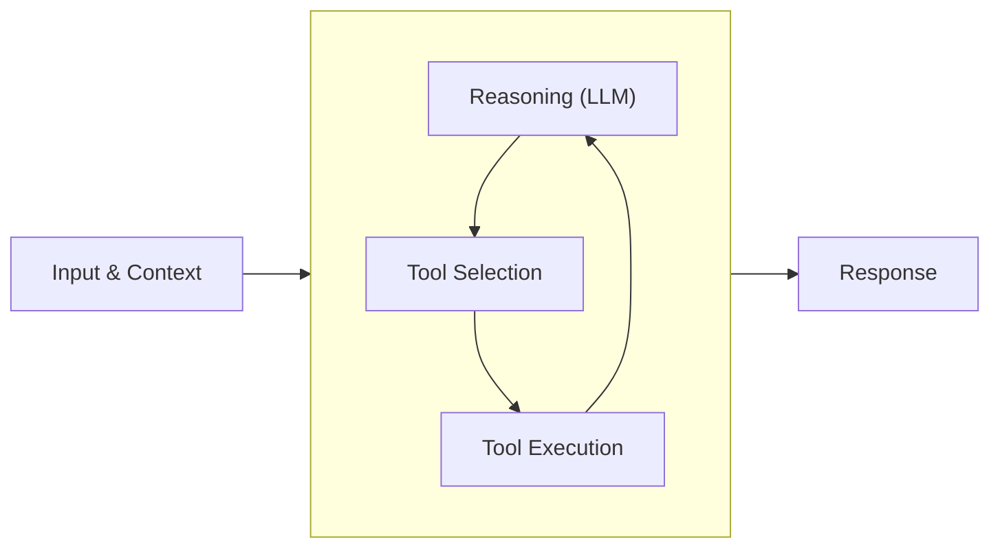

This quickstart takes you to a first running agent: install the SDK, pick a model
provider, run the agent, then give it a tool. Everything past that (streaming, memory,
observability, deployment) has its own guide, linked from [next steps](#next-steps).

<CopyPromptButton language="python" />

## Install the Strands Harness SDK

Make sure you have Python 3.10+ installed and a virtual environment activated. See the
[Python docs on virtual environments](https://docs.python.org/3/library/venv.html) if you
need to set one up. Then install the SDK:

```bash
pip install strands-agents
```

## Run your first agent

Strands works with any major model provider. The model is one object you hand to the
agent, and the rest of your code is the same no matter which provider is behind it. The
tabs below cover the most common providers; pick the one you already have access to,
then create `agent.py` with the snippet from that tab:

<Tabs>
<Tab label="Amazon Bedrock">

Amazon Bedrock is the default provider, using Claude Sonnet 4.6 in the `us-west-2`
region, so no extra install or model object is needed.

```python
from strands import Agent

# Bedrock is the default, so no model object is needed.
agent = Agent()
agent("What is an agent harness, in one sentence?")
```

Give the SDK AWS credentials with permission to invoke the model, using one of:

- **Bedrock API key**: set the `AWS_BEARER_TOKEN_BEDROCK` environment variable to a
  [Bedrock API key](https://docs.aws.amazon.com/bedrock/latest/userguide/api-key-management.html).
  Quickest for local development.
- **AWS credentials**: `aws configure`, or the `AWS_ACCESS_KEY_ID`, `AWS_SECRET_ACCESS_KEY`,
  and optionally `AWS_SESSION_TOKEN` environment variables
- **IAM roles**: on AWS services like EC2, ECS, or Lambda

Enable access to the models you use in the Amazon Bedrock console, following the
[AWS documentation](https://docs.aws.amazon.com/bedrock/latest/userguide/model-access-modify.html).

</Tab>
<Tab label="Anthropic">

```bash
pip install 'strands-agents[anthropic]'
export ANTHROPIC_API_KEY=<your key>
```

```python
from strands import Agent
from strands.models.anthropic import AnthropicModel

# Reads ANTHROPIC_API_KEY from the environment.
model = AnthropicModel(model_id="claude-sonnet-5", max_tokens=4096)
agent = Agent(model=model)
agent("What is an agent harness, in one sentence?")
```

</Tab>
<Tab label="OpenAI">

```bash
pip install 'strands-agents[openai]'
export OPENAI_API_KEY=<your key>
```

```python
from strands import Agent
from strands.models.openai import OpenAIModel

# Reads OPENAI_API_KEY from the environment.
model = OpenAIModel(model_id="gpt-5.4")
agent = Agent(model=model)
agent("What is an agent harness, in one sentence?")
```

</Tab>
<Tab label="Google">

```bash
pip install 'strands-agents[gemini]'
export GEMINI_API_KEY=<your key>
```

```python
from strands import Agent
from strands.models.gemini import GeminiModel

# Reads GEMINI_API_KEY from the environment.
model = GeminiModel(model_id="gemini-2.5-flash")
agent = Agent(model=model)
agent("What is an agent harness, in one sentence?")
```

</Tab>
<Tab label="Ollama">

Runs models locally on your machine. No API key or cloud account needed.

```bash
pip install 'strands-agents[ollama]'
ollama serve
ollama pull llama3.1
```

```python
from strands import Agent
from strands.models.ollama import OllamaModel

model = OllamaModel(host="http://localhost:11434", model_id="llama3.1")
agent = Agent(model=model)
agent("What is an agent harness, in one sentence?")
```

</Tab>
</Tabs>

Run it:

```bash
python -u agent.py
```

**Don't see your provider?** Strands also supports LiteLLM, Mistral, SageMaker, Llama
API, llama.cpp, Writer, OpenAI-compatible endpoints, and any model behind a custom
provider you write. [See all supported model providers](../model-providers/).

## Add tools to your agent

You now have a working agent loop, but the agent has nothing to act with. It can only
answer from what the model already knows. Tools are what let an agent do things: read a
file, call an API, run a command, or look something up.

A tool is a function the model can decide to call. Tools come from two places: Strands
ships [vended tools](../tools/vended-tools/) for common jobs like editing files,
running shell commands, and making HTTP requests, and you can turn any Python function of
your own into a tool with the `@tool` decorator. You'll use one of each.

Add this to the top of `agent.py`. It imports the `file_editor` vended tool and defines a
custom `letter_counter` tool. The docstring and type hints are what the model reads to
decide when to call the tool and what to pass it:

```python
from strands import Agent, tool
from strands.vended_tools import file_editor

@tool
def letter_counter(word: str, letter: str) -> int:
    """
    Count occurrences of a specific letter in a word.

    Args:
        word (str): The input word to search in
        letter (str): The specific letter to count

    Returns:
        int: The number of occurrences of the letter in the word
    """
    if len(letter) != 1:
        raise ValueError("The 'letter' parameter must be a single character")

    return word.lower().count(letter.lower())
```

Then replace the agent creation with this. Both tools go in the `tools` list, and the
prompt asks for something that needs each of them (keep your `model` line if you set one):

<Tabs>
<Tab label="Amazon Bedrock">

```python
agent = Agent(tools=[letter_counter, file_editor])
agent('How many letter R\'s are in the word "strawberry"? Write the answer to answer.txt.')
```

</Tab>
<Tab label="Anthropic">

```python
model = AnthropicModel(model_id="claude-sonnet-5", max_tokens=4096)
agent = Agent(model=model, tools=[letter_counter, file_editor])
agent('How many letter R\'s are in the word "strawberry"? Write the answer to answer.txt.')
```

</Tab>
<Tab label="OpenAI">

```python
model = OpenAIModel(model_id="gpt-5.4")
agent = Agent(model=model, tools=[letter_counter, file_editor])
agent('How many letter R\'s are in the word "strawberry"? Write the answer to answer.txt.')
```

</Tab>
<Tab label="Google">

```python
model = GeminiModel(model_id="gemini-2.5-flash")
agent = Agent(model=model, tools=[letter_counter, file_editor])
agent('How many letter R\'s are in the word "strawberry"? Write the answer to answer.txt.')
```

</Tab>
<Tab label="Ollama">

```python
model = OllamaModel(host="http://localhost:11434", model_id="llama3.1")
agent = Agent(model=model, tools=[letter_counter, file_editor])
agent('How many letter R\'s are in the word "strawberry"? Write the answer to answer.txt.')
```

</Tab>
</Tabs>

Run it again. The model works out that counting letters is what `letter_counter` is for
and that writing a file is what `file_editor` is for, calls both, and you end up with an
`answer.txt` in your working directory. You wrote one of those tools; the other came with
the SDK.

## What just happened

The agent decides when to call a tool based on the request, loops until it has an
answer, and streams the response to your console.



Every invocation returns an [`AgentResult`](@api/python/strands.agent.agent_result#AgentResult)
carrying the run's messages, metrics, and traces, so you can see which tools the agent
called and why. The [Agent Loop](../agents/agent-loop.md) explains the cycle
above, and [Observability](../observability-evaluation/observability.md) covers reading
traces and metrics. To silence the streamed console output, pass `callback_handler=None`
to the `Agent`.

## Connect your AI coding assistant

Strands ships an [MCP server](https://github.com/strands-agents/harness-sdk/tree/main/strands-mcp)
that gives AI coding assistants in your IDE live access to the Strands documentation —
search, section browsing, and on-demand fetching — so the code they generate follows
current APIs. It helps you build, but it isn't required to run an agent.

The server requires [uv](https://github.com/astral-sh/uv#installation). Once uv is
installed, add the server to your AI coding tool:

<Tabs>
<Tab label="Kiro">

Add the following to `~/.kiro/settings/mcp.json`:

```json
{
  "mcpServers": {
    "strands-agents": {
      "command": "uvx",
      "args": ["strands-agents-mcp-server"],
      "disabled": false,
      "autoApprove": ["search_docs", "fetch_doc"]
    }
  }
}
```

See the [Kiro MCP documentation](https://kiro.dev/docs/mcp/configuration/) for more details.

</Tab>
<Tab label="Claude Code">

Run the following command:

```bash
claude mcp add strands uvx strands-agents-mcp-server
```

See the [Claude Code MCP documentation](https://docs.anthropic.com/en/docs/claude-code/tutorials#configure-mcp-servers) for more details.

</Tab>
<Tab label="Cursor">

Add the following to `~/.cursor/mcp.json`:

```json
{
  "mcpServers": {
    "strands-agents": {
      "command": "uvx",
      "args": ["strands-agents-mcp-server"]
    }
  }
}
```

See the [Cursor MCP documentation](https://docs.cursor.com/context/model-context-protocol#configuring-mcp-servers) for more details.

</Tab>
<Tab label="Codex">

Add the following to `~/.codex/config.toml`:

```toml
[mcp_servers.strands-agents]
command = "uvx"
args = ["strands-agents-mcp-server"]
```

See the [Codex MCP documentation](https://github.com/openai/codex) for more details.

</Tab>
<Tab label="VS Code">

Add the following to your `mcp.json` file:

```json
{
  "servers": {
    "strands-agents": {
      "command": "uvx",
      "args": ["strands-agents-mcp-server"]
    }
  }
}
```

See the [VS Code MCP documentation](https://code.visualstudio.com/docs/copilot/customization/mcp-servers) for more details.

</Tab>
<Tab label="Other">

The Strands MCP server works with [40+ applications that support MCP](https://modelcontextprotocol.io/clients).
The general configuration is:

- **Command:** `uvx`
- **Args:** `["strands-agents-mcp-server"]`

</Tab>
</Tabs>

Verify the connection with the [MCP Inspector](https://modelcontextprotocol.io/docs/tools/inspector):

```bash
npx @modelcontextprotocol/inspector uvx strands-agents-mcp-server
```

## Next Steps

You have a running agent with a tool. From here:

- [Vended Tools](../tools/vended-tools/) - file editing, shell, HTTP, and more, ready to drop into `tools`
- [MCP Tools](../tools/mcp-tools/) - connect to external tool servers
- [Examples](/examples/) - agents for many use cases, from multi-agent systems to autonomous agents
- [Model Providers](../model-providers/) - every supported provider and its options
- [Agent Loop](../agents/agent-loop.md) - how Strands agents work under the hood
- [Context Management](../context-management/) - keep long conversations inside the model's context window
- [Memory](../memory/overview/) - give the agent long-term memory across sessions with memory stores
- [State & Sessions](../agents/state.md) - how agents keep context across a conversation or workflow
- [Streaming](../streaming/) - stream events to a UI with async iterators or callback handlers
- [Multi-agent](../multi-agent/agents-as-tools.md) - orchestrate multiple agents as one system
- [Observability & Evaluation](../observability-evaluation/observability.md) - understand agent decisions and improve them with data
- [Operating Agents in Production](../deploy/operating-agents-in-production.md) - take agents from development to production at scale
