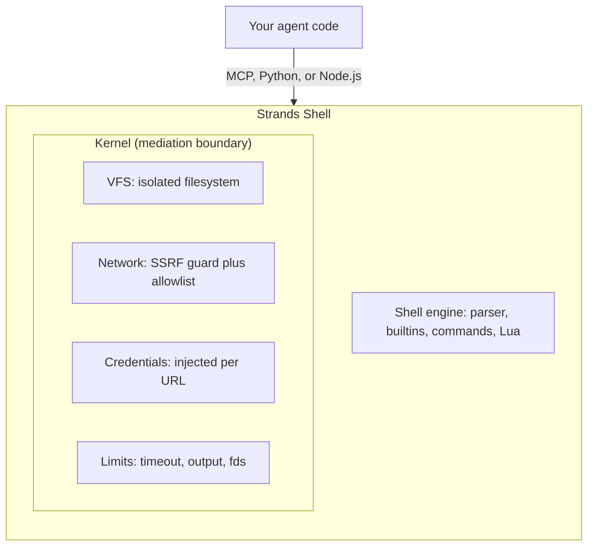

Most agent setups isolate command execution with a container or a cloud sandbox. Both
work, and both cost something on every command: a Docker container adds a cold start and
a daemon to manage; a cloud sandbox adds a network round trip and a platform dependency.
When an agent runs hundreds of commands per task, that overhead compounds. Strands Shell
makes a different tradeoff, and this page explains what that tradeoff is and when it
holds.

## Why a virtual shell

The isolation boundary in Strands Shell is an in-process virtual filesystem and a
mediation layer, not an operating-system primitive. There is no container to start and
no VM to provision, so constructing a shell and running a command costs under a
millisecond.

| | Docker | Cloud sandbox | Strands Shell |
|---|---|---|---|
| Cold start | ~200ms | ~1s (network) | under 1ms |
| Isolation | Container namespace | MicroVM | In-process VFS |
| Network | iptables or sidecar | Platform policy | URL allowlist plus SSRF guard |
| Secrets | Environment variables the agent can read | Platform-specific | Injected per request, agent doesn't see them |
| Setup | Docker daemon | API key plus network | `pip install strands-shell` |
| Platforms | Linux | Cloud only | macOS, Linux, WASM |

This is a different tradeoff, not a strictly better one. A container isolates at the
kernel; Strands Shell isolates at the process. Picking the wrong tool for an adversarial
workload is a real risk, so the boundary is worth understanding precisely.

## The Kernel and the engine

Your code talks to the shell through one of three surfaces: an MCP server, the Python
API, or the Node.js API. Every command, file read, and network request initiated inside
Strands Shell flows through the Kernel, the single mediation boundary.

The engine parses and runs shell syntax. When a command needs to touch the outside
world, it asks the Kernel, and the Kernel decides. The filesystem is an in-memory VFS
with explicit bind mounts; network access goes through an SSRF guard that blocks private
address ranges by default; credentials are injected per request and stripped before the
agent can read them.

Strands Shell is written in Rust and compiles from one source to native bindings for
Python (via PyO3) and Node.js (via napi-rs), plus a WASM target. All three surfaces
expose the same functionality.

## What it is, and what it is not

Strands Shell is a mediation layer, not a hardened sandbox. The Kernel enforces a
least-privilege policy inside the shell, and it runs in the same process as your code.
It does not protect against memory-safety exploits in the shell engine itself, timing
side channels, or an attacker who already controls the host process. That distinction
drives the deployment decision:

- For "my agent shouldn't touch anything I haven't explicitly allowed," the Kernel
  handles it. This is the common case: a coding agent, a research agent, a CI assistant.
- For "an untrusted tenant is running arbitrary adversarial code," you need OS-level
  isolation. Run each Strands Shell instance inside a container or microVM, and let the
  Kernel handle the in-process mediation on top.

The two layers compose. The [security model](security.md) draws the boundary in full:
the guarantees the Kernel makes, the threat models it does not cover, and how to choose
the right isolation for your workload.
