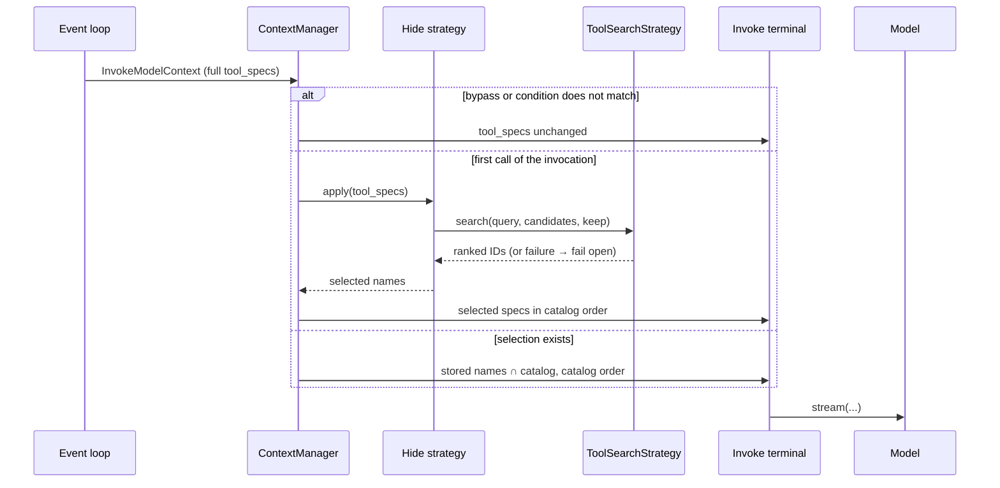

# Tool Selection

**Status**: Proposed

**Date**: 2026-09-23

**Issues**: [#263](https://github.com/strands-agents/harness-sdk/issues/263), [#1677](https://github.com/strands-agents/harness-sdk/issues/1677)

**Related**: [#1680](https://github.com/strands-agents/harness-sdk/issues/1680), [#4052](https://github.com/strands-agents/harness-sdk/issues/4052), [#4053](https://github.com/strands-agents/harness-sdk/issues/4053)

**Scope**: Python and TS

## Overview

Tool definitions are context. The system that decides which messages and tool results the model sees should also decide which tool definitions it sees. Tool selection therefore belongs to the `ContextManager`, not to a standalone plugin or a new `Agent` parameter.
The `ContextManager` manages durable messages through hooks, while tool definitions are a per-call projection of the tool registry. Tool specs become a ContextManager target managed by `Hide("tool_specs", ...)`, which ContextManager delivers through the same model-input seam the SDK already uses for per-call changes. The registry is never touched.

## Goals and Non-Goals

Goals:
- Reduce model input tokens and tool-choice noise for large catalogs.
- Manage tool specs as context, under `context_manager`, with no new top-level surface.
- Change nothing for agents that do not opt in. `ContextManager()` and the `"auto"` and `"agentic"` facades keep today's behavior and today's wire request; `"auto"` adopts selection only after benchmarks establish when it is net-positive.
- Select once per invocation from its input and keep membership stable through the autonomous tool loop, so the tool prefix a provider caches does not change mid-loop.
- Work out of the box. The default strategy is lexical, in-process, and deterministic: the same input always yields the same ranking.
- Support custom relevance through one contract, `ToolSearchStrategy`, so embeddings, an LLM judge, or a storage-backed index are each one class away.
- Correct `projected_input_tokens` for filtered calls, so token status and spans reflect what the model will actually receive.
- Never mutate the tool registry; selection changes only the per-call view.
- Fail open: a search failure leaves eligible tools visible rather than failing the model call.
- Keep Python and TypeScript concepts, names, defaults, and behavior aligned.

Non-Goals (v1):
- Agentic discovery (#1680). An add-on to this design, tracked as a P2 item.
- Provider-native delivery. OpenAI `allowed_tools`, OpenAI and Anthropic deferred loading, and OpenAI `additional_tools` are the cache-preserving paths and are wanted. Each needs adapter request and response handling, new `ToolChoice` or `ToolSpec` fields, and a capability the policy can read from `context.model`. They are P1 and P2 below and consume the v1 selection result rather than replace it; see [Prompt caching](#prompt-caching).
- A second index or persistence abstraction. Semantic search is in scope: `ToolSearchStrategy` ranks in-memory tool candidates, and `StorageSearch` adapts it to the shipped `Storage.search` (and the embeddings and S3 Vectors backends in #3967). What v1 does not add is a new vector, embedding, or persistence API for tools alone.

## Design decisions

**Tool specs are managed at the model-input seam, not in the registry and not in the message pipeline.** Every model call already rebuilds `tool_specs` from the full `ToolRegistry`, copies it into an `InvokeModelContext`, and runs that context through `InvokeModelStage.Input` middleware before the terminal sends it. `ModelRouter`, `BackgroundTasks`, `MemoryManager`, and `ContextInjector` all deliver their policies from that seam, registered from their own `init_agent`. `Hide("tool_specs", ...)` does the same. The `ContextManager`'s message strategies stay on hooks and the stash, while `Hide` filters only the per-call spec projection.

**The registry is read, never written.** A tool is executable code; its spec becomes context only when supplied to the model. The registry owns the code and how it is loaded, including local tools, MCP tools, and hot reload.
The `ContextManager` decides which specs appear in a call. "Hiding" a tool means its spec is absent from one call's projection; "reloading" it means a later projection includes it again. Nothing is stored or fetched because the spec comes from code that is still registered. `agent.tools` and `agent.tool_registry` always return the full set, and the executor still resolves a returned tool name against the full registry. Hiding is therefore a visibility control, not authorization.

**Selection is provider-agnostic; delivery is provider-specific.** LangChain filters at the request layer the same way, and Anthropic's and OpenAI's tool search defer definitions rather than remove them, but provider search is gated to one vendor and blind to local tools. Strands selects across every registered source and lets each adapter decide how to express the result.

## Proposed SDK changes

`ContextManager` adds a `tool_specs` target and `Hide` strategy to its existing strategy list. Strategies over messages continue to run from hooks. When the list contains a model-input target, ContextManager also installs an Input handler and clears its invocation state at the end of the invocation.

```python
class ContextManager(Plugin):
    def init_agent(self, agent: Agent) -> None:
        agent.hooks.add_callback(BeforeModelCallEvent, self._run_strategies)
        agent.hooks.add_callback(AfterModelCallEvent, self._recover_from_overflow)

        if self._has_model_input_strategies:
            agent._middleware_registry.add_middleware(
                InvokeModelStage.Input, self._apply_model_input_strategies
            )
            agent.hooks.add_callback(
                AfterInvocationEvent, self._clear_invocation_state, order=HookOrder.SDK_LAST
            )
```

The Input handler is an implementation detail; developers configure `Hide` through the existing strategy list.

No breaking change. Existing strategies and facades are unchanged, and `agent.tools` and `agent.tool_registry` keep returning the full set.

### What happens on a model call

The strategy treats the incoming `context.tool_specs` as the catalog for the call. A call with an explicit `tool_choice` or forced structured output passes through unchanged. If `.when(count=...)` does not match, the catalog also passes through unchanged.

When the condition matches, the first call of an invocation derives a query from the latest user text, renders each matching tool into a candidate (name, description, input-property descriptions), asks `ToolSearchStrategy` for a best-first ranking, and keeps the top `keep` results. Target exclusions such as `!tool_spec::ask_user` remain visible without consuming `keep`. The selected names are stored in `invocation_state` under a private key and cleared on `AfterInvocationEvent`. Later calls in the same invocation reuse the names, intersected with that call's catalog. Emitted specs keep catalog order, so a stable selection is a byte-identical tool prefix from call to call. A search error, empty result, or result with no valid IDs fails open to the incoming catalog with one warning, and the structured-output tool is always retained on an unforced call.



Two things the event loop does today need adjusting for this handler.

Token projection. Current: `projected_input_tokens` is estimated before input middleware, against the full catalog. What we need to do: the handler subtracts the tokens of the specs it removed and writes the corrected value to `context.projected_input_tokens` (P0). Proactive compression at `BeforeModelCallEvent` runs before any input middleware and keeps the pre-filter estimate, which is conservative; 0016 records the same limitation for routing.

Handler ordering. Current: the handler runs after routing and tool-spec producers only because the manager's plugin initializes after them. What we need to do: make that an explicit ordering rule, either a `MiddlewareOrder` akin to `HookOrder` or a documented "ContextManager last" (P1).

### Search strategies

`ToolSearchStrategy` ranks in-memory candidates that are never stored. It is a separate contract from the storage package's `SearchStrategy`, which ranks stored keys for a `Storage`; `StorageSearch` bridges the two. Three implementations: `LexicalSearch` is the default, in-process token overlap between the query and each candidate, tool-name terms weighted up, ties broken by catalog order. `LLMSearch` is the opt-in judge, one call to a developer-supplied model that picks relevant names from the candidate list, with the output allowlisted to candidate IDs and any failure failing open. `StorageSearch(storage)` indexes candidate text and delegates to `Storage.search`, which is how embeddings and S3 Vectors (#3967) plug in.

### Developer experience

The explicit strategy shows the behavior:

```python
context_manager = ContextManager(
    strategies=[Hide("tool_specs", keep=10).when(count=20)],
)
agent = Agent(tools=[...many tools...], context_manager=context_manager)
```

Tool-specific exclusions keep a base set visible:

```python
context_manager = ContextManager(
    strategies=[
        Hide(
            ["tool_spec::*", "!tool_spec::ask_user", "!tool_spec::finish"],
            search=LexicalSearch(),
            keep=15,
        ).when(count=20),
    ],
)
```

After benchmarks establish the default activation rule, a preset expands to the same strategy:

```python
ContextManager(strategies=["tool_selection"])
```

A judge changes only the search implementation:

```python
judge = BedrockModel(model_id="amazon.nova-micro-v1:0")
context_manager = ContextManager(
    strategies=[
        Hide("tool_specs", search=LLMSearch(model=judge), keep=15).when(count=20),
    ],
)
```

TypeScript recases the target and preset to `toolSpecs`, `toolSpec::ask_user`, and `toolSelection`. Each decision records strategy, candidate count, selected names, duration, and fail-open on the agent-loop-cycle span; an `LLMSearch` call gets its own child span with usage.

### Interface

The proposed interface is:

```python
@dataclass(frozen=True)
class SearchCandidate:
    id: str       # tool name for this feature
    text: str     # searchable name, description, and input-property descriptions

@dataclass(frozen=True)
class SearchMatch:
    id: str
    score: float | None = None   # informational; the contract is result ORDER, best-first

class ToolSearchStrategy(Protocol):
    name: str

    async def search(
        self, query: str, candidates: Sequence[SearchCandidate], *, limit: int
    ) -> Sequence[SearchMatch]: ...

class Hide(ContextStrategy):
    def __init__(
        self,
        target: str | Sequence[str],
        *,
        search: ToolSearchStrategy | None = None,
        keep: int = 10,
    ) -> None: ...

    def when(self, *, count: int | None = None) -> "Hide": ...

ContextPreset = Literal["proactive_compression", "tool_selection"]

class ContextManager:
    def __init__(
        self,
        *,
        strategies: Sequence[ContextStrategy | ContextPreset] | None = None,
        ...,
    ) -> None: ...
```

A tool-spec `Hide` strategy keeps the first matches returned by `ToolSearchStrategy`; scores are informational. The `tool_selection` preset is added after benchmarks establish its default `Hide` configuration.

## Prompt caching

Tool definitions are the first section of the cached prefix on Anthropic, Bedrock, and OpenAI, so changing them invalidates the tools cache and everything behind it, while a `tool_choice` change invalidates only messages ([Anthropic](https://platform.claude.com/docs/en/build-with-claude/prompt-caching), [Bedrock](https://docs.aws.amazon.com/bedrock/latest/userguide/prompt-caching.html), [OpenAI](https://developers.openai.com/api/docs/guides/prompt-caching)). The design does three things about it:

- Membership is fixed within an invocation and specs are emitted in catalog order, so every call in a tool loop sends the same tool prefix.
- Selection stays explicit until benchmarked. Removing definitions saves tokens but can cost more than it saves on a warm cache with a long conversation, so `"auto"` does not enable it until we know when it is net-positive.
- The selection result is kept separate from delivery, so adapters can adopt the cache-preserving modes providers recommend without changing the policy: keep the definitions list stable and restrict callability with `allowed_tools`; mark definitions `defer_loading` and let tool search append loaded ones at the end of context; or record loaded tools as `additional_tools` items in the thread ([OpenAI tool search](https://developers.openai.com/api/docs/guides/tools-tool-search)).

| Delivery mode | Definitions the model sees | Callable set | Saves definition tokens | Cache prefix | Portable |
|---|---|---|---|---|---|
| Full catalog (today) | all | all | no | stable while the registry is stable | yes |
| Portable `Hide` (v1) | selected | selected, not enforced | yes | rewritten when membership changes | yes |
| Stable definitions + `allowed_tools` | all | selected | no | preserved; only message blocks change | OpenAI |
| Deferred, append-only loading | summary, then loaded subset | loaded subset | yes | preserved; discovered definitions enter through the message history | OpenAI, Anthropic |

`allowed_tools` preserves the cache but not the tokens; deferred loading does both but grows the active set through load events rather than re-selecting each invocation. Neither is expressible through `ToolSpec` and `ToolChoice` today; both are follow-up items.

### Measured evidence

A Bedrock prototype ([script and full results](https://github.com/JackYPCOnline/harness-sdk/tree/prototypes/0018-tool-selection-benchmark/prototypes/0018-tool-selection)) compared the full catalog with per-invocation lexical selection over 60- and 120-tool catalogs and short and 16k-word histories, four tool-use tasks per cell, both arms hitting the expected tool 16/16. Selection cut raw prompt tokens 40 to 78 percent in every cell, but cache-adjusted cost rose 3 and 45 percent at 60 tools and fell 46 and 20 percent at 120. Tool count alone is not a safe activation rule. The benchmark is synthetic (padded descriptions, one run per cell) and speaks to cache economics, not retrieval quality.

## Follow-up items

TypeScript proves the extension first because its first-class `ContextManager` and stash already exist. Python ports the stabilized surface rather than shipping a temporary plugin.

- **P0, TypeScript target and local search.** Add the `toolSpecs` target and `Hide` strategy; register the Input handler and `AfterInvocationEvent` cleanup; store selection state in `invocationState`; correct `projectedInputTokens`; add `ToolSearchStrategy`, `LexicalSearch`, a fixed-list `StaticSearch` for tests, validation, bypasses, fail-open, and observability. No registry API changes.
- **P0, benchmarks.** Extend the prototype to real MCP and local catalogs and ambiguous tasks; tune `keep` and query projection; derive a cache-aware activation policy from raw tokens, cache reads and writes, latency, realized cost, and task success. Compare automatic selection against progressive disclosure (names plus short previews and a `search_tools` tool) on the same tasks.
- **P1, preset.** After benchmarks choose the default activation rule, add the `toolSelection` preset from #4053 as sugar over the default `Hide` strategy.
- **P1, Python parity.** Port the first-class `ContextManager`, `tool_specs` target, and `Hide` with the same behavior; add the `tool_selection` preset after its default is established.
- **P1, `LLMSearch` and `StorageSearch`.** Add the judge option and the `Storage.search`-backed strategy so embedding and S3 Vectors backends from #3967 plug in without a new abstraction.
- **P1, projection after input middleware.** Re-estimate `projected_input_tokens` once after the `InvokeModelStage.Input` chain so spans and downstream consumers reflect every input handler, not only this one. `BeforeModelCallEvent` compression keeps the pre-middleware estimate; moving it later is a loop change shared with 0016 and out of scope here.
- **P1, ordering contract.** Formalize where the manager's Input handler runs relative to routing and tool-spec producers, either a `MiddlewareOrder` akin to `HookOrder` or a documented "ContextManager last" rule, before the surface leaves experimental.
- **P1, provider callability.** Add OpenAI `allowed_tools` as a separate ContextManager strategy for restricting calls; it does not replace `Hide`.
- **P1, facade default.** Add the `toolSelection` preset to `"auto"` only after benchmarks establish when it is net-positive, with an explicit opt-out.
- **P2, deferred, append-only loading.** Mark definitions `defer_loading` and deliver discovered ones through OpenAI's tool search and `additional_tools` items or Anthropic's `tool_reference` blocks, with the loaded-tool history kept in model input so the prefix survives across calls. The active set grows through load events rather than being re-selected, so this mode needs its own lifecycle rules on top of the P0 policy. Anthropic's custom search tool returns `tool_reference` blocks, which is where `ToolSearchStrategy` plugs in server-side.
- **P2, agentic discovery.** A ContextManager-owned search tool for #1680, backed by `ToolSearchStrategy`.

This design supersedes the `ToolManager` proposal in #263; the registry remains the source of truth. Migration: none. Tool selection is explicit in experimental v1.

## Appendix: alternatives considered

**Use `Offload` for tool specs.** `Offload` can share the `tool_specs` target, but its stash and overflow semantics do not apply because the registry still holds each spec. `Hide` keeps tool selection in the strategy list without storing specs or applying message transformations.

**Use a dedicated `tool_selection` parameter or standalone plugin.** Either can use the same middleware and registry boundary, but creates a second configuration path. `Hide("tool_specs", ...)` keeps context policies in one strategy list and supports the preset model.

**Register and unregister tools around each call.** No new seam, and every registry consumer sees the reduced set. It turns the registry into per-call state shared across concurrent invocations, `agent.tools` stops reflecting what the developer registered, a tool use for a tool hidden on this call resolves against a registry that no longer contains it, MCP consumer counts and hot reload are disturbed, and the wire request changes exactly as it does with the portable filter, so nothing is saved on cache. The defensive per-call copy exists so a projection can differ from the inventory.

**Provider-native restriction as the v1 foundation.** `allowed_tools` preserves the tool prefix for OpenAI but is not portable and does not reduce definition tokens. It is a separate ContextManager strategy for restricting calls, not an implementation of `Hide`.

## Willingness to Implement

Yes.
